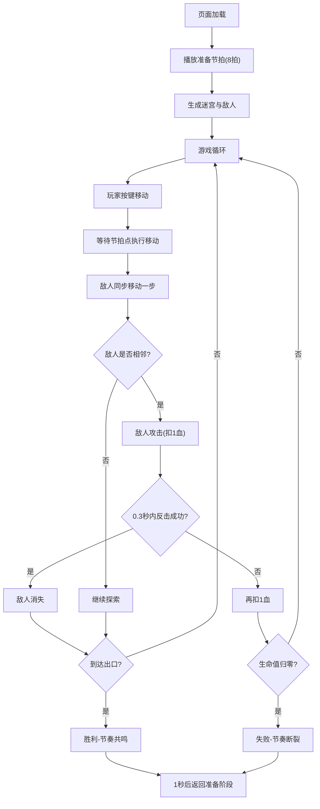

## 1. 产品概述

「节奏迷窟」是一款将音乐节拍与Roguelike迷宫探索结合的浏览器游戏。玩家需要跟随鼓点节奏在随机生成的迷宫中移动，击败节拍错乱的敌人，收集宝箱道具，最终到达出口。

- 目标用户：喜欢节奏游戏和Roguelike游戏的玩家
- 核心价值：将音乐节奏感与策略性迷宫探索融合，提供独特的游戏体验

## 2. 核心功能

### 2.1 用户角色
| 角色 | 注册方式 | 核心权限 |
|------|----------|----------|
| 玩家 | 无需注册 | 体验完整游戏流程 |

### 2.2 功能模块
1. **游戏主循环**：节奏驱动、状态管理、场景调度
2. **迷宫生成**：基于BPM和复杂度的随机迷宫生成
3. **敌人系统**：敌人AI、状态机、攻击与反击机制
4. **节奏引擎**：Web Audio节拍生成、输入同步
5. **渲染系统**：Canvas绘制迷宫、角色、特效

### 2.3 页面详情
| 页面名称 | 模块名称 | 功能描述 |
|----------|----------|----------|
| 游戏主界面 | 准备阶段 | 播放8拍准备节拍，提示"按空格键开始" |
| 游戏主界面 | 游戏进行 | 迷宫探索、敌人战斗、道具收集 |
| 游戏主界面 | 胜利/失败 | 结果展示、自动重置 |
| 游戏主界面 | HUD | 生命值、宝箱数、BPM、节拍进度条 |

## 3. 核心流程

玩家打开页面后自动播放准备节拍，8拍后迷宫生成并开始游戏。玩家使用方向键在节拍点上移动，敌人同步移动。与敌人相邻时触发战斗，敌人攻击后玩家有0.3秒反击窗口。收集宝箱获得增益效果，到达出口胜利，生命归零失败。

## 4. 用户界面设计

### 4.1 设计风格
- 主色调：深蓝#1B2A49、暗银灰#6B7B8D、青色玩家、红色敌人
- 背景：从#0A0E1A到#142130的垂直渐变
- 边框：半透明浅蓝#3A5A7A（0.3透明度），模拟街机荧光效果
- 字体：monospace等宽字体，白色#E0E4F0
- 动画：平滑位移(ease-out)、脉冲光晕、粒子爆散

### 4.2 页面设计概述
| 页面名称 | 模块名称 | UI元素 |
|----------|----------|--------|
| 游戏主界面 | 画布区域 | 640x640 Canvas，12px半透明边框 |
| 游戏主界面 | 顶部HUD | 红色心形+生命值、金色星形+宝箱数（24px monospace #8AC8FF） |
| 游戏主界面 | 左侧HUD | BPM(48px白色)、节拍进度条(120x6px #FF6B35→#FFD700渐变) |
| 游戏主界面 | 结果蒙版 | #000000 0.7透明度，中央显示结果文字 |

### 4.3 响应式
- 桌面端：640x640画布
- 移动端（<768px）：画布宽度100vw-32px，UI字体缩小至80%

### 4.4 视觉元素规格
- 迷宫房间：80x80px
- 走廊宽度：40px
- 玩家：青色三角形
- 敌人：红色椭圆+脉冲光晕
- 出口：闪烁金色箭头
- 宝箱：金色外观，拾取时50粒子爆散(1秒)
