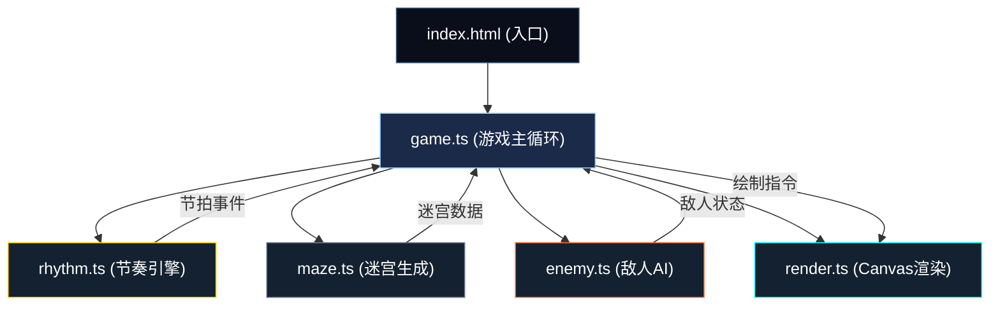

## 1. 架构设计



**调用关系与数据流：**
- `index.html` 加载入口，创建Canvas，实例化Game
- `rhythm.ts` → `game.ts`：每拍推送节拍事件(beatNumber, time)
- `game.ts` → `maze.ts`：请求生成迷宫(BPM, complexity)，获取迷宫网格、入口、出口、宝箱、敌人初始位置
- `game.ts` → `enemy.ts`：玩家移动后通知敌人，获取敌人更新状态
- `game.ts` → `render.ts`：每帧推送绘制指令(迷宫、玩家、敌人、特效、HUD)

## 2. 技术描述

- 前端：TypeScript + HTML5 Canvas + Web Audio API + Vite
- 构建工具：Vite（支持HMR热更新）
- 目标：ES2020
- TypeScript严格模式启用

**模块职责：**

| 模块 | 文件 | 职责 |
|------|------|------|
| 游戏主控 | src/game.ts | 主循环、状态机、协调各模块、输入处理 |
| 迷宫系统 | src/maze.ts | 网格迷宫生成、连通性保证、实体分配 |
| 敌人系统 | src/enemy.ts | 敌人实体、状态机、AI移动、攻击反击 |
| 节奏系统 | src/rhythm.ts | Web Audio节拍生成、节拍事件分发 |
| 渲染系统 | src/render.ts | Canvas绘制所有图层、粒子特效 |

## 3. 核心数据结构

### 3.1 迷宫
```typescript
// 格子类型
type CellType = 'wall' | 'room' | 'corridor' | 'entrance' | 'exit' | 'chest';

interface Cell {
  type: CellType;
  x: number;  // 网格坐标
  y: number;
}

interface Maze {
  grid: Cell[][];
  width: number;   // 网格宽
  height: number;  // 网格高
  entrance: { x: number; y: number };
  exit: { x: number; y: number };
  chests: { x: number; y: number; collected: boolean }[];
  enemySpawns: { x: number; y: number }[];
}
```

### 3.2 玩家
```typescript
interface Player {
  x: number;           // 网格x
  y: number;           // 网格y
  hp: number;          // 生命值
  maxHp: number;       // 最大生命
  shield: boolean;     // 护盾
  speedBoost: number;  // 加速剩余步数
  moveTarget: { x: number; y: number } | null;  // 待执行移动
  moveAnim: { progress: number; fromX: number; fromY: number; toX: number; toY: number } | null;
}
```

### 3.3 敌人
```typescript
type EnemyState = 'idle' | 'chase' | 'attack' | 'dead';

interface Enemy {
  id: number;
  x: number;
  y: number;
  state: EnemyState;
  attackTimer: number;    // 攻击动画剩余秒数
  flashTimer: number;     // 闪烁动画
  canCounter: boolean;    // 反击窗口是否开启
  counterTimer: number;   // 反击窗口剩余秒数
}
```

### 3.4 节拍
```typescript
interface BeatEvent {
  beatNumber: number;   // 1,2,3,4 拍号
  time: number;         // 音频时间
  isMeasureStart: boolean;  // 是否小节起始
}
```

### 3.5 游戏状态
```typescript
type GamePhase = 'ready' | 'preparing' | 'playing' | 'victory' | 'defeat';

interface GameState {
  phase: GamePhase;
  prepareBeats: number;  // 准备阶段已过拍数
  maze: Maze | null;
  player: Player;
  enemies: Enemy[];
  chestsCollected: number;
  particles: Particle[];
}
```

### 3.6 粒子
```typescript
interface Particle {
  x: number;
  y: number;
  vx: number;
  vy: number;
  life: number;    // 剩余生命(秒)
  maxLife: number;
  color: string;
  size: number;
}
```

## 4. 关键常量

```typescript
const ROOM_SIZE = 80;       // 房间像素尺寸
const CORRIDOR_WIDTH = 40;  // 走廊像素宽度
const CELL_PIXEL = 40;      // 每格像素大小（走廊）
const BPM = 120;            // 每分钟节拍数
const BEAT_INTERVAL = 60 / BPM;  // 每拍间隔(秒)
const PLAYER_MAX_HP = 5;    // 初始最大生命
const ENEMY_COUNT_MIN = 3;  // 最少敌人数
const ENEMY_COUNT_MAX = 5;  // 最多敌人数
const CHEST_COUNT = 2;      // 宝箱数
const MOVE_ANIM_DURATION = 0.15;  // 移动动画时长
const ATTACK_DURATION = 0.5;      // 攻击动画时长
const ATTACK_FLASH = 0.3;         // 攻击闪烁时长
const COUNTER_WINDOW = 0.3;       // 反击窗口时长
const PARTICLE_COUNT = 50;        // 宝箱拾取粒子数
const PARTICLE_DURATION = 1.0;    // 粒子持续时间
```
