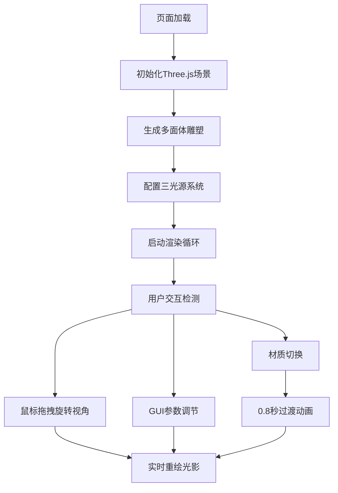

## 1. 产品概述

「浮光掠影」是一款三维动态光影雕塑可视化应用，用户通过拖拽和旋转虚拟光源，实时观察多面体雕塑表面光线路径的折射、反射与阴影交织产生的复杂光影图案。

- 主要用途：艺术创作辅助、光影美学欣赏、3D交互演示
- 目标用户：设计师、艺术家、3D爱好者、教育场景

## 2. 核心功能

### 2.1 功能模块

1. **主场景页面**：3D多面体雕塑渲染、虚拟光源系统、实时阴影渲染
2. **光源控制面板**：dat.gui调试面板，支持多光源参数调节
3. **材质切换系统**：磨砂玻璃/高光镀铬双材质平滑过渡
4. **信息展示面板**：光源参数显示、帧率监控
5. **视角控制系统**：OrbitControls旋转、缩放、平移

### 2.2 页面详情

| 页面名称 | 模块名称 | 功能描述 |
|-----------|-------------|---------------------|
| 主场景 | 多面体雕塑 | 50-80面抽象几何体，悬浮中央，占据画面60% |
| 主场景 | 光源系统 | 点光源+方向光+聚光灯，三色标记球可视化 |
| 主场景 | 阴影渲染 | 2048x2048阴影贴图，实时更新 |
| 控制面板 | GUI参数调节 | 光源位置/颜色/强度/类型实时调节，延迟<50ms |
| 控制面板 | 材质切换 | 磨砂玻璃↔高光镀铬，0.8秒平滑过渡动画 |
| 信息面板 | 状态显示 | 实时光源参数、FPS帧率显示 |

## 3. 核心流程

用户打开页面 → 自动加载3D场景与雕塑 → 默认三光源自动启用 → 鼠标拖拽旋转视角/滚轮缩放 → 调节GUI面板参数 → 实时观察光影变化 → 切换材质类型 → 欣赏光影艺术效果

## 4. 用户界面设计

### 4.1 设计风格
- **主色调**：深灰蓝渐变背景（#0D1321 → #1D2B4A）
- **强调色**：雕塑蓝 #B0C4DE、暖金 #FFD700、冷青 #E0F7FA
- **材质风格**：半透明毛玻璃UI、圆角设计（12px/20px）
- **字体**：现代无衬线字体，清晰可读
- **动效**：平滑过渡、实时响应、流畅60fps

### 4.2 页面设计概述

| 页面名称 | 模块名称 | UI元素 |
|-----------|-------------|-------------|
| 主场景 | 背景容器 | 全屏深灰蓝径向渐变，无边框 |
| 主场景 | 信息面板 | 左上角半透明rgba(20,30,55,0.7)，圆角12px，内边距12px |
| 主场景 | 控制按钮 | 右下角固定位置，圆角20px毛玻璃浮动面板，8px间距 |
| 主场景 | 3D雕塑 | 中央悬浮，磨砂玻璃质感，默认占画面60% |
| 主场景 | 光源标记 | 三色半透明球体（半径0.15）标记光源位置 |

### 4.3 响应式设计
- Desktop-first设计，最小宽度800px
- 宽屏（>1440px）场景两侧留白，居中展示
- 信息面板与控制按钮固定定位，不随分辨率变化
- 移动端：简化交互，保留核心观赏功能

### 4.4 3D场景指引
- **环境**：深灰蓝渐变背景，无HDRI，突出光影对比
- **光照**：
  - 点光源：位置(2,3,4)，颜色#FFF8DC，强度1.2
  - 方向光：方向(-1,-1,-1)，颜色#E0F7FA，强度0.8
  - 聚光灯：指向中心，颜色#FFD700，强度0.6，角度30°，衰减2
- **相机**：PerspectiveCamera，fov 50，OrbitControls控制
- **构图**：雕塑居中，光源环绕，形成视觉焦点
- **交互**：鼠标拖拽旋转、滚轮缩放（0.5-5倍）、Shift+拖拽平移
- **后期**：实时阴影、透明材质折射效果
- **性能**：阴影贴图2048x2048，最多3光源阴影，稳定55+fps
