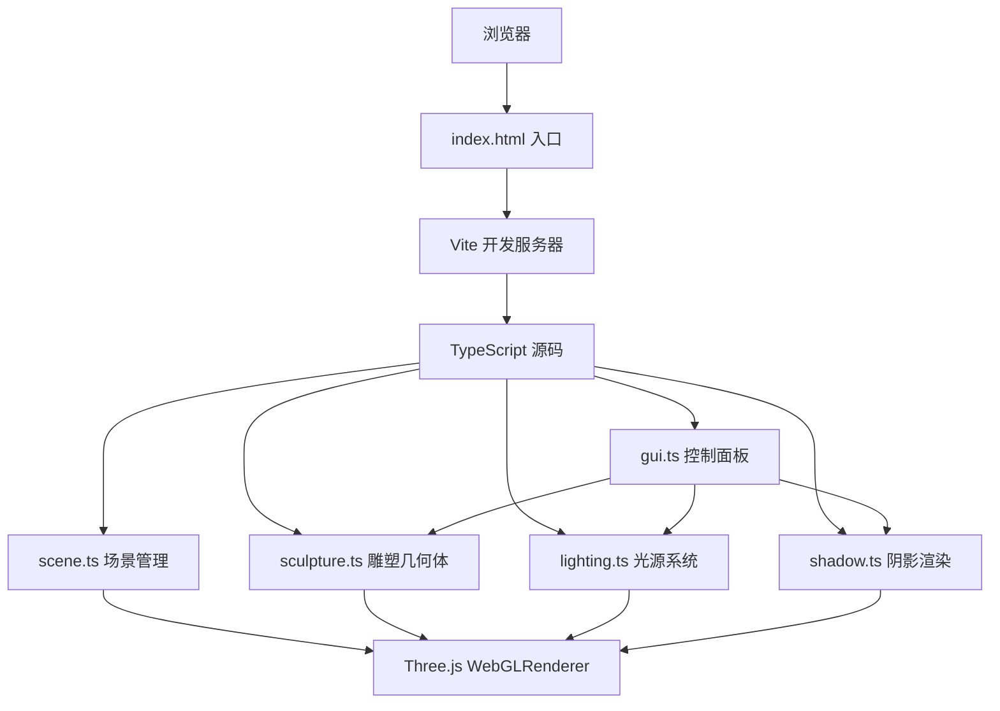

## 1. 架构设计



## 2. 技术选型

- **前端框架**：原生 TypeScript（无React/Vue，用户明确指定）
- **3D渲染引擎**：Three.js 最新版本
- **构建工具**：Vite（支持HMR）
- **GUI调试工具**：dat.gui + @types/dat.gui
- **类型系统**：TypeScript 严格模式，目标 ES2020
- **无后端**：纯前端应用

## 3. 项目文件结构

| 文件路径 | 职责说明 |
|---------|----------|
| `package.json` | 依赖管理、启动脚本 |
| `vite.config.js` | Vite构建配置，HMR支持 |
| `tsconfig.json` | TypeScript配置，严格模式 |
| `index.html` | 入口页面，全屏深灰蓝渐变容器 |
| `src/scene.ts` | 初始化Three.js场景、相机、渲染器，管理动画循环和OrbitControls |
| `src/sculpture.ts` | 生成并管理多面体雕塑的几何体、材质和网格，支持动态修改顶点和面数 |
| `src/lighting.ts` | 管理虚拟光源的位置、颜色、强度、类型，计算并应用光线追踪效果 |
| `src/shadow.ts` | 生成并更新阴影贴图，控制阴影的模糊度和投影矩阵 |
| `src/gui.ts` | 使用dat.gui创建调试面板，控制光源参数、雕塑材质和阴影质量 |

## 4. 核心模块设计

### 4.1 SceneManager (src/scene.ts)

```typescript
export class SceneManager {
  scene: THREE.Scene;
  camera: THREE.PerspectiveCamera;
  renderer: THREE.WebGLRenderer;
  controls: OrbitControls;
  clock: THREE.Clock;
  fps: number;

  init(container: HTMLElement): void;
  onResize(): void;
  animate(callback: (delta: number) => void): void;
}
```

**功能**：
- 创建全屏WebGL渲染器，开启抗锯齿
- PerspectiveCamera fov=50，初始距离雕塑2.5单位
- OrbitControls：enableDamping=true，minDistance=0.5，maxDistance=5，enablePan=true（Shift键触发）
- requestAnimationFrame动画循环，计算FPS

### 4.2 SculptureManager (src/sculpture.ts)

```typescript
export class SculptureManager {
  mesh: THREE.Mesh;
  material: THREE.MeshPhysicalMaterial;
  geometry: THREE.BufferGeometry;
  materialType: 'glass' | 'chrome';
  transitionProgress: number;

  createSculpture(faceCount: number): THREE.Mesh;
  setMaterialType(type: 'glass' | 'chrome', duration?: number): void;
  updateMaterialTransition(delta: number): void;
  regenerateGeometry(faceCount: number): void;
}
```

**功能**：
- 使用IcosahedronGeometry细分 + 顶点随机扰动生成50-80面抽象多面体
- 玻璃材质：color=#B0C4DE, transparent=true, opacity=0.65, roughness=0.2, metalness=0.1, transmission=0.3, thickness=0.5
- 镀铬材质：color=#C0C0C0, roughness=0.05, metalness=0.9
- 手动线性插值实现0.8秒材质过渡动画

### 4.3 LightingManager (src/lighting.ts)

```typescript
export type LightType = 'point' | 'directional' | 'spot';

export interface LightConfig {
  id: string;
  type: LightType;
  position: THREE.Vector3;
  color: string;
  intensity: number;
  angle?: number;
  decay?: number;
}

export class LightingManager {
  lights: Map<string, THREE.Light>;
  markers: Map<string, THREE.Mesh>;
  scene: THREE.Scene;

  addLight(config: LightConfig): void;
  updateLightPosition(id: string, x: number, y: number, z: number): void;
  updateLightColor(id: string, color: string): void;
  updateLightIntensity(id: string, intensity: number): void;
  changeLightType(id: string, type: LightType): void;
  getLightConfigs(): LightConfig[];
}
```

**功能**：
- 管理3个光源（点光、方向光、聚光）
- 每个光源配一个半透明球体标记（半径0.15）
- 光源切换时保留位置/颜色/强度参数
- 标记球颜色与光源颜色一致，透明度0.8

### 4.4 ShadowManager (src/shadow.ts)

```typescript
export class ShadowManager {
  renderer: THREE.WebGLRenderer;
  shadowMapSize: number;

  setupRenderer(renderer: THREE.WebGLRenderer): void;
  configureLightShadow(light: THREE.Light, mapSize?: number): void;
  setShadowMapSize(size: number): void;
  setShadowBlur(blur: number): void;
}
```

**功能**：
- 渲染器开启shadowMap.enabled = true
- 阴影类型：PCFSoftShadowMap
- 每个光源shadow.mapSize.width/height = 2048
- 聚光灯/方向光设置shadow.camera参数

### 4.5 GUIManager (src/gui.ts)

```typescript
export class GUIManager {
  gui: dat.GUI;
  sculptureManager: SculptureManager;
  lightingManager: LightingManager;
  shadowManager: ShadowManager;
  infoPanel: HTMLElement;

  init(): void;
  createLightControls(): void;
  createMaterialControls(): void;
  createShadowControls(): void;
  updateInfoPanel(fps: number): void;
}
```

**功能**：
- 每个光源：position.x/y/z (-5~5)、color（颜色选择器）、intensity (0.5~3.0)、type（下拉选择）
- 材质：glass/chrome 切换按钮
- 阴影：shadowMapSize 选项
- 信息面板实时更新FPS与光源参数

## 5. UI组件定义

### 5.1 信息面板
- 位置：position: fixed, top: 16px, left: 16px
- 背景：rgba(20, 30, 55, 0.7)
- 圆角：12px，padding: 12px
- backdrop-filter: blur(10px)
- 字体：12px monospace，颜色rgba(255,255,255,0.9)
- 内容：FPS、三个光源的类型/颜色/强度/位置

### 5.2 控制按钮面板
- 位置：position: fixed, bottom: 16px, right: 16px
- 背景：rgba(255,255,255,0.08)，backdrop-filter: blur(12px)
- 圆角：20px，padding: 8px
- 按钮间距：8px
- 按钮样式：圆角12px，半透明，hover时加深背景

## 6. 性能优化策略

1. **阴影优化**：最多3光源投射阴影，阴影贴图2048x2048上限
2. **材质过渡**：手动delta插值，避免TWEEN.js额外依赖
3. **几何体复用**：切换材质时不重建几何体，仅更新material属性
4. **渲染循环**：单requestAnimationFrame，合并所有更新逻辑
5. **OrbitControls**：enableDamping开启但设置低dampingFactor=0.05平衡流畅与性能
6. **HMR支持**：Vite原生支持，开发时热更新

## 7. 构建与运行

```bash
npm install
npm run dev
```

开发服务器启动后访问 `http://localhost:5173`
