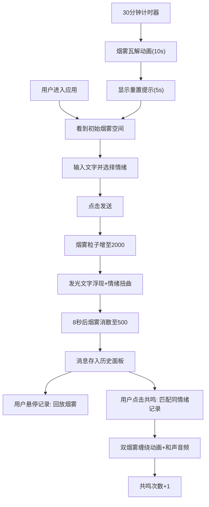

## 1. 产品概述

「雾语者」是一款基于虚拟烟雾媒介的匿名社交应用，用户通过发送匿名文字和情绪标签，在3D烟雾空间中观察烟雾形态随情绪变化而扭曲消散，体验社交疏离感与情绪共鸣。

- 核心问题：在缺乏实时人际互动的情况下，为用户提供一种匿名、沉浸式的情绪表达方式
- 目标用户：寻求匿名情绪表达、体验社交疏离美学的年轻群体
- 产品价值：通过独特的3D烟雾视觉效果和共鸣机制，创造沉浸式的情感交互体验

## 2. 核心功能

### 2.1 功能模块
1. **主烟雾空间页面**：3D烟雾粒子渲染、情绪文字输入、情绪标签选择、发送功能
2. **历史记录面板**：消息列表展示、悬停回放、共鸣功能
3. **自动清理系统**：30分钟定时重置、烟雾消散动画过渡

### 2.2 页面详情
| 页面名称 | 模块名称 | 功能描述 |
|-----------|-------------|---------------------|
| 主页面 | 烟雾空间 | Three.js 3D粒子系统，支持鼠标拖拽旋转、滚轮缩放 |
| 主页面 | 文字输入区 | 底部输入框（80字限制）、情绪标签选择（喜悦/忧伤/疑惑/愤怒）、发送按钮 |
| 主页面 | 历史记录面板 | 右侧透明滚动面板，按时间倒序显示消息，支持悬停回放和共鸣 |
| 主页面 | 自动重置系统 | 每30分钟清除所有记录，显示重置提示 |

## 3. 核心流程

### 3.1 发送消息流程
用户进入页面 → 输入文字内容 → 选择情绪标签 → 点击发送 → 烟雾粒子增加至2000 → 发光文字浮现 → 烟雾按情绪扭曲 → 持续8秒后烟雾消散至初始状态 → 消息保存至历史记录

### 3.2 共鸣匹配流程
用户点击历史记录旁的「共鸣」按钮 → 系统随机匹配同情绪记录 → 两股烟雾缠绕融合动画（6秒） → 播放和声音频 → 记录共鸣次数+1

### 3.3 自动清理流程
系统运行30分钟 → 触发清除 → 烟雾从下方缓慢瓦解（10秒动画） → 显示「雾已散尽，新的开始」提示（5秒淡出） → 重置为初始状态

## 4. 用户界面设计

### 4.1 设计风格
- **主色调**：深灰蓝绿渐变背景（#0F1A2E → #2C3E50），强调色 #1ABC9C
- **情绪色**：喜悦#FFD700、忧伤#5B9BD5、疑惑#9B59B6、愤怒#E74C3C
- **按钮风格**：渐变色（#1ABC9C → #16A085），圆角，悬停亮度提升10%，点击缩放scale(0.95)
- **字体**：使用优雅的无衬线字体，营造朦胧诗意氛围
- **布局风格**：左中右三栏结构（留白20% / 烟雾60% / 面板20%），响应式堆叠
- **视觉效果**：半透明磨砂玻璃效果（rgba(10,15,25,0.7)，模糊12px，边框rgba(255,255,255,0.1)）

### 4.2 页面设计概述
| 页面名称 | 模块名称 | UI元素 |
|-----------|-------------|-------------|
| 主页面 | 烟雾空间 | 600x500px 3D粒子系统，半透明白色粒子，发光模糊后期处理 |
| 主页面 | 输入区域 | 底部居中，磨砂玻璃输入框，情绪标签按钮组，渐变发送按钮 |
| 主页面 | 历史面板 | 右侧220px宽透明滚动面板，圆角12px，每条含情绪圆点/时间/内容预览 |
| 主页面 | 重置提示 | 面板顶部淡出提示条，持续5秒 |

### 4.3 响应式设计
- 桌面端（≥768px）：左中右三栏布局（20% / 60% / 20%）
- 移动端（<768px）：上下堆叠布局（烟雾60% / 面板40%），按钮和输入框等比放大适配触屏

### 4.4 3D场景设计
- **环境**：深灰蓝绿渐变背景，营造迷雾氛围
- **粒子**：初始500个半透明白色圆点，大小2-5px，运动速度0.01，缓慢旋转
- **相机**：透视相机，支持Y轴-90°~90°旋转，缩放范围0.5~2.0
- **后期处理**：Canvas模糊和发光效果
- **情绪动画**：
  - 喜悦：螺旋上升
  - 忧伤：下垂丝状
  - 疑惑：不规则絮状
  - 愤怒：向外爆裂
