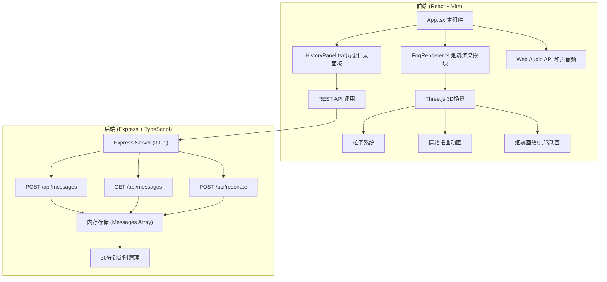
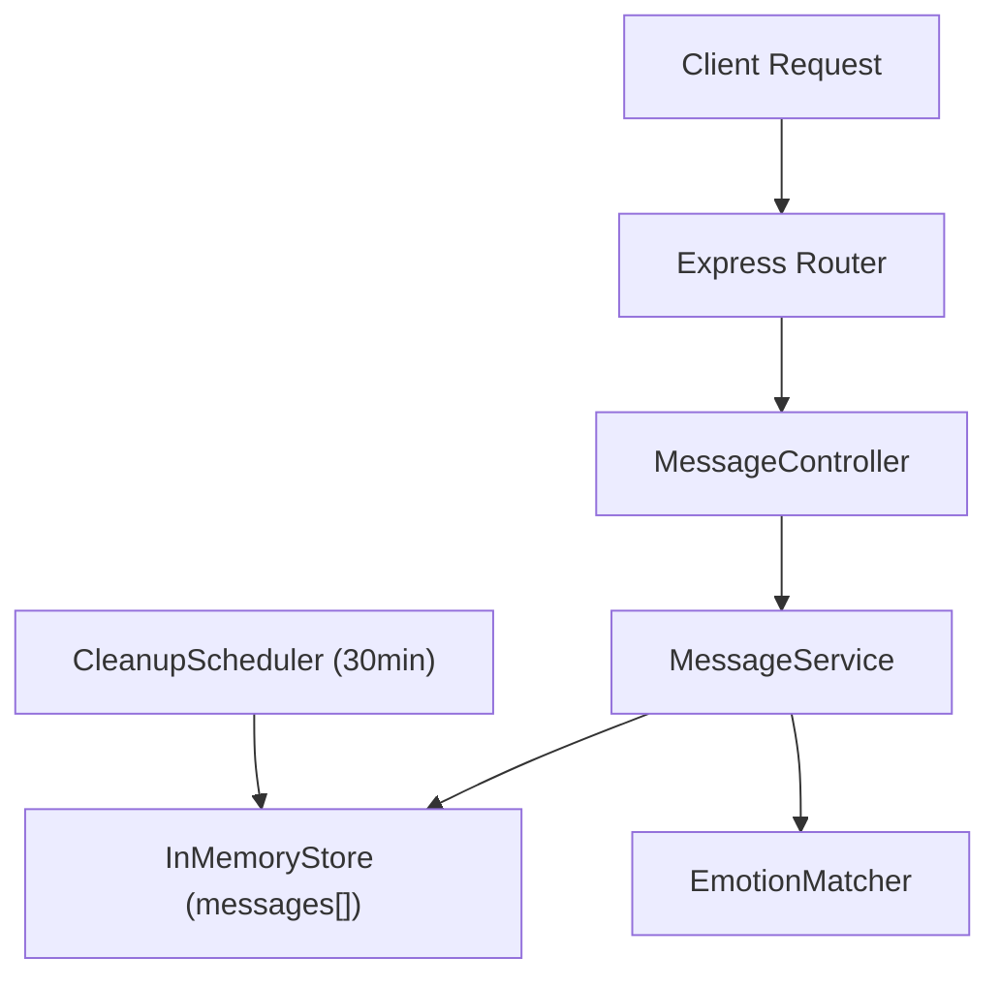
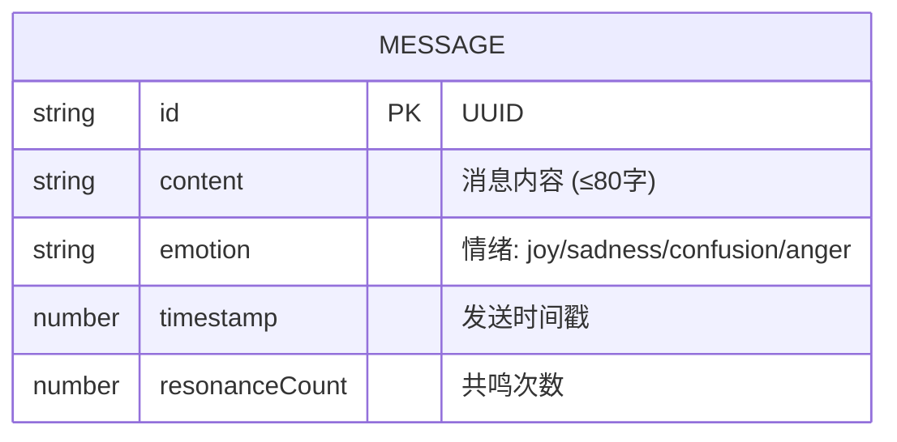

## 1. 架构设计



## 2. 技术说明

- **前端框架**: React@18 + TypeScript + Vite
- **3D渲染**: Three.js (粒子系统、后期处理效果)
- **状态管理**: React useState/useEffect (无需全局状态库)
- **样式方案**: 原生CSS + CSS变量 (无Tailwind，保持精细视觉控制)
- **后端框架**: Express@4 + TypeScript
- **数据存储**: 内存数组（无数据库，每30分钟自动清空）
- **音频**: Web Audio API (实时合成和声音频)
- **通信**: RESTful API + Vite代理 (/api → localhost:3001)

## 3. 路由定义

| 路由 | 用途 |
|-------|---------|
| / | 主应用页面（烟雾空间+历史面板+输入区） |

## 4. API 定义

### 4.1 TypeScript 类型定义

```typescript
// 情绪类型
type Emotion = 'joy' | 'sadness' | 'confusion' | 'anger';

// 消息记录
interface Message {
  id: string;
  content: string;
  emotion: Emotion;
  timestamp: number;
  resonanceCount: number;
}

// 烟雾配置
interface FogConfig {
  particleCount: number;
  emotion: Emotion;
  duration: number;
}

// 共鸣响应
interface ResonateResponse {
  success: boolean;
  matchedMessage?: Message;
  targetMessage?: Message;
}
```

### 4.2 请求/响应 Schema

**POST /api/messages**
- 请求: `{ content: string, emotion: Emotion }`
- 响应: `{ success: boolean, message: Message, fogConfig: FogConfig }`

**GET /api/messages**
- 请求: 无
- 响应: `{ messages: Message[] }` (按时间倒序)

**POST /api/resonate**
- 请求: `{ messageId: string }`
- 响应: `ResonateResponse`

## 5. 服务端架构图



## 6. 数据模型

### 6.1 数据模型定义



### 6.2 内存存储结构

```typescript
// 服务端内存存储
interface Store {
  messages: Message[];
  lastResetTime: number;
}
```

## 7. 项目文件结构

```
.
├── package.json
├── vite.config.js
├── tsconfig.json
├── index.html
├── src/
│   ├── client/
│   │   ├── app.tsx           # 主React组件
│   │   ├── app.css           # 全局样式
│   │   ├── fogRenderer.ts    # Three.js烟雾渲染模块
│   │   └── historyPanel.tsx  # 历史记录面板组件
│   └── server/
│       └── index.ts          # Express后端服务
```
