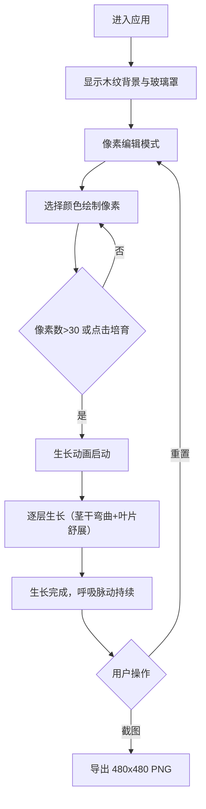

## 1. 产品概述

像素盆景是一款基于 Canvas 的交互式虚拟盆栽培育应用，用户通过拼接像素方块设计并培育一株生长在玻璃罩中的动态像素植物，融合复古像素艺术与精致玻璃器皿美学。

- 主要用途：让用户体验像素艺术创作与植物生长模拟的乐趣
- 目标用户：像素艺术爱好者、休闲游戏玩家、创意设计人群

## 2. 核心功能

### 2.1 功能模块

1. **主页**：像素编辑器、生长模拟器、操作按钮栏、状态栏
2. **像素编辑器**：16x16 网格编辑、8 种基础色板、像素放置与移除
3. **生长模拟器**：逐层生长动画、茎干弯曲效果、叶片舒展动画、呼吸脉动效果
4. **导出功能**：PNG 截图保存、重置编辑状态

### 2.2 页面详情

| 页面名称 | 模块名称 | 功能描述 |
|---------|---------|---------|
| 主页 | 玻璃罩容器 | 520x620px 圆角玻璃容器，带高光光晕，承载像素编辑与植物展示 |
| 主页 | 像素编辑网格 | 16x16 像素网格（12px/格），支持点击放置/移除像素 |
| 主页 | 色板选择器 | 8 种预设颜色，点击切换当前绘制颜色 |
| 主页 | 状态栏 | 显示操作模式（编辑中/生长中）与像素数量统计 |
| 主页 | 操作按钮栏 | 培育、重置、截图三个功能按钮 |
| 主页 | 生长动画 | 从底部逐层向上生长，茎干弯曲、叶片舒展、呼吸脉动 |

## 3. 核心流程

用户进入应用后，在玻璃罩底部的像素网格中使用色板绘制植物模板。当像素数量超过 30 或点击「培育」按钮后，植物从底部开始逐层向上生长，生长完成后可点击「截图」保存作品，或点击「重置」重新开始。

## 4. 用户界面设计

### 4.1 设计风格

- **主色调**：暖棕木纹渐变（#5C3A21 → #8B5E3C）为基底
- **辅助色**：玻璃罩半透明乳白（rgba(240,240,235,0.2)）、状态栏深棕（#3E2723 带 0.6 透明度）
- **像素色板**：叶绿 #4CAF50、草绿 #8BC34A、花红 #E91E63、花紫 #9C27B0、花黄 #FFEB3B、枝干棕 #795548、深绿 #2E7D32、白色 #FFFFFF
- **按钮颜色**：培育 #4CAF50（悬浮 #66BB6A）、重置 #795548、截图 #5C6BC0
- **圆角风格**：统一圆角 8-20px，内阴影 2px
- **字体**：16px 状态栏文字，颜色 #D7CCC8

### 4.2 页面设计概述

| 页面名称 | 模块名称 | UI 元素 |
|---------|---------|---------|
| 主页 | 整体布局 | 上下结构，顶部状态栏，中央玻璃罩，底部按钮栏 |
| 主页 | 玻璃罩 | 520x620px，圆角 20px，半透明乳白色背景，2px 边框，左上角高光 |
| 主页 | 状态栏 | 16px 高，#3E2723 带 0.6 透明度，圆角 8px |
| 主页 | 像素网格 | 16x16，12px/格，网格线 #6B4226 带 0.3 透明度 |
| 主页 | 色板 | 8 个色块横向排列在网格右侧 |
| 主页 | 按钮栏 | 圆角 8px，点击缩放 0.95x，悬浮变色 |
| 主页 | 动画效果 | 生长速度每秒 3 行，呼吸脉动周期 0.8 秒，上下 2px 幅度 |

### 4.3 响应式

桌面端优先设计，像素网格与玻璃罩采用固定像素尺寸，居中布局。

## 5. 性能要求

- 生长动画阶段维持 60FPS 帧率
- 截图生成响应时间 ≤ 300ms
- 编辑器交互点击延迟 < 50ms
