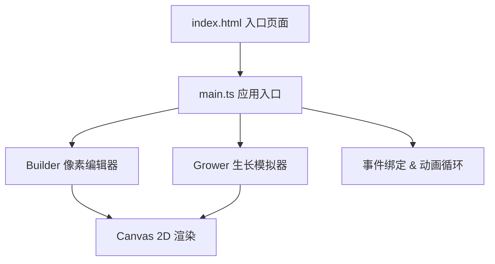

## 1. 架构设计



## 2. 技术说明

- **前端框架**：原生 TypeScript + HTML5 Canvas
- **构建工具**：Vite（支持 HMR 热更新）
- **语言**：TypeScript（严格模式，目标 ES2020）
- **无后端**：纯前端实现，无服务端依赖

## 3. 文件结构

| 文件路径 | 用途 |
|---------|-----|
| package.json | 项目配置，依赖 typescript、vite，启动脚本 npm run dev |
| vite.config.js | Vite 构建配置，支持 HMR |
| tsconfig.json | TypeScript 配置，严格模式，目标 ES2020 |
| index.html | 入口页面，全屏木纹渐变背景容器 |
| src/main.ts | 应用入口，初始化画布、事件绑定、动画循环 |
| src/builder.ts | 像素块编辑器，16x16 网格编辑，颜色选择，输出模板数据 |
| src/grower.ts | 生长模拟器，逐层生长、茎干弯曲、叶片舒展、呼吸脉动 |

## 4. 核心数据结构

### 4.1 像素模板数据

```typescript
interface PixelData {
  x: number;       // 网格 X 坐标 0-15
  y: number;       // 网格 Y 坐标 0-15（底部为 15）
  color: string;   // 像素颜色值
}

type PlantTemplate = PixelData[];
```

### 4.2 编辑器状态

```typescript
interface BuilderState {
  grid: (string | null)[][];  // 16x16 网格，存储颜色或 null
  selectedColor: string;      // 当前选中颜色
  pixelCount: number;         // 已放置像素数量
}
```

### 4.3 生长器状态

```typescript
interface GrowerState {
  template: PlantTemplate;       // 植物模板数据
  currentRow: number;            // 当前生长到的行
  isGrowing: boolean;            // 是否正在生长
  growthProgress: number;        // 生长进度 0-1
  rowPixels: Map<number, PixelData[]>;  // 按行组织的像素数据
  stemBends: Map<string, number>;       // 茎干像素弯曲偏移
  leafAngles: Map<string, number>;      // 叶片舒展角度
  breathOffset: number;         // 呼吸脉动偏移量
}
```

## 5. 性能优化策略

- **Canvas 分层渲染**：背景层（玻璃罩、木纹）、静态层（网格、色板）、动态层（生长动画）分离，减少重绘区域
- **requestAnimationFrame**：使用原生 RAF 驱动动画循环，确保 60FPS
- **脏矩形优化**：仅重绘变化区域，而非整屏重绘
- **像素缓存**：预渲染像素色块，避免每帧重复绘制纯色块
- **离屏 Canvas**：截图功能使用离屏 Canvas 快速生成 480x480 PNG
