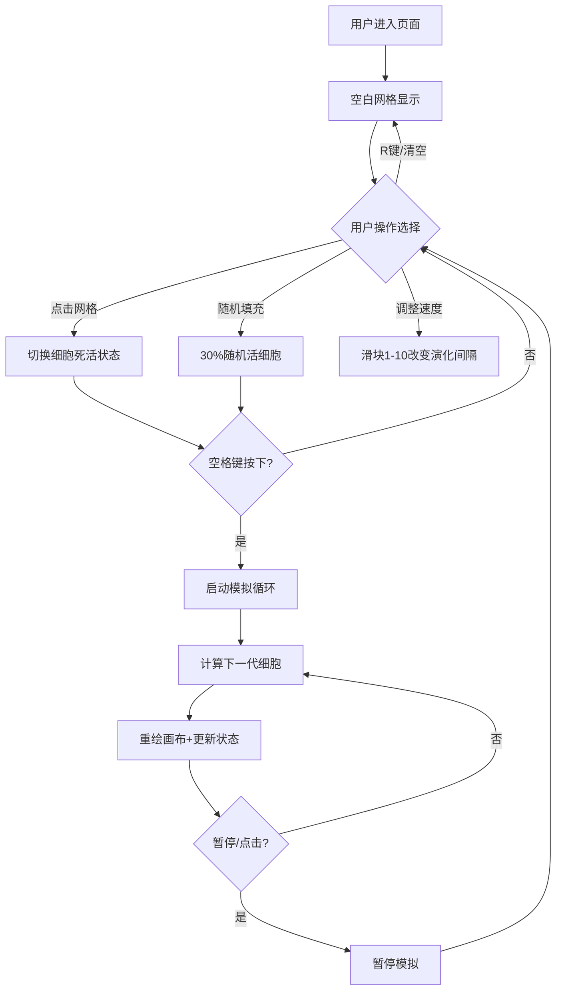

## 1. 产品概述

一款基于康威生命游戏规则的交互式生命模拟与进化应用，用户可在30x30网格上手动放置细胞或随机生成，观察生命演化过程。

- 面向对细胞自动机、生命模拟感兴趣的用户群体，提供直观的可视化操作体验
- 产品价值：以游戏化方式展示复杂系统涌现行为，兼具教育意义与娱乐性

## 2. 核心功能

### 2.1 用户角色
| 角色 | 注册方式 | 核心权限 |
|------|----------|----------|
| 普通用户 | 无需注册 | 放置细胞、启动/暂停模拟、调整参数、重置网格 |

### 2.2 功能模块
1. **主画布区域**：30x30网格显示、细胞绘制、鼠标交互
2. **控制面板**：速度滑块、随机填充按钮、清空网格按钮
3. **状态信息区**：实时显示当前代数和活细胞数量
4. **键盘交互**：空格键启动/暂停、R键重置

### 2.3 页面详情
| 页面名称 | 模块名称 | 功能描述 |
|----------|----------|----------|
| 主页面 | 30x30网格画布 | 鼠标点击切换细胞死活，悬停高亮显示，活细胞为深绿色实心圆 |
| 主页面 | 顶部标题 | "生命模拟器"标题，带淡入动画 |
| 主页面 | 右上角状态面板 | 显示当前代数和活细胞数量（18px等宽字体） |
| 主页面 | 底部控制面板 | 速度滑块（1-10）、随机填充、清空网格 |
| 主页面 | 键盘交互 | 空格键启动/暂停模拟、R键重置为空网格 |

## 3. 核心流程

用户进入页面 → 在网格上点击放置活细胞（或使用随机填充） → 按空格键启动模拟 → 观察细胞按规则自动演化（每200ms一代，速度可调） → 可随时点击网格暂停并编辑 → 按R键或清空按钮重置

## 4. 用户界面设计

### 4.1 设计风格
- **主色调**：暗色主题，背景色#1a1a2e，控制区#16213e
- **强调色**：蓝绿色#00d2ff → #3a7bd5渐变（按钮）、#00d4ff（标题）
- **细胞色**：深绿色#2e8b57（基础活细胞）、#556b2f、#8fbc8f（随机色）
- **按钮样式**：圆角、蓝绿色渐变、悬停亮度提升10%、按下缩放0.95倍（过渡0.1s）
- **字体**：14px/16px/18px/24px 等宽字体，文字色#e0e0e0
- **布局**：顶部标题、中间居中画布、底部控制面板、右上角状态浮层
- **动画**：标题淡入0.3s、稳定模式细胞颜色渐变（2s周期）、按钮状态过渡

### 4.2 页面设计概述
| 页面名称 | 模块名称 | UI元素 |
|----------|----------|--------|
| 主页面 | 顶部标题 | 24px粗体#00d4ff，0.3s淡入动画，居中显示 |
| 主页面 | 网格画布 | 最大600px高，居中显示，8px内边距，浅灰#ddd网格线1px，交叉点0.5px灰点，悬停半透明蓝#87ceeb（0.3），活细胞深绿圆15px带外发光 |
| 主页面 | 状态面板 | 18px等宽字体#e0e0e0，显示代数和活细胞数，位于画布右上角 |
| 主页面 | 底部控制面板 | 高度60px，背景#16213e，圆角12px，包含滑块（轨道200px宽，渐变滑块头）和两个渐变按钮 |
| 主页面 | 速度滑块 | 范围1-10，默认3，步进1，标签实时显示当前值，1→400ms、5→200ms、10→50ms |

### 4.3 响应式
- 桌面端优先，画布居中最大宽度
- 宽度<500px时画布尺寸缩小至屏幕宽度的90%
- 控制区自适应布局，移动端保持可触控区域

### 4.4 性能指标
- 使用requestAnimationFrame保持60FPS
- 每次演化计算≤5ms，重绘≤10ms
- 稳定模式细胞颜色渐变（#2e8b57→#66cdaa→#2e8b57，2s周期）
- 移动模式细胞保持深绿色无渐变
