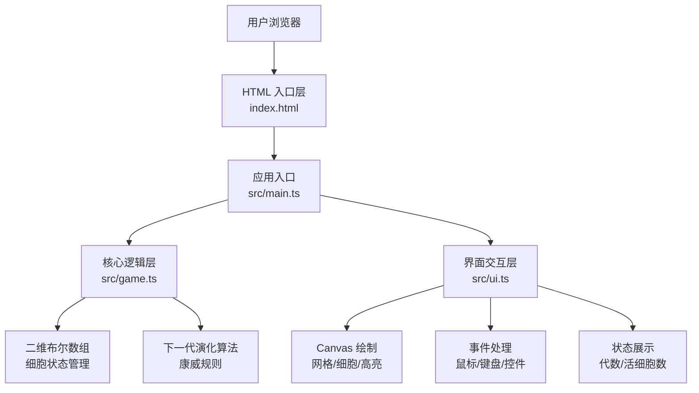

## 1. 架构设计



## 2. 技术说明

- **前端框架**：原生 TypeScript（无框架）+ HTML5 Canvas
- **构建工具**：Vite 5.x
- **语言版本**：TypeScript 5.x，目标 ES2020，模块 ESNext，严格模式
- **样式方案**：原生 CSS（内联于 index.html）
- **无后端、无数据库**，纯前端单页应用

## 3. 项目文件结构

| 文件路径 | 职责说明 |
|----------|----------|
| package.json | 项目元信息，vite + typescript 依赖，dev 启动脚本 |
| tsconfig.json | TypeScript 编译配置（严格模式、ES2020、ESNext） |
| vite.config.js | Vite 构建配置（assetsInlineLimit: 0） |
| index.html | 应用入口页，Canvas 容器、控制面板、状态区域 DOM 结构与 CSS |
| src/main.ts | 应用入口，初始化 Canvas、事件绑定、requestAnimationFrame 主循环 |
| src/game.ts | 核心游戏逻辑：二维网格状态管理、演化计算、代数/尺寸接口 |
| src/ui.ts | 界面控制：Canvas 绘制、鼠标/键盘事件、滑块/按钮交互、状态更新 |

## 4. 数据模型

### 4.1 细胞网格数据
```typescript
// 30x30 二维布尔数组，true=活细胞，false=死细胞
type Grid = boolean[][];

// 每个细胞可选颜色（仅活细胞有效）
type CellColor = string; // #2e8b57 | #556b2f | #8fbc8f
```

### 4.2 游戏状态
```typescript
interface GameState {
  grid: Grid;               // 当前代细胞状态
  prevGrid: Grid;           // 上一代细胞状态（用于判断稳定/移动模式）
  generation: number;       // 当前代数
  running: boolean;         // 是否运行中
  speed: number;            // 速度等级 1-10
  cellColors: Map<string, CellColor>; // 活细胞颜色 key = "x,y"
}
```

## 5. 核心算法

### 5.1 康威生命游戏演化规则
- **活细胞邻居<2** → 死亡（孤独）
- **活细胞邻居 2 或 3** → 存活
- **活细胞邻居>3** → 死亡（拥挤）
- **死细胞邻居=3** → 复活（繁殖）
- 邻居计算：8 个方向（上下左右+4 对角），边界外视为死细胞

### 5.2 稳定/移动模式判断
- **稳定模式**：连续两代细胞状态完全相同 → 活细胞启用颜色渐变动画
- **移动模式**：状态有变化 → 活细胞保持深绿色

### 5.3 颜色渐变算法
- 周期：2 秒
- 色值路径：#2e8b57 → #66cdaa → #2e8b57
- 使用 HSL 线性插值，根据 elapsedTime % 2000 计算当前色

## 6. 性能策略

- **Canvas 批量绘制**：单次重绘完成所有网格线、交叉点、活细胞，避免多次 flush
- **双缓冲数组**：演化计算使用新数组，避免读写冲突
- **requestAnimationFrame 时间累计**：非固定间隔绘制，用 deltaTime 控制演化频率（50ms~400ms）
- **仅变化检测重绘**：代数变化才重绘计算，非动画帧仅更新渐变颜色
