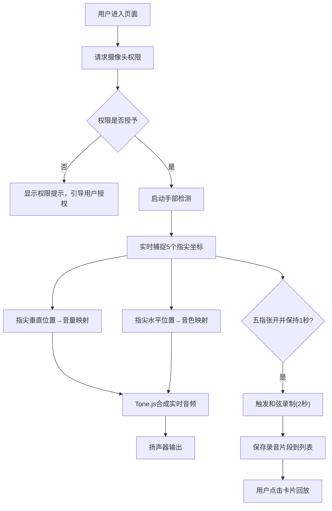

## 1. 产品概述

基于手势控制的交互式音乐合成器面板，用户通过浏览器摄像头捕捉手掌五个指尖位置，实现像指挥家一样用双手在空中演奏音乐。

- 目标用户：音乐爱好者、交互艺术爱好者、教育场景
- 产品价值：提供沉浸式、直觉化的音乐创作体验，降低音乐创作门槛

## 2. 核心功能

### 2.1 功能模块

1. **主交互面板**：摄像头视频捕捉、指尖位置可视化、五线谱背景网格
2. **音频合成引擎**：五音符轨道（C4/D4/E4/F4/G4）、音量动态控制、四种音色切换（钢琴/电子/弦乐/管乐）
3. **控制栏**：毛玻璃风格、实时音符音量显示、音色选择器
4. **录音回放系统**：和弦自动检测录制、录音列表管理、一键回放

### 2.2 页面详情

| 页面名称 | 模块名称 | 功能描述 |
|-----------|-------------|---------------------|
| 主页面 | 摄像头预览区 | 实时显示摄像头画面，叠加五线谱网格和指尖光点 |
| 主页面 | 底部控制栏 | 显示5个音符音量条、音色选择按钮、录制状态指示 |
| 主页面 | 录音回放列表 | 展示已录制和弦片段卡片，支持点击回放 |

## 3. 核心流程

## 4. 用户界面设计

### 4.1 设计风格

- **主色调**：深色渐变背景（#0a0a1a → #1a1a3a）
- **指尖颜色**：红(#ff4757)、橙(#ff7f50)、黄(#ffd93d)、绿(#6bcb77)、蓝(#4d96ff)
- **视觉效果**：毛玻璃（背景模糊12px，圆角16px）、发光扩散（半径8px，透明度0.6）、弹性动画
- **字体**：现代无衬线字体，适合科技感音乐界面
- **布局风格**：沉浸式全屏布局，底部悬浮控制栏，顶部录音卡片列表

### 4.2 页面设计概览

| 页面名称 | 模块名称 | UI元素 |
|-----------|-------------|-------------|
| 主页面 | 摄像头预览区 | 全屏视频、半透明五线谱网格、5个发光指尖光点（弹性跟随动画0.1s ease-out） |
| 主页面 | 底部控制栏 | 毛玻璃背景、左侧5个音符名称+音量条（过渡0.15s）、右侧4个音色按钮（切换过渡0.3s淡入淡出） |
| 主页面 | 录音回放列表 | 卡片式长条布局、浅色圆角边框、5个音色颜色小圆点标识 |

### 4.3 响应式设计

- Desktop-first 设计
- 控制栏在移动端自适应高度
- 录音列表支持横向滚动
- 摄像头画面保持16:9比例

### 4.4 动画与微交互

- 光点跟随：0.1秒延迟，ease-out缓动
- 音量条变化：0.15秒平滑过渡
- 音色切换：0.3秒淡入淡出
- 录制状态：红色脉冲边框，脉动周期0.5秒
- 按钮反馈：微弱波动动画
