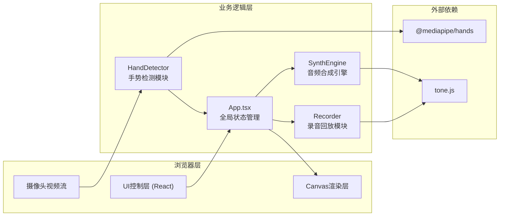

## 1. 架构设计



## 2. 技术描述

- **前端框架**: React 18 + TypeScript
- **构建工具**: Vite 5 + @vitejs/plugin-react
- **音频合成**: tone.js
- **手势检测**: @mediapipe/hands（内置手部关键点检测算法）
- **状态管理**: React Hooks (useState, useEffect, useRef)
- **样式方案**: 原生CSS + CSS变量

## 3. 模块定义

### 3.1 核心模块文件

| 文件路径 | 模块职责 |
|----------|----------|
| `src/App.tsx` | 主组件，管理全局状态：指尖坐标、音量值、音色选择、录制列表 |
| `src/components/HandDetector.ts` | 手势检测模块，从视频帧提取5个指尖归一化坐标 |
| `src/components/SynthEngine.ts` | 音频引擎模块，使用tone.js生成实时音频流 |
| `src/components/Recorder.ts` | 录音模块，处理和弦录音和回放逻辑 |
| `src/styles/main.css` | 全局样式：深色背景、毛玻璃、光点动画、卡片布局 |

### 3.2 类型定义

```typescript
// 指尖坐标（归一化 0-1）
interface FingerPoint {
  x: number;
  y: number;
  visible: boolean;
}

// 音符类型
type NoteName = 'C4' | 'D4' | 'E4' | 'F4' | 'G4';

// 音色类型
type TimbreType = 'piano' | 'electronic' | 'strings' | 'wind';

// 录音片段
interface RecordingClip {
  id: string;
  timestamp: number;
  notes: NoteName[];
  volumes: number[];
  timbre: TimbreType;
  duration: number;
}
```

## 4. 数据模型

### 4.1 全局状态

```typescript
interface AppState {
  // 5个指尖坐标 [拇指, 食指, 中指, 无名指, 小指]
  fingerPoints: FingerPoint[];
  // 各音符实时音量 0-1
  volumes: number[];
  // 当前音色
  currentTimbre: TimbreType;
  // 录音列表
  recordings: RecordingClip[];
  // 是否正在录制
  isRecording: boolean;
  // 摄像头是否启用
  cameraEnabled: boolean;
}
```

## 5. 核心交互逻辑

### 5.1 指尖映射规则
- 垂直位置 (y): y越小（越高）→ 音量越大，映射范围 0-1
- 水平位置 (x): 均匀分为4段 → 对应4种音色切换

### 5.2 和弦录制触发
- 检测5个指尖 `visible=true` 持续1秒
- 开始录制2秒音频数据
- 录制期间控制栏显示红色脉冲边框

### 5.3 性能要求
- 手势检测帧率 ≥ 30FPS
- 光点渲染使用 requestAnimationFrame
- 音频合成使用 Web Audio API 低延迟模式
