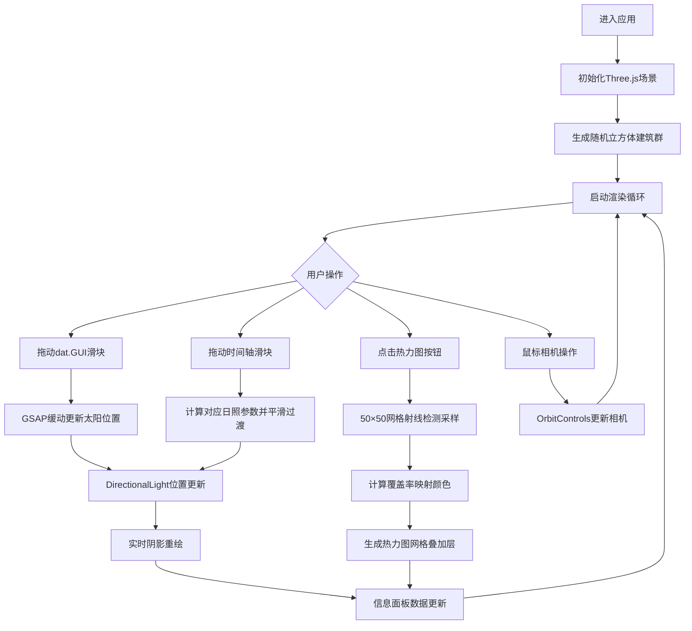

## 1. 产品概述
基于Web的交互式日照模拟与建筑阴影分析应用，帮助建筑设计师和城市规划师在浏览器中即时观察不同日照条件下建筑阴影的动态变化，快速评估设计方案的日照效果。
- 主要用途：建筑外立面日照分析、阴影覆盖率统计、城市规划方案日照预评估
- 目标用户：建筑设计师、城市规划师、景观设计师、房地产开发商
- 市场价值：无需复杂3D建模软件，在浏览器中即可完成专业级日照模拟，大幅提升设计沟通效率

## 2. 核心功能

### 2.1 用户角色
| 角色 | 注册方式 | 核心权限 |
|------|----------|----------|
| 访客用户 | 无需注册 | 使用全部模拟功能、导出热力图 |

### 2.2 功能模块
1. **3D场景渲染模块**：立方体建筑群生成、地面网格纹理、Three.js阴影映射
2. **日照参数控制模块**：太阳方位角/仰角调节、时间轴模拟、GSAP平滑动画过渡
3. **阴影分析模块**：射线检测网格采样、阴影覆盖率计算、热力图可视化
4. **相机交互模块**：OrbitControls旋转/平移/缩放、视角限制
5. **UI界面模块**：信息面板、dat.GUI控制面板、时间轴滑块、热力图叠加层

### 2.3 页面详情
| 页面名称 | 模块名称 | 功能描述 |
|----------|----------|----------|
| 主场景页 | 3D场景渲染 | 实时渲染10+个随机立方体建筑群，半透明浅灰色材质，深绿色网格地面，高质量PCF软阴影 |
| 主场景页 | 日照参数控制 | dat.GUI面板调节方位角(0-360°)和仰角(0-90°)，滑块变化触发0.3秒GSAP缓动，阴影实时更新 |
| 主场景页 | 时间轴模拟 | 底部滑块模拟6:00-18:00日照变化，10分钟步长平滑过渡，方位角由东至西，仰角先升后降 |
| 主场景页 | 阴影分析 | 50×50网格采样，统计各点阴影覆盖率，生成蓝→黄→红渐变热力图，ESC或按钮关闭 |
| 主场景页 | 信息面板 | 左上角半透明面板实时显示方位角、仰角、平均阴影覆盖率（两位小数） |
| 主场景页 | 相机交互 | 左键旋转、右键平移、滚轮缩放，缩放范围5-30单位，初始鸟瞰视角(20,15,20) |

## 3. 核心流程
用户进入应用后，首先看到加载完成的3D建筑群场景。用户可以通过左上角信息面板查看当前日照参数，通过dat.GUI面板手动调整太阳位置，或使用底部时间轴滑块模拟一天的日照变化。当需要分析阴影覆盖率时，点击"生成热力图"按钮，系统在地面上叠加显示彩色热力图，按ESC或再次点击按钮可关闭。所有操作过程中场景保持60FPS流畅渲染。

## 4. 用户界面设计

### 4.1 设计风格
- **主色调**：深空蓝背景 #0d0d1a，亮青色高亮 #00d4ff，橙色交互 #ff8c00
- **建筑材质**：半透明浅灰 #d0d0d0，opacity 0.85
- **热力图渐变**：蓝色 #0000ff → 黄色 #ffff00 → 红色 #ff0000
- **字体**：等宽字体（Consolas / Monaco / monospace），亮色文字白色/亮青
- **布局**：全屏沉浸式3D场景，浮动UI面板，磨砂玻璃半透明效果
- **阴影效果**：PCFSoftShadowMap，2048×2048 shadowMapSize，柔和无锯齿

### 4.2 页面设计概述
| 页面名称 | 模块名称 | UI元素 |
|----------|----------|--------|
| 主场景页 | 信息面板 | 左上角半透明圆角面板，背景rgba(13,13,26,0.75)，亮青色等宽字体，三行数据实时刷新 |
| 主场景页 | dat.GUI面板 | 深色主题背景 #1a1a2e，白色文字，滑块轨道蓝紫渐变，右上角可折叠 |
| 主场景页 | 时间轴容器 | 底部中央磨砂玻璃效果（backdrop-filter: blur(8px)），半透明背景，圆角，包含滑块和按钮 |
| 主场景页 | 时间轴滑块 | 自定义样式，圆形亮橙色手柄 #ff8c00，轨道半透明，刻度标注6:00-18:00 |
| 主场景页 | 热力图按钮 | 橙色边框按钮，hover发光效果，点击后变为激活状态 |
| 主场景页 | 热力图叠加层 | 地面上方0.1单位，半透明opacity 0.6，从边缘向中心展开的0.5秒GSAP淡入动画 |

### 4.3 响应式设计
- **桌面端（≥768px）**：完整布局，dat.GUI面板展开，信息面板正常尺寸，时间轴容器宽度60%
- **移动端（<768px）**：dat.GUI折叠为汉堡菜单按钮，信息面板缩小字体和尺寸，时间轴缩小为紧凑条状，按钮尺寸适配触控
- **触控优化**：按钮最小触控区域44×44px，时间轴滑块增大手柄便于拖动

### 4.4 3D场景指导
- **环境氛围**：深空蓝背景 #0d0d1a，无雾气，营造科幻感
- **光照设置**：DirectionalLight（主太阳光源，投射阴影）+ AmbientLight（0.3强度环境光，避免暗部死黑）
- **相机设置**：PerspectiveCamera，FOV 60，OrbitControls，目标原点，初始位置(20,15,20)，距离限制5-30
- **场景构图**：建筑群居中分布在40×40地面范围内，地面网格纹理提供空间参照
- **交互动画**：太阳位置变化使用GSAP缓动（Power2.easeInOut），热力图生成使用从0到1的opacity + scale动画
- **后处理**：无额外后处理，通过高分辨率shadowMap和PCFSoftShadowMap保证阴影质量
- **性能控制**：建筑使用BoxGeometry + MeshLambertMaterial，阴影2048分辨率，采样计算使用requestIdleCallback避免阻塞
