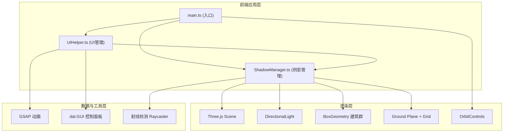

## 1. 架构设计



## 2. 技术说明
- **前端框架**：原生 TypeScript + Three.js（不使用React/Vue，按用户需求使用原生Three.js）
- **构建工具**：Vite 5.x，配置 assetsInlineLimit: 4096
- **语言**：TypeScript 5.x，严格模式，目标 ES2020，模块 ESNext
- **3D渲染**：Three.js 0.160.x，PCFSoftShadowMap软阴影
- **UI控制**：dat.GUI 0.7.9 控制面板
- **动画库**：GSAP 3.12.x 缓动动画
- **无后端**：纯前端运行，无服务端依赖

## 3. 文件结构定义
| 文件路径 | 职责说明 |
|----------|----------|
| package.json | 项目依赖：three, @types/three, vite, typescript, gsap, dat.gui；启动脚本：npm run dev |
| index.html | 入口HTML，全屏canvas容器，左上角信息面板，底部时间轴容器，引入main.ts |
| tsconfig.json | strict:true, target:ES2020, module:ESNext, moduleResolution:bundler, skipLibCheck:true |
| vite.config.js | 基础Vite配置，设置assetsInlineLimit: 4096 |
| src/main.ts | 入口：初始化Renderer/Scene/Camera/OrbitControls，生成建筑数据，启动动画循环，实例化ShadowManager和UIHelper |
| src/ShadowManager.ts | 管理建筑网格、阴影映射、光源更新、阴影覆盖率射线采样计算 |
| src/UIHelper.ts | 渲染dat.GUI面板、时间轴滑块、热力图按钮、信息面板更新、热力图生成与动画 |
| src/types.ts | 公共类型定义：日照参数、覆盖率数据结构 |

## 4. 核心数据流
1. main.ts 初始化时调用 ShadowManager.generateBuildings() 生成10+个随机立方体建筑并添加到场景
2. 用户通过 dat.GUI 或时间轴改变参数 → UIHelper 调用 ShadowManager.updateSun(azimuth, elevation) → 更新 DirectionalLight 位置 → 触发阴影实时渲染
3. ShadowManager.updateSun() 完成后 → 计算当前平均阴影覆盖率 → 通过回调传递给 UIHelper 更新信息面板
4. 用户点击热力图按钮 → UIHelper 调用 ShadowManager.computeCoverageMap() → 50×50网格射线采样 → 返回 coverage: number[][] → UIHelper 生成热力图网格并添加GSAP淡入动画
5. ESC键或再次点击按钮 → UIHelper 移除热力图网格

## 5. 核心模块设计

### 5.1 ShadowManager
```typescript
// 主要属性
scene: THREE.Scene
buildings: THREE.Mesh[]
directionalLight: THREE.DirectionalLight
ambientLight: THREE.AmbientLight
ground: THREE.Mesh
coverageCallback: (avgCoverage: number) => void

// 主要方法
constructor(scene: THREE.Scene, coverageCallback: Function)
generateBuildings(): void  // 生成10+随机立方体
updateSun(azimuth: number, elevation: number): void  // 方位角0-360, 仰角0-90
computePointShadow(x: number, z: number): boolean  // 单点射线检测
computeCoverageMap(): { coverage: number[][], avgCoverage: number }  // 50x50网格
getAverageCoverage(): number
```

### 5.2 UIHelper
```typescript
// 主要属性
shadowManager: ShadowManager
gui: dat.GUI
infoPanel: HTMLElement
timelineSlider: HTMLInputElement
heatmapButton: HTMLButtonElement
heatmapMesh: THREE.Mesh | null
sunParams: { azimuth: number, elevation: number }
timeProgress: number  // 0-1 对应6:00-18:00

// 主要方法
constructor(shadowManager: ShadowManager, scene: THREE.Scene, camera: THREE.Camera)
initGUI(): void
initTimeline(): void
initInfoPanel(): void
updateInfoPanel(azimuth: number, elevation: number, coverage: number): void
timeToSunParams(progress: number): { azimuth: number, elevation: number }
generateHeatmap(): void
removeHeatmap(): void
```

## 6. 性能优化方案
- **阴影优化**：shadowMapSize设置2048×2048，PCFSoftShadowMap，directionalLight.shadow.camera.left/right/top/bottom设置为-30至30以覆盖整个场景
- **几何体优化**：建筑使用共享的BoxGeometry实例，仅缩放矩阵不同，减少GPU内存占用
- **材质优化**：所有建筑共享同一MeshLambertMaterial，减少draw call
- **采样优化**：50×50=2500点射线检测，使用分帧计算（每帧处理50点）避免主线程阻塞超过16ms
- **渲染优化**：使用requestAnimationFrame，仅在相机或光源变化时标记needRender（虽然连续渲染，但避免不必要的计算）
