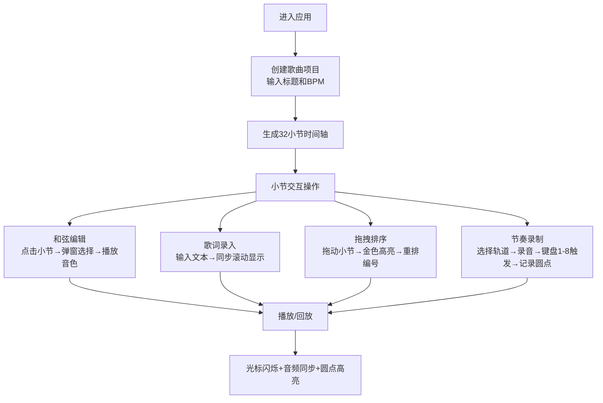

## 1. 产品概述
乐队在线协作创作工具，解决乐队异地排练时无法同步记录和弦进行、节奏模式和歌词段落的问题。
- 面向乐队成员（吉他手、贝斯手、鼓手、主唱等），提供可视化时间轴进行歌曲结构编排
- 通过Web Audio API实现即时音频反馈，支持多轨道节奏录制与回放，提升远程创作效率

## 2. 核心功能

### 2.1 用户角色
| 角色 | 注册方式 | 核心权限 |
|------|---------|---------|
| 乐队成员 | 无需注册（本地单用户模式） | 创建歌曲、编辑和弦、录入歌词、录制节奏、回放预览 |

### 2.2 功能模块
1. **歌曲项目创建**：输入歌曲标题与BPM，自动生成32小节4拍时间轴
2. **和弦编辑系统**：12个根音 × 7种和弦类型，点击小节编辑，即时钢琴音色播放
3. **歌词录入系统**：每小节最多20字符歌词，等宽字体显示，自动同步滚动
4. **拖拽排序系统**：鼠标拖拽调整小节顺序，金色高亮边框，平滑动画过渡
5. **节奏录制系统**：4条独立打击乐轨道，键盘1-8触发8种音色，回放时位置同步高亮
6. **播放控制系统**：播放/暂停、BPM调整、小节跳转、闪烁播放光标

### 2.3 页面详情
| 页面名称 | 模块名称 | 功能描述 |
|---------|---------|---------|
| 主创作页 | 项目创建区 | 歌曲标题输入框、BPM数值输入（60-200）、创建/重置按钮 |
| 主创作页 | 时间轴区域 | 横条式可滚动时间轴（32小节）、小节分隔线、闪烁播放光标、和弦标签、歌词行 |
| 主创作页 | 和弦编辑弹窗 | 磨砂毛玻璃效果、根音选择网格（C-B）、和弦类型选择（大/小/7等）、确认/取消按钮 |
| 主创作页 | 节奏录制区 | 轨道选择器（4轨）、录音按钮、回放按钮、轨道静音开关、触发乐器圆点显示 |
| 主创作页 | 状态栏 | 底部固定，显示当前BPM、播放小节数、总小节数、当前状态（空闲/播放/录制） |

## 3. 核心流程

用户进入应用后首先创建歌曲项目（输入标题和BPM），系统生成空时间轴。用户可以在任意小节点击编辑和弦（选择后自动播放钢琴音色），在下方歌词区录入文本。通过拖拽可调整小节顺序，编号自动更新。选择节奏轨道后点击录音，用键盘1-8录入打击乐节奏，完成后可回放。播放时时间轴光标同步闪烁，所有轨道音频与视觉位置保持同步。

## 4. 用户界面设计

### 4.1 设计风格
- **主色调**：深色背景 #1a1a2e，内容区渐变 #16213e → #0f3460，时间轴背景 #e0e0e0
- **强调色**：淡蓝色分隔线 #87ceeb，金色拖拽高亮边框，白色歌词文本 #ffffff
- **按钮样式**：圆角矩形 border-radius: 8px，悬停亮度降低15%，点击时 0.15s 缩放动画（scale 0.95→1.0）
- **字体**：歌词使用等宽字体 monospace，其余使用现代无衬线字体
- **布局风格**：顶部工具栏 + 中间时间轴主区 + 底部状态栏，紧凑专业音乐工作站风格
- **动效**：所有交互响应100ms内，播放光标每秒闪烁2次，拖拽压缩等比例平滑过渡

### 4.2 页面设计概览
| 页面名称 | 模块名称 | UI元素 |
|---------|---------|--------|
| 主创作页 | 顶部工具栏 | 歌曲标题输入、BPM数值框、创建按钮、播放/暂停按钮、录音按钮 |
| 主创作页 | 时间轴区域 | 灰白色背景横条、每4小节淡蓝色分隔线、小节编号、和弦标签悬浮、歌词行下方显示、闪烁竖线光标 |
| 主创作页 | 和弦弹窗 | 居中磨砂毛玻璃（backdrop-filter: blur(8px)）、12宫格根音按钮、7种和弦类型下拉、确认取消 |
| 主创作页 | 节奏轨道区 | 4条轨道横向排列、每条显示彩色圆点、轨道名称、静音开关、乐器图例 |
| 主创作页 | 底部状态栏 | 固定底部，显示当前BPM、小节位置、播放状态指示 |

### 4.3 响应式
- 桌面优先设计，适配 1366x768 到 1920x1080 分辨率
- 按钮和文本使用 rem/vw 单位，随窗口等比缩放，最小 12px
- 时间轴使用横向滚动容器，窗口宽度变化时自动调整小节宽度
