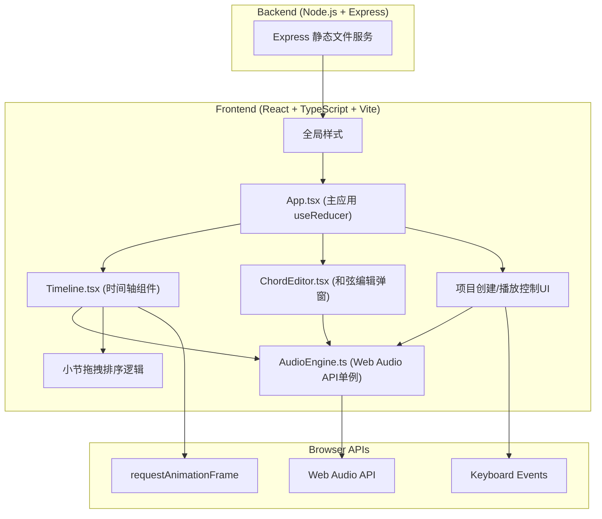
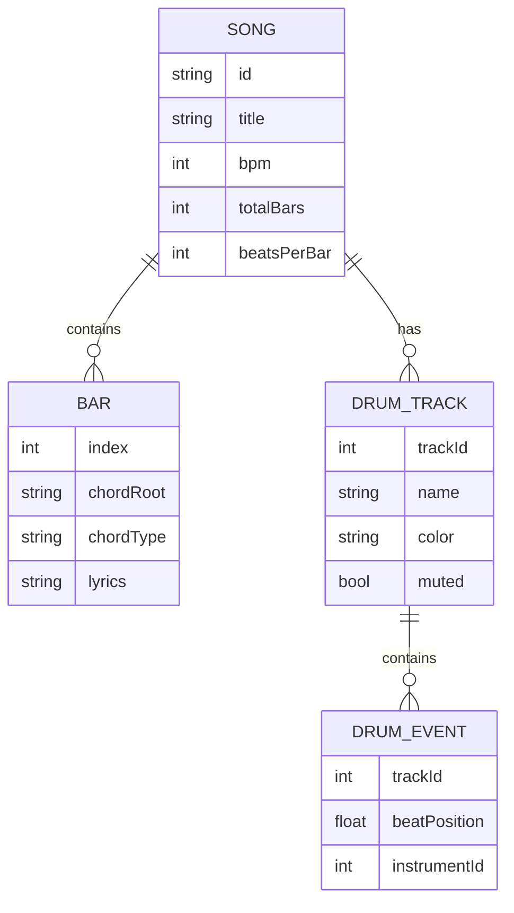

## 1. 架构设计



## 2. 技术说明
- **前端**：React@18 + TypeScript@5 + Vite@5
- **初始化工具**：Vite
- **后端**：Express@4（提供静态文件服务，可扩展为协作后端）
- **音频引擎**：Web Audio API 原生实现，无需外部音频文件
- **状态管理**：useReducer 管理复杂歌曲状态（小节、和弦、歌词、节奏轨道）
- **样式方案**：原生 CSS + CSS 变量，无 UI 库依赖

## 3. 路由定义
| 路由 | 用途 |
|-----|------|
| / | 主创作页（单页应用唯一入口） |

## 4. API 定义（后端）
| 路由 | 方法 | 说明 |
|-----|------|------|
| / | GET | 返回 index.html |
| /\* | GET | 静态资源服务（Vite 开发模式下由 Vite dev server 处理） |

## 5. 数据模型

### 5.1 数据模型定义



### 5.2 TypeScript 类型定义

```typescript
// 和弦根音
type ChordRoot = 'C' | 'C#' | 'D' | 'D#' | 'E' | 'F' | 'F#' | 'G' | 'G#' | 'A' | 'A#' | 'B';

// 和弦类型
type ChordType = 'major' | 'minor' | 'dim' | 'aug' | 'maj7' | 'min7' | '7';

// 小节数据
interface Bar {
  index: number;
  chordRoot: ChordRoot | null;
  chordType: ChordType | null;
  lyrics: string;
}

// 打击乐事件
interface DrumEvent {
  id: string;
  trackId: number;
  beatPosition: number;
  instrumentId: number;
}

// 节奏轨道
interface DrumTrack {
  id: number;
  name: string;
  color: string;
  muted: boolean;
}

// 歌曲状态
interface SongState {
  id: string;
  title: string;
  bpm: number;
  totalBars: number;
  beatsPerBar: number;
  bars: Bar[];
  drumTracks: DrumTrack[];
  drumEvents: DrumEvent[];
  isPlaying: boolean;
  isRecording: boolean;
  currentBeat: number;
  recordingTrackId: number | null;
}
```

## 6. 项目文件结构

```
project-root/
├── package.json
├── index.html
├── tsconfig.json
├── vite.config.js
├── server/
│   └── index.js          # Express 服务端
└── src/
    ├── main.tsx          # React 入口
    ├── App.tsx           # 主应用组件 (useReducer)
    ├── styles.css        # 全局样式
    ├── components/
    │   ├── Timeline.tsx      # 时间轴组件
    │   └── ChordEditor.tsx   # 和弦编辑弹窗
    └── audio/
        └── AudioEngine.ts    # 音频引擎单例
```
