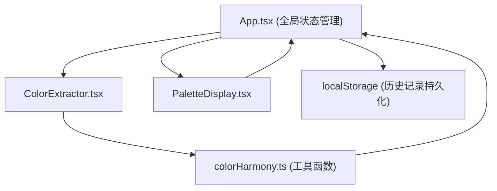

## 1. 架构设计



## 2. 技术描述

- **前端框架**：React@18 + TypeScript@5
- **构建工具**：Vite@5 + @vitejs/plugin-react
- **状态管理**：React useState/useEffect（轻量级场景，无需额外状态库）
- **样式方案**：原生 CSS + CSS Variables（无 CSS 框架，保持简约）
- **颜色处理**：Canvas API getImageData + 自定义 K-means 聚类算法
- **持久化**：localStorage 存储历史记录

## 3. 目录结构

```
src/
├── main.tsx              # React 入口，渲染 App，初始化全局状态
├── App.tsx               # 根组件，状态管理，布局容器
├── components/
│   ├── ColorExtractor.tsx   # 图片上传 + 颜色提取组件
│   └── PaletteDisplay.tsx   # 配色展示 + 交互组件
└── utils/
    └── colorHarmony.ts      # 配色算法工具函数
```

**数据流：**
`ColorExtractor (File → 主色数组)` → `colorHarmony (主色+参数 → 配色方案)` → `App (state)` → `PaletteDisplay (渲染+交互)`

## 4. 核心数据类型

```typescript
// 单个颜色
interface ColorItem {
  hex: string;
  rgb: { r: number; g: number; b: number };
  hsl: { h: number; s: number; l: number };
}

// 配色方案
interface Palette {
  name: string;           // 方案名称：单色/互补/三角/分裂互补
  mode: 'mono' | 'complementary' | 'triadic' | 'split-complementary';
  colors: ColorItem[];    // 5 个色块
}

// 调整参数
interface AdjustParams {
  hueShift: number;       // -180 ~ 180
  saturation: number;     // 0 ~ 100
}

// 历史记录
interface HistoryItem {
  id: string;
  timestamp: number;
  baseColors: ColorItem[];
  palettes: Palette[];
}
```

## 5. 性能优化策略

- **颜色提取**：Canvas 缩放到最大 200px 后再采样，K-means 迭代上限 20 次
- **调色板更新**：纯函数计算，避免不必要的重渲染
- **动画**：CSS transform/opacity 硬件加速，保持 60FPS
- **历史记录**：防抖写入 localStorage，最多保留 5 条
