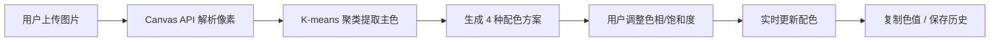

## 1. 产品概述

交互式配色方案生成器，帮助创意设计师快速从图片中提取主色调并生成协调配色组合。

- 解决传统设计工具缺乏配色自动提取和智能调整功能的痛点，目标用户为创意设计师、UI/UX 设计师
- 产品价值：通过自动化颜色提取和智能配色算法，大幅提升设计师的配色效率和方案质量

## 2. 核心功能

### 2.1 功能模块

1. **图片上传与颜色提取**：支持 PNG/JPEG 图片上传，自动提取 5 个主要颜色
2. **配色方案生成**：基于提取主色生成多种协调配色方案（单色、互补、三角、分裂互补）
3. **手动调整**：色相偏移滑块（-180°~180°）和饱和度滑块（0%~100%）实时调整
4. **色值复制**：点击色块复制 HEX 值到剪贴板，带复制成功动画反馈
5. **历史记录**：保存最近 5 次配色方案，localStorage 持久化，支持一键恢复

### 2.2 页面详情

| 页面名称 | 模块名称 | 功能描述 |
|-----------|-------------|---------------------|
| 主页面 | 图片上传区 | 拖拽上传/点击上传图片，虚线边框+拖拽高亮动画 |
| 主页面 | 历史记录列表 | 展示最近 5 条配色历史，点击恢复 |
| 主页面 | 主色展示区 | 展示从图片提取的 5 个主色及 HEX 值 |
| 主页面 | 配色方案区 | Tab 切换 4 种配色模式，滑动切换动画 |
| 主页面 | 调整控制区 | 色相/饱和度滑块，带渐变轨道 |

## 3. 核心流程

用户上传图片 → Canvas API 解析像素数据 → K-means 聚类提取 5 个主色 → 基于主色生成 4 种配色方案 → 用户通过滑块调整色相/饱和度 → 实时更新配色方案 → 点击色块复制色值 / 保存到历史记录

## 4. 用户界面设计

### 4.1 设计风格

- **主色调**：深色背景 `#1e1e2e`，搭配高饱和度亮色作为色块
- **按钮风格**：圆角设计，悬停微放大效果
- **字体**：现代无衬线字体，标题醒目、正文清晰
- **布局风格**：左右分栏（桌面端）、上下布局（移动端 <768px）
- **动画**：方案切换 0.3s ease-out 滑动、色块悬停 1.05 倍放大、复制反馈 0.5s 渐隐

### 4.2 页面设计概述

| 页面名称 | 模块名称 | UI 元素 |
|-----------|-------------|-------------|
| 主页面 | 图片上传区 | 虚线边框、拖拽高亮、上传图标、提示文字 |
| 主页面 | 历史列表 | 水平排列小色块组、悬停高亮、点击恢复 |
| 主页面 | 配色展示区 | Tab 切换栏、色块网格、HEX 值标签、tooltip |
| 主页面 | 滑块控制区 | 渐变轨道滑块、数值显示、标签 |

### 4.3 响应式

- 桌面端（≥768px）：左右分栏布局，左侧上传区+历史，右侧配色展示
- 移动端（<768px）：上下堆叠布局，上传区在上，配色区在下
- 触控优化：色块点击区域 ≥44px，滑块触控友好
