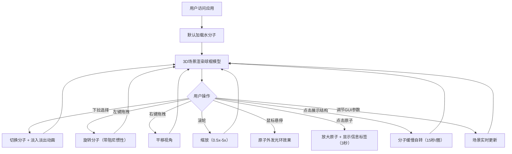

## 1. 产品概述
基于Web的交互式分子结构3D可视化应用，让用户直观地浏览常见化学分子的三维球棍模型，通过丰富的交互手段（旋转、缩放、悬停、点击）深入了解分子结构与原子信息。
- 面向化学学习者、教育工作者和科学爱好者，提供沉浸式的分子结构探索体验
- 无需安装任何客户端软件，在现代浏览器中即可获得高质量的3D渲染效果

## 2. 核心功能

### 2.1 功能模块
1. **3D分子可视化主场景**：球棍模型渲染、光照系统、雾效、辅助网格
2. **分子切换模块**：右上角下拉菜单选择5种内置分子，0.5秒淡入淡出过渡动画
3. **鼠标交互模块**：左键旋转、右键平移、滚轮缩放、悬停发光、点击显示标签
4. **底部信息栏模块**：显示分子名称、化学式、原子总数，自动旋转开关
5. **参数控制面板**：dat.GUI调节环境光强度、点光源位置、原子发光强度

### 2.2 页面详情
| 页面名称 | 模块名称 | 功能描述 |
|-----------|-------------|---------------------|
| 主页面 | 3D渲染Canvas | 全屏Three.js场景，渲染分子球棍模型，深空蓝黑渐变背景 |
| 主页面 | 分子选择下拉菜单 | 右上角位置，切换5种内置分子（H₂O、CH₄、CO₂、C₆H₆、C₆H₁₂O₆） |
| 主页面 | 底部信息栏 | 半透明黑底，显示分子名称、化学式、原子总数，"展示结构"按钮控制自转 |
| 主页面 | 左侧控制面板 | dat.GUI面板，实时调节场景光照与发光参数 |
| 主页面 | 原子交互标签 | 点击原子弹出，显示原子名称与相对原子质量，3秒后自动消失 |

## 3. 核心流程
用户打开应用后，默认加载水分子模型。用户可通过下拉菜单切换不同分子，观察模型淡入淡出动画。通过鼠标拖拽旋转、平移、缩放从不同角度观察分子结构。鼠标悬停在原子上时看到发光提示，点击原子查看详细信息。通过底部信息栏可开启分子自动旋转，通过左侧面板调节视觉参数。

## 4. 用户界面设计

### 4.1 设计风格
- **主色调**：深空蓝黑渐变（#0a0e27 → #1a1a3a）作为场景背景
- **原子配色**：碳#555555（灰）、氧#FF0000（红）、氢#FFFFFF（白）、氮#0000FF（蓝）
- **化学键**：灰色半透明圆柱体
- **信息栏**：半透明黑色rgba(0,0,0,0.6)，字色浅灰色，14px sans-serif字体，圆角8px
- **控制面板**：dat.GUI默认深色风格
- **整体氛围**：科技感、沉浸式、简洁专业的科学可视化风格

### 4.2 页面设计概述
| 页面名称 | 模块名称 | UI元素 |
|-----------|-------------|-------------|
| 主页面 | 3D场景 | 全屏Canvas、深空蓝黑渐变背景、雾效（密度0.02）、底部辅助网格（半径10、分割20、淡灰#444） |
| 主页面 | 分子模型 | 原子球体（Phong材质带光泽、半径0.4-0.8）、化学键圆柱体（半透明灰） |
| 主页面 | 光照系统 | 环境光（强度0.5）+ 方向光（右上角、强度0.8）+ 可调点光源 |
| 主页面 | 右上角下拉菜单 | 深色半透明背景，白色文字，hover高亮 |
| 主页面 | 底部信息栏 | 左对齐文字展示分子信息，右侧按钮控制自转，内边距10px 15px |
| 主页面 | 原子悬停效果 | 原子颜色一致的发光环（半径+0.1，透明度0.5） |
| 主页面 | 原子点击效果 | 原子放大1.2倍，弹出浮动标签显示名称与原子量 |

### 4.3 响应性
- 桌面端优先设计，Canvas自适应窗口大小
- 鼠标交互完全支持（左键/右键/滚轮）
- 窗口resize时自动调整渲染尺寸与相机比例

### 4.4 3D场景指导
- **环境与氛围**：深空蓝黑渐变背景配合指数雾效（密度0.02），营造深邃的科学探索空间感
- **光照设置**：柔和环境光（0.5）作为基础照明，主方向光从右上角照射（强度0.8）产生立体感，可调点光源增强局部高光
- **相机设置**：PerspectiveCamera，初始距离使分子完整可见，OrbitControls提供旋转/平移/缩放
- **交互与动画**：旋转阻尼惯性（0.1秒），分子切换0.5秒淡入淡出，点击原子缩放动画，自动旋转15秒/圈
- **性能预算**：最多100原子场景稳定60FPS，分子切换重建时间<500ms
