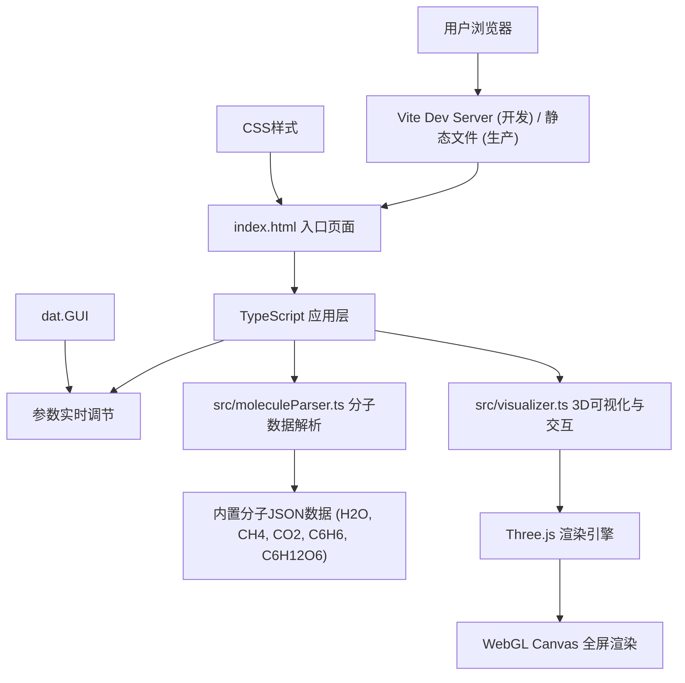

## 1. 架构设计



## 2. 技术说明
- **前端框架**：无框架纯TypeScript，直接调用Three.js API
- **3D引擎**：Three.js (r160+)，使用OrbitControls实现相机交互
- **构建工具**：Vite 5.x，提供快速热更新与ES模块支持
- **语言**：TypeScript 5.x，严格模式(strict)，目标ES2020，模块ESNext
- **UI组件**：dat.GUI用于参数控制面板
- **样式**：原生CSS，内联于index.html中，无额外CSS框架

## 3. 文件结构
| 文件路径 | 用途 |
|-------|---------|
| package.json | 项目依赖：three, @types/three, vite, typescript, dat.gui；启动脚本：npm run dev |
| index.html | 入口页面：全屏Canvas容器、右上角下拉菜单、底部信息栏、内联CSS样式 |
| tsconfig.json | TypeScript配置：严格模式、target ES2020、module ESNext |
| vite.config.js | Vite基础构建配置 |
| src/main.ts | 主入口：初始化Three.js场景/相机/渲染器、整合分子数据、启动动画循环、管理GUI参数 |
| src/moleculeParser.ts | 分子解析模块：内置5种分子结构JSON数据，解析生成原子位置/半径/颜色/化学键信息 |
| src/visualizer.ts | 可视化模块：创建原子球体(Phong材质)和化学键圆柱体，管理点击/悬停交互、标签显示、淡入淡出动画 |

## 4. 数据模型

### 4.1 分子数据结构
```typescript
interface AtomData {
  element: string;      // 元素符号: C, O, H, N
  position: [number, number, number];  // 三维坐标 [x, y, z]
}

interface BondData {
  atomIndex1: number;   // 第一个原子索引
  atomIndex2: number;   // 第二个原子索引
}

interface MoleculeData {
  name: string;         // 分子中文名: 水、甲烷等
  formula: string;      // 化学式: H2O、CH4等
  atoms: AtomData[];
  bonds: BondData[];
}
```

### 4.2 元素属性配置
```typescript
const ELEMENT_PROPERTIES: Record<string, {
  color: string;     // 十六进制颜色
  radius: number;    // 球体半径 0.4-0.8
  name: string;      // 中文名称
  mass: number;      // 相对原子质量
}> = {
  C: { color: '#555555', radius: 0.7, name: '碳', mass: 12.01 },
  O: { color: '#FF0000', radius: 0.66, name: '氧', mass: 16.00 },
  H: { color: '#FFFFFF', radius: 0.4, name: '氢', mass: 1.008 },
  N: { color: '#0000FF', radius: 0.65, name: '氮', mass: 14.01 }
};
```

### 4.3 内置分子坐标
- **H₂O（水）**：O在原点，两个H呈104.5°键角，键长0.96Å（映射为~1.0单位）
- **CH₄（甲烷）**：C在中心，4个H构成正四面体
- **CO₂（二氧化碳）**：C在中心，两个O在两侧线性排列
- **C₆H₆（苯）**：6个C构成平面正六边形，每个C连接一个H
- **C₆H₁₂O₆（葡萄糖）**：简化的六元环结构，含C/H/O原子

## 5. 核心模块设计

### 5.1 MoleculeParser 模块
- `getMoleculeList()`: 返回所有内置分子名称列表
- `parseMolecule(name: string)`: 根据名称解析并返回MoleculeData
- 内置5种分子的原子坐标与化学键数据

### 5.2 Visualizer 模块
- `constructor(scene: THREE.Scene, camera: THREE.PerspectiveCamera, renderer: THREE.WebGLRenderer)`
- `loadMolecule(data: MoleculeData)`: 加载分子并创建球棍模型，带0.5秒淡入淡出
- `update(deltaTime: number)`: 每帧更新，处理悬停发光、自转、阻尼、标签超时
- `handleMouseMove(event: MouseEvent)`: 射线检测原子悬停
- `handleClick(event: MouseEvent)`: 射线检测原子点击，显示标签
- `setAutoRotate(enabled: boolean)`: 控制分子自动旋转
- `setEmissiveIntensity(intensity: number)`: 设置原子发光强度
- `dispose()`: 清理Three.js资源

### 5.3 Main 主程序
- 初始化Three.js场景：FogExp2、环境光、方向光、点光源、GridHelper
- 创建OrbitControls：enableDamping=true, dampingFactor=0.05, minDistance=3, maxDistance=30
- 搭建UI：下拉菜单、信息栏、dat.GUI面板
- 启动requestAnimationFrame循环，调用visualizer.update()

## 6. 关键实现要点

### 6.1 化学键圆柱体生成
两个原子A和B之间创建圆柱体：计算中点位置、向量方向、四元数旋转，使圆柱体沿AB方向对齐，高度为AB距离，半径0.1。

### 6.2 Raycaster交互
使用THREE.Raycaster进行鼠标拾取。鼠标事件时将屏幕坐标归一化为NDC坐标(-1~1)，射线与所有原子Mesh求交。

### 6.3 淡入淡出动画
切换分子时：当前分子组opacity从1→0（0.25秒），然后替换Mesh对象，新分子opacity从0→1（0.25秒）。使用THREE.MeshPhongMaterial的transparent与opacity属性。

### 6.4 原子标签
点击原子时在2D层创建浮动div标签，通过project()将原子3D坐标投影到屏幕坐标，设置div位置。标签3秒后自动移除。

### 6.5 性能优化
- 原子球体使用共享的SphereGeometry（按半径分组）
- 化学键使用共享的CylinderGeometry
- 材质尽量复用，减少GPU状态切换
- 射线检测时只对原子Mesh数组求交，不对整个场景
