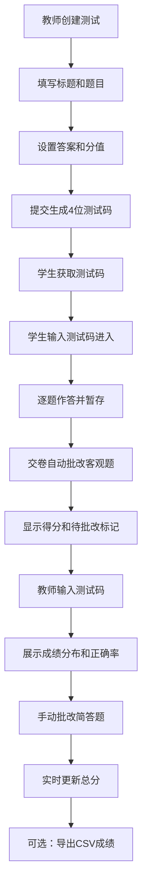

## 1. 产品概述

在线随堂测验与成绩分析看板是一款面向教育机构和教师的轻量级测验工具，帮助教师快速创建包含多种题型的随堂测试，学生在线作答后系统自动批改客观题并展示得分，教师端即时查看全班成绩分布。

- 核心用途：课堂测验、作业评估、成绩统计分析
- 目标用户：教师（创建测试、查看成绩）、学生（参与测试作答）
- 核心价值：简化测验创建流程，自动批改节省时间，实时数据可视化助力教学决策

## 2. 核心功能

### 2.1 用户角色

| 角色 | 使用方式 | 核心权限 |
|------|----------|----------|
| 教师 | 直接进入功能页 | 创建测试、管理题目、查看成绩看板、手动批改简答题、导出成绩CSV |
| 学生 | 通过测试码进入 | 输入测试码、逐题作答、暂存答案、提交试卷、查看得分 |

### 2.2 功能模块

1. **创建测试页面**：教师填写测试标题、添加多种题型（选择/判断/简答）、设置答案和分值，生成4位测试码
2. **参加测试页面**：学生输入测试码进入，逐题作答支持暂存回退，交卷后显示客观题得分
3. **成绩看板页面**：教师查看全班成绩分布直方图、每题正确率、学生列表、手动批改简答题、导出成绩CSV

### 2.3 页面详情

| 页面名称 | 模块名称 | 功能描述 |
|----------|----------|----------|
| 创建测试 | 标题输入 | 限制最多50字，必填校验 |
| 创建测试 | 题目管理 | 添加5-10题，支持选择/判断/简答三种题型，每题2分 |
| 创建测试 | 选择题型 | 单选A/B/C/D四个选项，设置正确选项字母 |
| 创建测试 | 判断题型 | 对/错两个选项，设置正确答案 |
| 创建测试 | 简答题型 | 文本输入框，填写参考答案 |
| 创建测试 | 测试码生成 | 提交后生成4位数字测试码并展示 |
| 参加测试 | 测试码输入 | 输入4位数字进入作答 |
| 参加测试 | 逐题作答 | 单页一题，下一题时暂存答案，可回退修改 |
| 参加测试 | 交卷评分 | 客观题自动评分，简答题显示待批改黄色标记 |
| 成绩看板 | 测试码输入 | 输入测试码查看对应测试统计 |
| 成绩看板 | 分数分布柱状图 | x轴分数段（0-10、11-20...），y轴人数，渐变色柱体，悬停弹窗 |
| 成绩看板 | 正确率条形图 | 每题正确率，低于60%红色闪烁边框，按正确率排序 |
| 成绩看板 | 学生列表 | 学生姓名/编号、客观题得分、待批改简答题数 |
| 成绩看板 | 简答题批改 | 手动输入0-2分，实时更新总分 |
| 成绩看板 | CSV导出 | 导出所有学生成绩，含进度条动画 |

## 3. 核心流程

### 3.1 教师创建测试流程
教师填写测试标题 → 添加多道题目（选择/判断/简答）→ 设置每题正确答案和分值 → 提交创建 → 后端生成4位测试码 → 显示测试码供分享

### 3.2 学生作答流程
学生输入4位测试码 → 加载题目 → 逐题作答（可暂存回退）→ 完成后点击交卷 → 系统自动批改选择/判断题 → 显示得分和待批改标记

### 3.3 教师查看成绩流程
教师输入测试码 → 加载全班提交数据 → 展示分数分布直方图和正确率条形图 → 查看学生列表 → 手动批改简答题（0-2分）→ 实时更新总分 → 可导出CSV

### 3.4 核心流程图

## 4. 用户界面设计

### 4.1 设计风格

- 主色调：蓝色 `#3498db`（导航高亮、选中状态）、绿色 `#2ecc71`（交卷按钮、高分柱体）、红色 `#e74c3c`（低分柱体、低正确率）
- 按钮风格：圆角设计，交卷按钮使用绿色渐变（`#2ecc71` 到 `#27ae60`），点击时脉冲动画
- 字体：系统默认无衬线体
- 布局风格：卡片式布局 + 左侧200px导航栏 + 白色主体区域
- 图标风格：使用 lucide-react 图标库

### 4.2 页面设计概览

| 页面名称 | 模块名称 | UI元素 |
|----------|----------|--------|
| 创建测试 | 整体布局 | 左侧导航+右侧卡片表单 |
| 创建测试 | 标题输入 | 圆角输入框，字符计数提示 |
| 创建测试 | 题目卡片 | 12px圆角，轻微阴影，悬停加深阴影并上移2px（0.2s过渡） |
| 创建测试 | 选择题选项 | 圆形单选按钮，选中时蓝色实心+白色勾号 |
| 创建测试 | 判断选项 | 圆形单选按钮，对/错两个选项 |
| 创建测试 | 简答题输入 | 淡黄色背景 `#fffbe6` + 虚线边框 |
| 创建测试 | 测试码展示 | 大号字体4位数字，醒目展示 |
| 参加测试 | 作答区域 | 单题卡片，下一题/上一题导航按钮 |
| 参加测试 | 得分展示 | 客观题得分大号字体，待批改黄色标记 |
| 成绩看板 | 分数分布柱状图 | x轴分数段，y轴人数，红→绿渐变色，悬停弹窗 |
| 成绩看板 | 正确率条形图 | 每题条形，低于60%红色闪烁边框（1s交替） |
| 成绩看板 | 学生列表 | 表格布局，简答题可点击批改 |
| 成绩看板 | CSV导出 | 按钮+进度条动画（0.5s完成） |

### 4.3 响应式设计

- 桌面端优先设计
- 视口宽度 < 768px 时：成绩图表从并排变为上下堆叠，图内文字从14px缩小到12px
- 移动端适配卡片宽度和导航栏显示

### 4.4 动画与交互

- 卡片悬停：阴影加深 `0 4px 16px rgba(0,0,0,0.12)` 并上移2px，0.2s ease过渡
- 交卷按钮：点击时0.15s脉冲动画
- 低正确率条形：1s亮暗交替闪烁红色边框
- CSV导出：0.5s进度条动画
- 全局消息通知区域在 index.html 中预留
