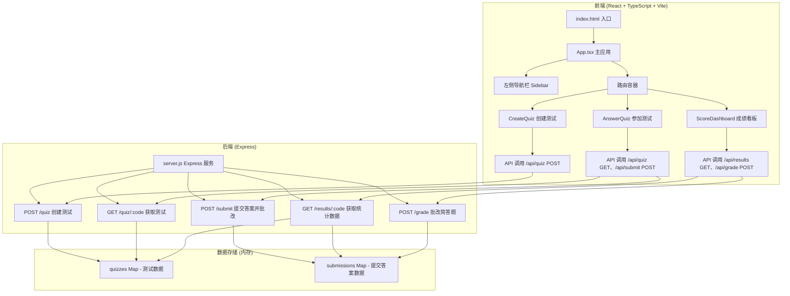
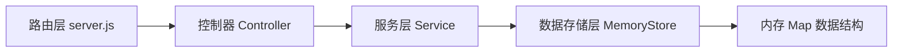
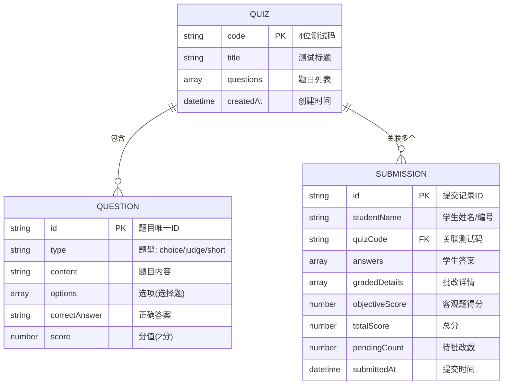

## 1. 架构设计



## 2. 技术说明

- 前端：React@18 + TypeScript + Vite + @vitejs/plugin-react
- 初始化工具：npm init vite-init
- 后端：Express@4
- 数据存储：内存存储（Map 对象），使用 uuid 生成唯一ID
- 状态管理：React useState + useEffect（轻量级场景，无需额外状态管理库）

## 3. 路由定义

| 前端路由 | 页面组件 | 用途 |
|----------|----------|------|
| /create | CreateQuiz.tsx | 教师创建测试页面 |
| /answer | AnswerQuiz.tsx | 学生参加测试页面 |
| /dashboard | ScoreDashboard.tsx | 教师成绩看板页面 |
| / | 重定向到 /create | 默认首页 |

## 4. API 定义

### 4.1 POST /api/quiz - 创建测试

**请求体：**
```typescript
interface CreateQuizRequest {
  title: string;
  questions: Question[];
}

type QuestionType = 'choice' | 'judge' | 'short';

interface Question {
  id: string;
  type: QuestionType;
  content: string;
  options?: string[];  // 选择题：A/B/C/D 四个选项
  correctAnswer: string;  // 选择：A/B/C/D，判断：T/F，简答：参考答案文本
  score: number;  // 每题2分
}
```

**响应体：**
```typescript
interface CreateQuizResponse {
  success: boolean;
  code: string;  // 4位数字测试码
  message?: string;
}
```

### 4.2 GET /api/quiz/:code - 获取测试

**响应体：**
```typescript
interface GetQuizResponse {
  success: boolean;
  quiz?: {
    code: string;
    title: string;
    questions: Question[];
  };
  message?: string;
}
```

### 4.3 POST /api/submit - 提交答案

**请求体：**
```typescript
interface SubmitAnswerRequest {
  quizCode: string;
  studentName: string;
  answers: {
    questionId: string;
    answer: string;
  }[];
}
```

**响应体：**
```typescript
interface SubmitAnswerResponse {
  success: boolean;
  submissionId?: string;
  objectiveScore?: number;  // 客观题得分
  totalQuestions?: number;
  gradedDetails?: {
    questionId: string;
    type: QuestionType;
    isCorrect?: boolean;  // 客观题
    score?: number;  // 得分
    needsGrading?: boolean;  // 简答题待批改
  }[];
  message?: string;
}
```

### 4.4 GET /api/results/:code - 获取统计数据

**响应体：**
```typescript
interface GetResultsResponse {
  success: boolean;
  quiz?: {
    title: string;
    code: string;
    questions: Question[];
  };
  submissions?: Submission[];
  statistics?: {
    scoreDistribution: { range: string; count: number }[];  // 0-10, 11-20 等
    questionAccuracy: { questionId: string; accuracy: number; correctCount: number; totalCount: number }[];
  };
  message?: string;
}

interface Submission {
  id: string;
  studentName: string;
  quizCode: string;
  answers: { questionId: string; answer: string }[];
  gradedDetails: {
    questionId: string;
    type: QuestionType;
    isCorrect?: boolean;
    score: number;
    needsGrading: boolean;
  }[];
  objectiveScore: number;
  totalScore: number;
  pendingCount: number;  // 待批改简答题数
}
```

### 4.5 POST /api/grade - 批改简答题

**请求体：**
```typescript
interface GradeRequest {
  submissionId: string;
  questionId: string;
  score: number;  // 0-2 分
}
```

**响应体：**
```typescript
interface GradeResponse {
  success: boolean;
  submission?: Submission;
  message?: string;
}
```

## 5. 服务器架构



由于是轻量级应用，后端逻辑统一在 `src/server.js` 中实现，采用内存存储，结构如下：

- 内存数据：`quizzes` Map（key: 测试码，value: Quiz 对象）、`submissions` 数组
- 路由处理：直接在 Express 路由中处理请求
- 业务逻辑：包含在路由回调函数中

## 6. 数据模型

### 6.1 数据模型定义



### 6.2 数据流说明

1. 创建测试流程：前端 CreateQuiz 组件 → 表单验证 → POST /api/quiz → 后端生成4位测试码 → 存入 quizzes Map → 返回测试码 → 前端展示

2. 学生作答流程：前端 AnswerQuiz 组件 → 输入测试码 → GET /api/quiz/:code → 获取题目 → 逐题作答暂存(本地状态) → 提交 POST /api/submit → 后端自动批改客观题 → 返回得分 → 前端展示

3. 成绩统计流程：前端 ScoreDashboard → 输入测试码 → GET /api/results/:code → 后端汇总 submissions → 计算分数分布和正确率 → 返回统计数据 → 前端渲染柱状图和条形图

4. 批改简答题流程：前端点击简答题 → 输入0-2分 → POST /api/grade → 后端更新 submission → 重新计算总分 → 返回更新后数据 → 前端列表实时更新

## 7. 项目文件结构与调用关系

```
auto41/
├── package.json              # 项目依赖配置
├── vite.config.js            # Vite 配置（含API代理）
├── tsconfig.json             # TypeScript 配置
├── index.html                # HTML 入口
├── src/
│   ├── main.tsx              # React 入口文件
│   ├── App.tsx               # 主应用组件（路由、导航布局）
│   ├── types/
│   │   └── index.ts          # TypeScript 类型定义
│   ├── components/
│   │   ├── Sidebar.tsx       # 左侧导航栏组件（被App调用）
│   │   ├── CreateQuiz.tsx    # 创建测试组件（页面路由）
│   │   ├── AnswerQuiz.tsx    # 参加测试组件（页面路由）
│   │   └── ScoreDashboard.tsx # 成绩看板组件（页面路由）
│   ├── utils/
│   │   └── api.ts            # API 请求封装工具函数
│   ├── styles/
│   │   └── global.css        # 全局样式
│   └── server.js             # Express 后端服务
```

### 调用关系说明：

- `index.html` → 加载 `main.tsx` → 渲染 `App.tsx`
- `App.tsx` → 包含 `Sidebar.tsx` 导航，根据路由渲染页面组件
- `CreateQuiz.tsx` → 调用 `api.ts` 中 `createQuiz()` → 请求 `POST /api/quiz`
- `AnswerQuiz.tsx` → 调用 `api.ts` 中 `getQuiz()` 和 `submitAnswers()` → 请求 `GET /api/quiz/:code` 和 `POST /api/submit`
- `ScoreDashboard.tsx` → 调用 `api.ts` 中 `getResults()` 和 `gradeQuestion()` → 请求 `GET /api/results/:code` 和 `POST /api/grade`
- `src/server.js` → 处理所有 API 请求，操作内存中的 quizzes 和 submissions 数据
