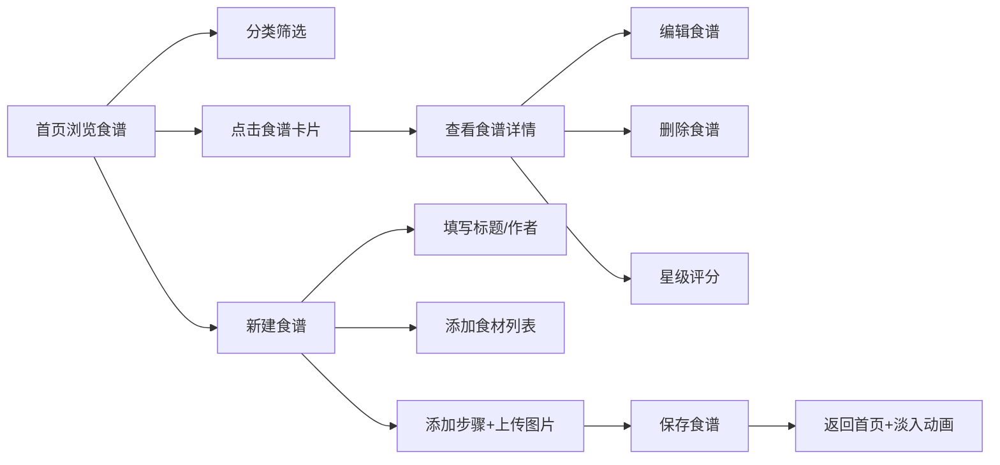

## 1. 产品概述

协同食谱编辑与分享应用，让用户创建、编辑和分享带有步骤图片和食材清单的精美食谱卡片。
- 面向家庭厨师、美食爱好者和食谱创作者
- 市场价值：降低食谱分享门槛，打造视觉化、结构化的美食内容社区

## 2. 核心功能

### 2.1 功能模块
1. **首页瀑布流**：食谱卡片瀑布流展示、分类筛选、星级评分、图片懒加载
2. **食谱编辑页**：标题/作者输入、动态食材列表、步骤拖拽排序、步骤图片上传
3. **食谱详情页**：大图展示、食材清单（可标记完成）、步骤时间线、评论区

### 2.2 页面详情
| 页面名称 | 模块名称 | 功能描述 |
|---------|---------|----------|
| 首页 | 导航栏 | 固定顶部、毛玻璃效果、分类标签筛选、新建按钮 |
| 首页 | 瀑布流卡片 | 2-3列自适应、圆角米色卡片、悬停上浮、懒加载缩略图、星级评分 |
| 编辑页 | 表单区域 | 标题/作者输入框、动态食材增删、步骤时间线（虚线连接）、步骤拖拽排序 |
| 编辑页 | 图片上传 | jpg/png格式、≤5MB、圆形进度条、后端压缩生成800px缩略图和60x60微缩图 |
| 详情页 | 头图区域 | 大尺寸首图、食谱标题、作者信息 |
| 详情页 | 食材清单 | 点击带删除线效果、可勾选状态 |
| 详情页 | 步骤展示 | 左右交替布局、编号标识、图片+文字说明 |
| 详情页 | 评论区 | 用户评论列表展示 |

## 3. 核心流程

用户在首页浏览食谱卡片 → 按分类筛选食谱 → 点击卡片查看详情 → 可编辑/删除食谱 → 点击"新建食谱"进入编辑页 → 填写信息并上传步骤图片 → 保存后返回首页，新卡片淡入滑入 → 可对食谱进行星级评分

## 4. 用户界面设计

### 4.1 设计风格
- **主色调**：暖色系配色方案 —— 米色(#faf3e0)、浅棕色(#d4a574)、暗金色(#b8860b)、深灰(#2c2c2c)
- **按钮风格**：圆角设计，点击时有涟漪扩散动画
- **字体**：系统无衬线体 font-family: -apple-system, sans-serif
- **布局风格**：卡片式布局，瀑布流排列，时间线步骤展示
- **动画**：页面切换淡入淡出(0.3s)、卡片悬停上浮(3px)、新建卡片从上方滑入淡入(0.4s)

### 4.2 页面设计概述
| 页面名称 | 模块名称 | UI元素 |
|---------|---------|--------|
| 首页 | 导航栏 | 毛玻璃backdrop-filter: blur(10px)、固定顶部、分类标签选中缩放反馈(0.2s) |
| 首页 | 瀑布流卡片 | border-radius: 16px、背景#faf3e0、阴影悬停效果、60x60微缩图、星级评分 |
| 编辑页 | 步骤时间线 | 浅棕色虚线连接步骤卡片、拖拽排序、每步骤可上传图片(最多5步) |
| 编辑页 | 上传进度 | 圆形进度条动画，显示百分比 |
| 详情页 | 食材清单 | 点击删除线效果，平滑过渡 |
| 详情页 | 步骤展示 | 文字与图片左右交替排列、步骤编号徽章 |

### 4.3 响应式设计
- Desktop-first 设计
- 瀑布流：大屏3列、中屏2列、小屏1列
- 导航栏分类标签在移动端可横向滚动
- 详情页步骤左右交替布局在移动端改为垂直堆叠

## 5. 性能要求
- 首页初始加载 &lt; 1秒（100条模拟数据）
- 图片懒加载使用 IntersectionObserver
- 滚动保持 60FPS
- 后端API响应 ≤ 200ms（10条并发请求内）
