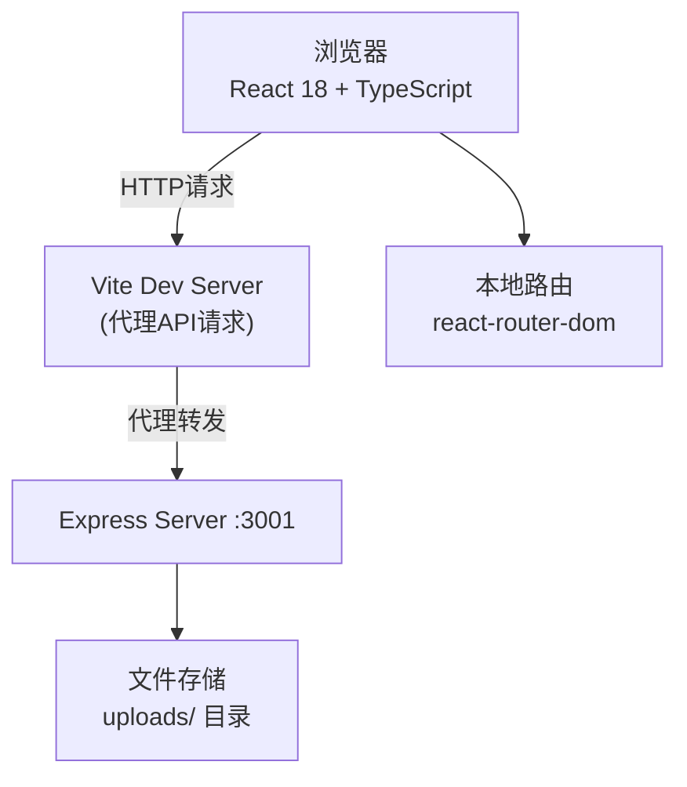
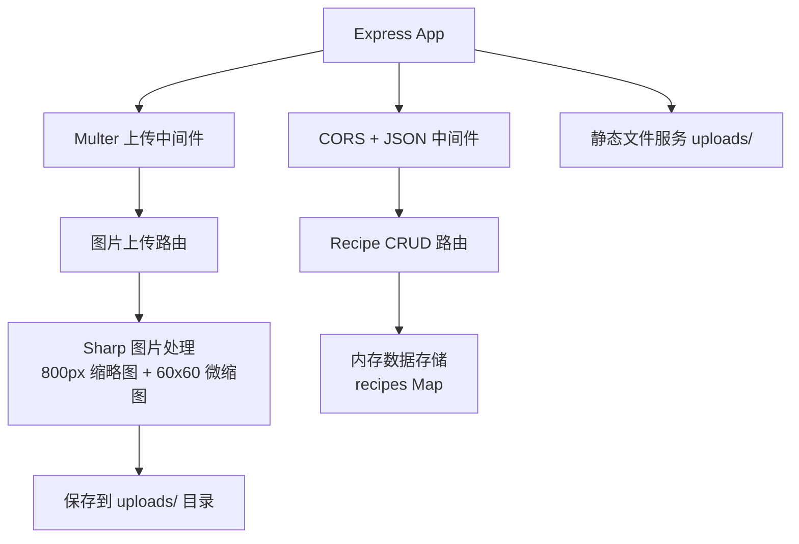

## 1. 架构设计



## 2. 技术描述

- **前端框架**：React 18 + TypeScript
- **构建工具**：Vite 5.x + @vitejs/plugin-react
- **后端服务**：Node.js + Express 4.x
- **图片处理**：multer(上传) + sharp(压缩/裁剪)
- **唯一ID**：uuid
- **路由管理**：React Router v6（前端）
- **样式方案**：原生 CSS Modules / CSS（无UI库，自定义样式）

## 3. 目录结构

```
.
├── package.json
├── vite.config.js
├── tsconfig.json
├── index.html
├── uploads/                    # 图片上传目录（运行时创建）
├── server/
│   └── index.ts               # Express 服务器
└── src/
    ├── main.tsx               # React 入口
    ├── App.tsx                # 主应用组件
    ├── types.ts               # 共享类型定义
    └── components/
        ├── RecipeCard.tsx     # 食谱卡片
        ├── RecipeEditor.tsx   # 食谱编辑器
        └── RecipeDetail.tsx   # 食谱详情页
```

## 4. 路由定义

| 路由 | 用途 |
|------|------|
| / | 首页：瀑布流展示所有食谱 |
| /editor | 新建食谱编辑页 |
| /editor/:id | 编辑已有食谱 |
| /recipe/:id | 食谱详情页 |

## 5. API 定义

### 5.1 类型定义
```typescript
interface Ingredient {
  id: string;
  name: string;
  quantity: string;
}

interface Step {
  id: string;
  description: string;
  imageUrl?: string;
  thumbnailUrl?: string;
}

interface Comment {
  id: string;
  author: string;
  content: string;
  createdAt: string;
}

interface Recipe {
  id: string;
  title: string;
  author: string;
  category: string;
  rating: number;
  ratingCount: number;
  ingredients: Ingredient[];
  steps: Step[];
  comments: Comment[];
  thumbnailUrl?: string;
  coverUrl?: string;
  createdAt: string;
  updatedAt: string;
}
```

### 5.2 RESTful API

| 方法 | 路径 | 说明 | 请求体 | 响应 |
|------|------|------|--------|------|
| GET | /api/recipes | 获取食谱列表（支持?category=筛选） | - | Recipe[] |
| GET | /api/recipes/:id | 获取单条食谱详情 | - | Recipe |
| POST | /api/recipes | 创建食谱 | Recipe(不含id) | Recipe |
| PUT | /api/recipes/:id | 更新食谱 | Recipe(部分) | Recipe |
| DELETE | /api/recipes/:id | 删除食谱 | - | {success: true} |
| POST | /api/recipes/:id/rating | 提交评分 | {rating: number} | {rating, ratingCount} |
| POST | /api/upload | 上传步骤图片 | multipart/form-data(field: image) | {imageUrl, thumbnailUrl} |

## 6. 服务端架构



## 7. 性能优化策略

- **图片懒加载**：IntersectionObserver 实现瀑布流图片懒加载
- **图片压缩**：上传时生成 800px 缩略图 + 60x60 微缩图，按需加载
- **CSS 动画**：使用 transform/opacity 保证 GPU 加速，60FPS
- **防抖**：分类筛选、评分操作防抖处理
- **内存缓存**：服务端内存存储，初始 100 条模拟数据
