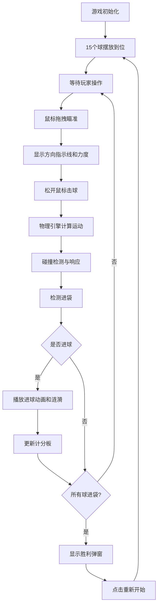

## 1. 产品概述

基于HTML Canvas的虚拟台球桌游戏，在浏览器中模拟真实的台球物理碰撞、反弹和进袋机制，让玩家通过鼠标拖拽体验类似现实台球的策略乐趣。

- 面向休闲游戏爱好者，提供简单易上手但富有策略深度的台球体验
- 无需安装插件，直接在现代浏览器中运行，实现轻量化的游戏体验

## 2. 核心功能

### 2.1 功能模块

1. **游戏主界面**：台球桌画布、力度计、计分板、重置按钮
2. **物理引擎**：球的位置/速度管理、弹性碰撞检测、摩擦衰减、进袋逻辑
3. **渲染系统**：桌面绘制、球体渲染（含高光和拖尾）、瞄准线、袋口涟漪动画
4. **交互系统**：鼠标拖拽击球、瞄准十字线、力度指示、音效反馈
5. **游戏状态**：进球记录、胜利判定、游戏重置

### 2.2 页面详情

| 页面名称 | 模块名称 | 功能描述 |
|---------|---------|---------|
| 游戏主页面 | 台球桌画布 | 900x450像素深绿色毛毡桌面，深棕色木质边框，6个球袋 |
| 游戏主页面 | 力度计 | 左侧圆形力度计，0-100%刻度，颜色从绿到红渐变 |
| 游戏主页面 | 计分板 | 右侧显示已进球列表，按球号排列，进高亮金色 |
| 游戏主页面 | 重置按钮 | 红色按钮，重置所有球到初始位置 |
| 游戏主页面 | 胜利弹窗 | 所有球进袋后显示，弹性缩放动画 |

## 3. 核心流程

## 4. 用户界面设计

### 4.1 设计风格

- **主色调**：深绿色毛毡 #1a5c2a，深棕色边框 #5c3a1a，深灰色背景 #2c2c2c
- **强调色**：红色重置按钮 #e74c3c（悬停 #c0392b），青色瞄准线，金色进球高亮
- **视觉风格**：拟物化台球桌，带有真实材质质感，微交互动画细腻
- **字体**：等宽数字字体用于计分板，简洁现代的无衬线字体用于UI文字

### 4.2 页面设计概述

| 页面名称 | 模块名称 | UI元素 |
|---------|---------|--------|
| 游戏主页面 | 台球桌 | 900x450像素画布，深绿色径向渐变桌面，棕色边框带立体阴影，6个黑色渐变球袋，球袋悬停发光 |
| 游戏主页面 | 球体 | 18像素直径，HSL色环配色，径向渐变高光，20像素半透明拖尾 |
| 游戏主页面 | 力度计 | 左侧圆形表盘，弧形刻度，指针随力度转动，颜色绿→红渐变 |
| 游戏主页面 | 计分板 | 右侧纵向排列15个球号，进球高亮金色，带数字编号 |
| 游戏主页面 | 重置按钮 | 圆角矩形红色按钮，悬停变色，点击缩放反馈 |
| 游戏主页面 | 胜利弹窗 | 半透明黑色遮罩，中央对话框，弹性缩放进入动画 |

### 4.3 响应式

- 桌面端优先设计，最小宽度800px
- 台球桌在窄屏时等比缩放，保持比例不变形
- 力度计和计分板跟随桌面等比缩放，保持布局平衡

### 4.4 动画与反馈

- 碰撞时0.1秒浅黄色闪烁 + Web Audio电子音效
- 进球时球缩小旋转落入袋中（0.3秒）+ 袋口水波涟漪（0.5秒）
- 胜利弹窗弹性缩放进入动画（0.4秒）
- 所有动画帧率不低于55FPS
