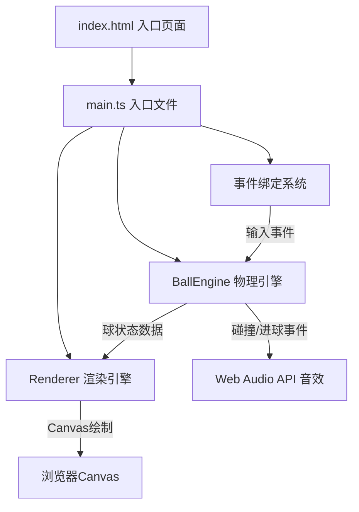

## 1. 架构设计



## 2. 技术描述

- **前端技术栈**：TypeScript + HTML5 Canvas + Vite
- **构建工具**：Vite 5.x
- **编程语言**：TypeScript（严格模式，ES2020目标）
- **模块系统**：ESNext
- **物理引擎**：自研2D弹性碰撞引擎
- **渲染方案**：原生Canvas 2D API
- **音频方案**：Web Audio API 生成电子音效
- **无后端依赖**：纯前端单页应用

## 3. 文件结构

| 文件路径 | 用途 |
|---------|------|
| `package.json` | 项目依赖和脚本配置 |
| `tsconfig.json` | TypeScript编译配置 |
| `vite.config.js` | Vite构建配置 |
| `index.html` | 入口HTML页面，包含布局容器 |
| `src/main.ts` | 应用入口，初始化画布、事件绑定、引擎实例 |
| `src/BallEngine.ts` | 物理引擎：球管理、碰撞检测、摩擦衰减、进袋逻辑 |
| `src/Renderer.ts` | 渲染引擎：桌面、球、拖尾、瞄准线、动画渲染 |

## 4. 核心数据模型

### 4.1 Ball（球体）

```typescript
interface Ball {
  id: number;           // 球号，0为母球
  x: number;            // X坐标
  y: number;            // Y坐标
  vx: number;           // X方向速度
  vy: number;           // Y方向速度
  radius: number;       // 半径（固定9px）
  color: string;        // HSL颜色
  isCue: boolean;       // 是否母球
  isPocketed: boolean;  // 是否已进袋
  trail: Array<{x: number; y: number}>; // 运动拖尾点
  pocketingAnim: number | null; // 进球动画进度 0-1
  flashTime: number;    // 碰撞闪烁剩余时间
  rotation: number;     // 旋转角度
}
```

### 4.2 Pocket（球袋）

```typescript
interface Pocket {
  x: number;
  y: number;
  radius: number;       // 15px
  hovered: boolean;
  ripple: number | null; // 涟漪动画进度 0-1
}
```

### 4.3 GameState（游戏状态）

```typescript
interface GameState {
  balls: Ball[];
  pockets: Pocket[];
  isAiming: boolean;
  aimStartX: number;
  aimStartY: number;
  aimCurrentX: number;
  aimCurrentY: number;
  power: number;        // 0-1
  pocketedBalls: number[]; // 已进球号列表
  gameWon: boolean;
  showVictory: boolean;
}
```

## 5. 物理引擎关键算法

### 5.1 碰撞检测
- 球-球：圆与圆距离检测，距离小于两半径之和则碰撞
- 球-桌边：边界检测，球中心到边距离小于半径则反弹
- 球-球袋：球中心到袋中心距离小于袋半径则判定进袋

### 5.2 碰撞响应
- 弹性碰撞：使用动量守恒和能量守恒公式
- 球-桌反弹：速度法向分量取反，乘以弹性系数0.98
- 摩擦衰减：每帧速度乘以系数 0.999（约每秒衰减5%）

### 5.3 运动积分
- 固定时间步长：使用 requestAnimationFrame 的 deltaTime
- 速度阈值：速度小于0.5像素/秒时判定为静止

## 6. 性能优化

- 仅渲染可见区域和活跃对象
- 拖尾使用固定长度数组（最多20个点）
- 碰撞检测使用空间分区（网格法）优化
- 静止球跳过物理计算
