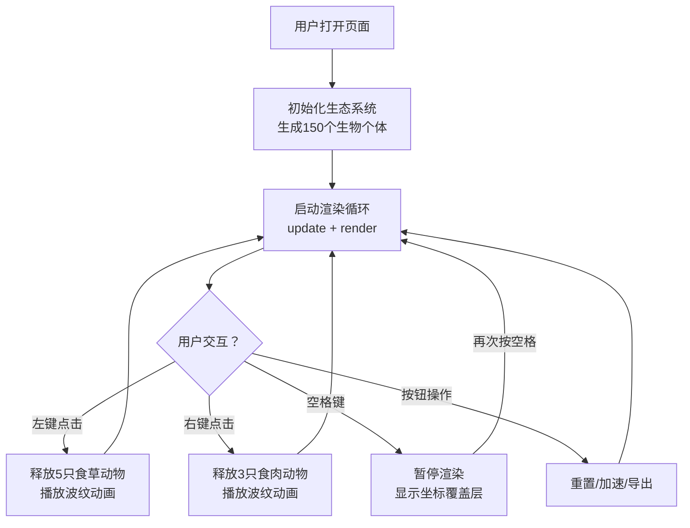

## 1. 产品概述

本产品是一个浏览器端的交互式动物行为生态系统沙盒，旨在让用户直观观察和理解简单生物链关系与群体行为涌现现象。通过Canvas实时渲染食草动物和食肉动物的互动，用户可以主动干预生态系统，观察动态演化过程。

- 主要目标：提供直观、可交互的生态模拟体验，帮助用户理解捕食关系和群体行为
- 目标用户：对生物行为学、复杂系统或编程可视化感兴趣的学习者、教育者、爱好者
- 产品价值：将抽象的生物链概念具象化，通过实时交互让用户亲身参与生态演化

## 2. 核心功能

### 2.1 用户角色
| 角色 | 注册方式 | 核心权限 |
|------|----------|----------|
| 普通用户 | 无需注册，直接使用 | 完整使用所有模拟功能 |

### 2.2 功能模块
1. **主画布区**：生态模拟画布、实时渲染所有生物个体及拖尾效果
2. **控制面板**：重置生态、加速时间、导出快照三个操作按钮
3. **统计面板**：实时显示总个体数、食草/食肉动物数量、捕食成功率
4. **交互系统**：鼠标点击释放生物、空格键暂停显示坐标列表
5. **视觉特效**：点击波纹动画、拖尾效果、数字过渡动画

### 2.3 页面详情
| 页面名称 | 模块名称 | 功能描述 |
|----------|----------|----------|
| 单页应用 | 生态画布 | 800x600深绿色草地背景，渲染150个随机分布生物个体及运动拖尾 |
| 单页应用 | 控制面板 | 三个功能按钮：重置生态、加速时间、导出快照 |
| 单页应用 | 统计数据 | 底部实时显示总个体数、食草动物数、食肉动物数、捕食成功率 |
| 单页应用 | 暂停覆盖层 | 半透明黑色遮罩，显示前50个个体坐标列表和继续提示 |
| 单页应用 | 交互响应 | 左键释放5只食草动物、右键释放3只食肉动物、空格键暂停/继续 |

## 3. 核心流程

用户进入页面 → 生态系统自动初始化（150个随机生物）→ 实时渲染运动状态与统计数据
→ 用户可通过以下方式交互：
  - 左键点击画布 → 释放5只食草动物（带波纹动画）
  - 右键点击画布 → 释放3只食肉动物（带波纹动画）
  - 按空格键 → 暂停并显示坐标列表覆盖层
  - 点击右侧按钮 → 重置/加速/导出

## 4. 用户界面设计

### 4.1 设计风格
- **主色调**：深绿色草地 #2d5a27，深灰色面板 #2a2a2a，白色文字
- **生物颜色**：食草动物绿色圆形，食肉动物红色圆形
- **按钮样式**：圆角矩形 border-radius:6px，悬停过渡0.2s，点击缩放0.95倍
- **字体**：全部使用 system-ui，颜色以白色为主
- **动效**：波纹扩散动画、数字淡入淡出过渡0.3s、拖尾半透明效果

### 4.2 页面设计概览
| 页面名称 | 模块名称 | UI元素 |
|----------|----------|--------|
| 单页应用 | 整体布局 | 左侧70%画布 + 右侧200px控制面板，紧凑协调 |
| 单页应用 | 画布区域 | 800x600深绿色背景，生物圆形带10px半透明拖尾 |
| 单页应用 | 控制面板 | 深灰背景，三个圆角矩形按钮垂直排列，悬停变色 |
| 单页应用 | 统计面板 | 底部横向排列四个统计项，数字变化带淡入淡出 |
| 单页应用 | 暂停覆盖层 | 半透明黑色背景，12px白色字体坐标列表，右下角提示文字 |

### 4.3 响应式
- 桌面端优先设计，固定布局（画布800x600，面板200px宽）
- 无需移动端适配，专注桌面浏览器体验

### 4.4 性能要求
- 150个个体时帧率稳定55FPS以上
- 单个个体移动计算不超过0.5ms
- 使用 Canvas 2D API 进行高效渲染
