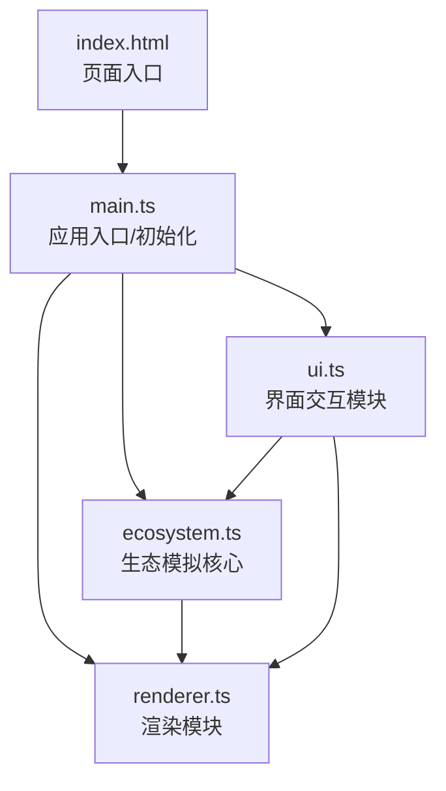

## 1. 架构设计

纯前端Canvas应用，采用模块化分层架构，无后端依赖。



## 2. 技术说明

- **前端框架**：原生 TypeScript（无React/Vue框架），直接操作 DOM 和 Canvas API
- **构建工具**：Vite@5，提供快速的开发服务器和构建能力
- **编程语言**：TypeScript@5，严格模式，目标 ES2020，模块 ESNext
- **渲染技术**：HTML Canvas 2D API，高效绘制大量圆形个体
- **状态管理**：无外部状态库，模块内部封装状态

## 3. 模块与文件结构

```
auto49/
├── package.json            # 项目依赖与脚本配置
├── vite.config.js          # Vite构建配置
├── tsconfig.json           # TypeScript编译配置（严格模式）
├── index.html              # 入口页面，包含画布容器和面板容器
└── src/
    ├── main.ts             # 应用入口，初始化画布和UI，启动主循环
    ├── ecosystem.ts        # 生态模拟核心：生物个体、位置、移动、捕食逻辑
    ├── renderer.ts         # 渲染模块：背景、个体、拖尾、波纹动画绘制
    └── ui.ts               # 界面模块：按钮事件、统计刷新、暂停覆盖层
```

### 模块说明

| 文件 | 职责 | 对外接口 |
|------|------|----------|
| main.ts | 应用初始化，主循环调度，模块装配 | - |
| ecosystem.ts | 管理所有生物个体数据，实现移动AI和捕食逻辑，统计追踪 | `update()`, `getStats()`, `addHerbivores(x, y, count)`, `addCarnivores(x, y, count)`, `reset()`, `setSpeedMultiplier()`, `getAllIndividuals()` |
| renderer.ts | 接收生态数据，执行所有Canvas绘制操作 | `render(ecosystem)`, `addRipple(x, y)`, `togglePause(paused)`, `exportPNG()` |
| ui.ts | DOM事件绑定，面板按钮处理，统计数据DOM更新，暂停覆盖层控制 | `init(ecosystem, renderer)`, `updateStats(stats)` |

## 4. 核心数据模型

### 4.1 生物个体 (Individual)
```typescript
interface Individual {
  id: number;
  type: 'herbivore' | 'carnivore';
  x: number;           // 画布X坐标
  y: number;           // 画布Y坐标
  vx: number;          // X方向速度
  vy: number;          // Y方向速度
  radius: number;      // 6px (食草) / 8px (食肉)
  color: string;       // 绿色 / 红色
  trail: {x: number; y: number}[];  // 最近位置历史，用于拖尾
}
```

### 4.2 统计数据 (Stats)
```typescript
interface Stats {
  total: number;          // 总个体数
  herbivores: number;     // 食草动物数量
  carnivores: number;     // 食肉动物数量
  huntAttempts: number;   // 追逐总次数
  huntSuccesses: number;  // 捕获成功次数
  huntSuccessRate: number; // 捕食成功率
}
```

### 4.3 波纹动画 (Ripple)
```typescript
interface Ripple {
  x: number;
  y: number;
  radius: number;    // 当前半径，从0增长到20px
  alpha: number;     // 当前透明度，从0.8衰减到0
  startTime: number; // 动画起始时间
  duration: number;  // 持续时间 600ms
}
```

## 5. 核心算法

### 5.1 食草动物移动AI
- 随机徘徊觅食：每帧在当前速度基础上叠加小幅随机扰动
- 速度限制：最大速度约 1-1.5 px/帧
- 边界处理：触碰画布边缘时反弹

### 5.2 食肉动物移动AI
- 搜索半径内最近的食草动物（搜索半径约 120px）
- 若发现目标：朝目标方向加速追逐
- 若无目标：随机徘徊
- 速度限制：最大速度约 1.5-2 px/帧（略快于食草动物）

### 5.3 捕食判定
- 食肉动物与食草动物距离 < 两者半径之和时判定捕获
- 被捕获的食草动物从生态系统移除
- 统计 huntSuccesses++

### 5.4 追逐统计
- 食肉动物进入追逐状态（发现目标并朝其移动）时 huntAttempts++

### 5.5 拖尾渲染
- 每个个体维护最近约10个历史位置
- 渲染时从历史位置依次绘制，透明度从0.3渐变到0，形成拖尾效果

## 6. 性能优化策略

1. **空间分区**：使用网格空间索引加速最近邻搜索，避免O(n²)全量距离计算
2. **对象池**：生物个体对象复用，减少GC压力
3. **批量渲染**：同类颜色个体批量绘制，减少Canvas状态切换
4. **requestAnimationFrame**：使用浏览器原生帧调度，确保流畅渲染
5. **计算限流**：单帧内单个体移动计算严格控制在0.5ms以内
