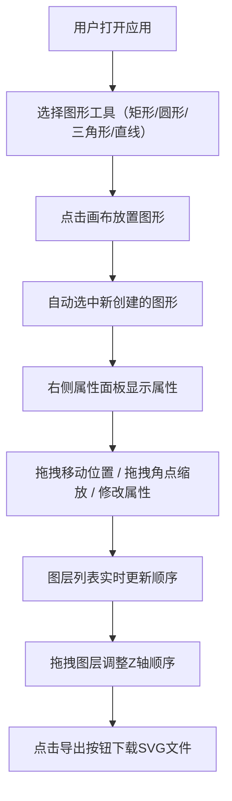

## 1. 产品概述

SVG矢量插画编辑器，一款面向非设计师用户的轻量级在线矢量图形创作工具。用户无需专业设计技能，即可快速绘制、编辑和导出简单的SVG矢量图形。

- 核心价值：降低矢量图形创作门槛，提供直观的拖拽式编辑体验
- 目标用户：需要制作简单图形、示意图、流程图的非专业设计师
- 市场定位：轻量、在线、无需安装，快速满足日常图形绘制需求

## 2. 核心功能

### 2.1 功能模块

1. **图形绘制模块**：支持矩形、圆形、三角形、直线四种基本形状的创建与编辑
2. **属性编辑模块**：实时编辑图形的填充色、描边色、描边宽度、透明度
3. **图层管理模块**：按Z轴顺序管理图形列表，支持排序与选中
4. **画布交互模块**：支持平移、缩放、网格背景显示
5. **导出模块**：将画布内容导出为SVG文件

### 2.2 功能详情

| 模块名称 | 子功能 | 功能描述 |
|---------|--------|---------|
| 图形绘制 | 形状创建 | 选择形状工具后点击画布即可放置图形 |
| 图形绘制 | 位置调整 | 拖拽图形可自由移动位置 |
| 图形绘制 | 缩放调整 | 选中图形后拖动角点可缩放（保持中心不变） |
| 图形绘制 | 选中反馈 | 选中状态显示虚线高亮边框和角点 |
| 属性编辑 | 填充色 | 颜色选择器实时修改填充颜色 |
| 属性编辑 | 描边色 | 颜色选择器实时修改描边颜色 |
| 属性编辑 | 描边宽度 | 数值输入/滑块调整描边粗细 |
| 属性编辑 | 透明度 | 滑块0-1连续调节，步进0.01 |
| 图层管理 | 图层列表 | 按绘制顺序从上到下显示所有图形 |
| 图层管理 | 图层信息 | 显示缩略图、图形类型图标和名称 |
| 图层管理 | 点击选中 | 点击图层条目选中对应图形 |
| 图层管理 | 拖拽排序 | 拖拽改变Z轴顺序，0.3s ease-out动画 |
| 画布操作 | 无限平移 | 鼠标拖拽空白区域平移画布 |
| 画布操作 | 缩放控制 | 滚轮缩放（0.2x-5x，步进0.1，0.2s动画） |
| 画布操作 | 网格背景 | 20px间隔浅灰网格，随缩放自动调整 |
| 导出功能 | SVG导出 | 保留所有样式和变换的SVG文件下载 |

## 3. 核心流程

用户主要操作流程：选择工具 → 绘制图形 → 调整属性 → 管理图层 → 导出成品。所有操作实时反馈，无需保存步骤。

## 4. 用户界面设计

### 4.1 设计风格

- **主色调**：柔和蓝灰 #2c3e50，白色背景 #ffffff
- **面板底色**：浅灰 #ecf0f1
- **按钮样式**：圆角矩形，hover有色彩渐变过渡（0.2s），点击缩放反馈（scale 1.05）
- **字体**：现代无衬线字体，清晰易读
- **布局风格**：三栏式布局，左侧图层、中间画布、右侧属性
- **图标风格**：Material Design风格SVG图标

### 4.2 页面布局概览

| 区域 | 宽度/尺寸 | 内容 |
|------|----------|------|
| 顶部工具栏 | 100% × 56px | 图形选择按钮、导出按钮 |
| 左侧图层面板 | 250px | 图层列表（缩略图+名称+类型） |
| 中间画布区域 | 自适应 | SVG画布（网格背景） |
| 右侧属性面板 | 300px | 填充色、描边色、描边宽度、透明度 |

### 4.3 响应式适配

- **桌面端（≥900px）**：标准三栏布局，面板常驻
- **移动端（<900px）**：面板折叠为抽屉式菜单，点击图标展开
- **触控优化**：增大触摸区域，支持手势缩放与平移

### 4.4 动画与交互细节

- 按钮hover：0.2s色彩渐变过渡
- 按钮点击：scale 1.05 轻微缩放反馈
- 画布缩放：0.2s平滑过渡
- 图层排序：0.3s ease-out缓动动画
- 图形选中：虚线边框高亮，显示角点控件
