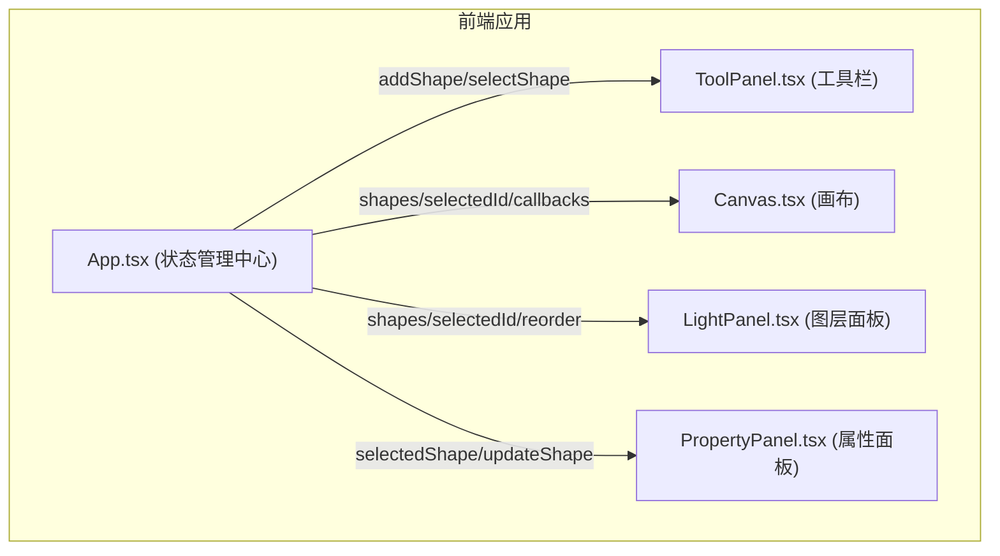

## 1. 架构设计



采用单向数据流的React组件架构，App.tsx作为唯一状态源，各子组件通过props接收数据和回调函数。

## 2. 技术描述

- **前端框架**：React@18 + TypeScript@5
- **构建工具**：Vite@5 + @vitejs/plugin-react@4
- **状态管理**：React useState/useReducer（轻量级场景，无需额外库）
- **拖拽排序**：react-beautiful-dnd（图层重排序）
- **样式方案**：CSS Modules / 内联样式（组件自包含）
- **SVG渲染**：原生SVG元素 + viewBox变换
- **后端**：无（纯前端应用）
- **数据库**：无（本地内存状态）

## 3. 项目文件结构

| 文件路径 | 职责 |
|---------|------|
| package.json | 项目依赖与脚本 |
| vite.config.js | Vite配置（React插件、Babel优化） |
| tsconfig.json | TypeScript配置（严格模式） |
| index.html | 入口HTML页面 |
| src/main.tsx | React应用入口 |
| src/App.tsx | 主组件，全局状态管理与事件分发 |
| src/components/Canvas.tsx | SVG画布渲染、拖拽、缩放、选中逻辑 |
| src/components/ToolPanel.tsx | 图形绘制工具栏（4种形状按钮） |
| src/components/LightPanel.tsx | 图层列表与拖拽排序 |
| src/components/PropertyPanel.tsx | 属性编辑面板（颜色、描边、透明度） |
| src/types.ts | 全局TypeScript类型定义 |
| src/utils/svg.ts | SVG导出与变换工具函数 |

## 4. 数据模型

### 4.1 Shape 类型定义

```typescript
type ShapeType = 'rect' | 'circle' | 'triangle' | 'line';

interface Shape {
  id: string;
  type: ShapeType;
  x: number;           // 中心X坐标
  y: number;           // 中心Y坐标
  width: number;
  height: number;
  fill: string;        // 填充色，hex格式
  stroke: string;      // 描边色，hex格式
  strokeWidth: number; // 描边宽度（px）
  opacity: number;     // 透明度 0-1
  rotation: number;    // 旋转角度（预留）
}
```

### 4.2 Canvas 状态

```typescript
interface CanvasState {
  zoom: number;        // 缩放比例 0.2-5
  panX: number;        // 水平平移距离
  panY: number;        // 垂直平移距离
}
```

### 4.3 App 全局状态

```typescript
interface AppState {
  shapes: Shape[];
  selectedId: string | null;
  activeTool: ShapeType | null;
  canvas: CanvasState;
}
```

## 5. 核心算法与交互逻辑

### 5.1 图形缩放（保持中心不变）

```
当拖拽角点时：
1. 计算鼠标位移向量 Δx, Δy
2. 新宽度 = 原宽度 + 2 × |Δx|（左右对称扩展）
3. 新高度 = 原高度 + 2 × |Δy|（上下对称扩展）
4. 中心坐标 (x, y) 保持不变
5. 约束最小尺寸 10px
```

### 5.2 画布坐标转换

```
屏幕坐标 → 画布坐标：
canvasX = (screenX - panX) / zoom
canvasY = (screenY - panY) / zoom

画布坐标 → 屏幕坐标：
screenX = canvasX × zoom + panX
screenY = canvasY × zoom + panY
```

### 5.3 图层Z轴顺序

- 数组索引越小，Z轴越靠下（先绘制）
- 数组索引越大，Z轴越靠上（后绘制，覆盖下层）
- 拖拽排序通过交换数组索引实现

### 5.4 SVG网格动态调整

```
实际网格间隔 = 20px × zoom
当 zoom < 0.5 时，间隔翻倍（40px, 80px...）
当 zoom > 2 时，间隔减半（10px, 5px...）
保持视觉密度一致
```

## 6. 性能优化策略

1. **SVG渲染优化**：使用key属性精确diff，避免全量重绘
2. **事件节流**：拖拽/滚轮事件使用requestAnimationFrame节流
3. **局部更新**：属性修改仅更新目标图形的DOM节点
4. **CSS变换**：画布平移缩放使用transform而非重排
5. **GPU加速**：关键动画启用will-change提示
6. **响应时间目标**：拖拽/缩放/选中 <16ms，图层动画 ≥60FPS
