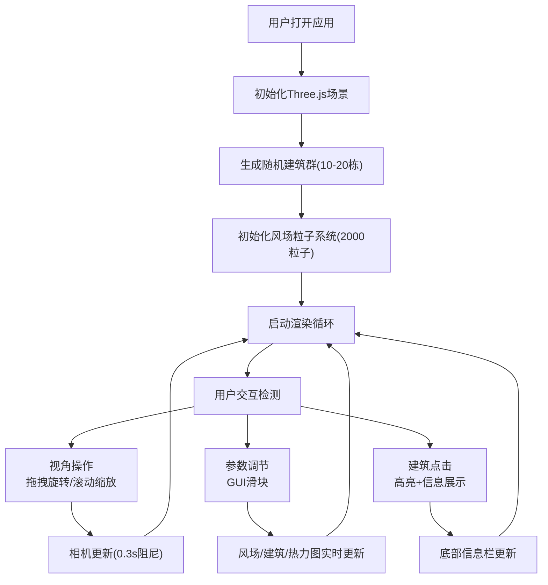

## 1. 产品概述

城市风环境模拟与热力图展示系统是一款面向气候研究人员和城市规划师的交互式3D可视化工具。通过模拟不同建筑布局下的城市街区风场流动，直观展示通风廊道分布与涡流区位置，辅助在规划阶段优化城市空间设计。

- **目标用户**：气候研究人员、城市规划师、建筑设计师
- **核心价值**：将抽象的流体动力学数据转化为直观可视的3D粒子动画与热力图，降低专业门槛，加速规划决策

## 2. 核心功能

### 2.1 功能模块

1. **3D城市场景模块**：自动生成随机建筑布局，支持视角拖拽旋转、滚动缩放，带平滑阻尼效果
2. **风场粒子系统模块**：数千个带尾迹的粒子模拟风流动画，支持风向风速调节，碰撞建筑表面反弹
3. **热力图可视化模块**：建筑群底面网格根据风场速度实时着色，展示高速区与低速区分布
4. **交互控制面板**：通过GUI滑块实时调节风向、风速、建筑密度、粒子数量等参数
5. **建筑信息查询**：点击建筑高亮显示，底部信息栏展示建筑参数与周围风速统计

### 2.2 功能详情

| 模块名称 | 功能描述 |
|----------|----------|
| 3D城市场景 | 10-20个随机高度(3-12)宽度(2-6)的建筑，分布于20x20平面，底部深灰到顶部浅灰渐变，顶部半透明红色轮廓，视角旋转0.3秒平滑阻尼 |
| 风场粒子系统 | 2000个白色粒子(大小2单位)，带4单位半透明渐变尾迹，正弦波动+风向移动，建筑碰撞反弹，尾迹0.5秒淡出 |
| 控制面板 | 风向(0-360°步长1)、风速(1-10步长0.5)、建筑密度(0.3-0.8步长0.1，0.5秒动画重排)、粒子数量(500-3000) |
| 热力图 | 30x30网格，最近100帧粒子平均速度，深蓝(#0000ff)→青(#00ffff)→亮黄(#ffff00)渐变，透明度0.4，0.2秒过渡动画 |
| 建筑交互 | 点击高亮(亮青#00ffff边框，2px厚度，1秒恢复)，底部显示名称、高度、底面积、5单位半径内平均风速(两位小数) |

## 3. 核心流程

用户打开应用后，系统自动初始化3D场景并生成随机建筑群与风场粒子。用户可通过鼠标拖拽旋转视角、滚动缩放；通过右侧GUI面板调节风场与建筑参数，所有变化实时反馈至场景。点击任意建筑可查看详细信息。

## 4. 用户界面设计

### 4.1 设计风格

- **主题**：深色科技风，专业数据可视化氛围
- **背景**：径向渐变，中心#0a0f1a → 边缘#05080f
- **主色调**：亮青色#00d4ff / #00ffff（交互与高光）
- **辅助色**：深蓝#0000ff、黄色#ffff00（热力图渐变）、红色#ff4444（建筑顶部轮廓）
- **建筑颜色**：底部深灰#3a3a3a → 顶部浅灰#a0a0a0垂向渐变
- **字体**：等宽字体（信息栏），白色文字深灰文字结合
- **控件风格**：扁平化，滑块轨道#1a1f2e，滑块按钮亮青色#00d4ff

### 4.2 页面布局

| 区域 | 位置 | 内容 |
|------|------|------|
| 3D画布 | 全屏主体 | Three.js渲染场景，建筑、粒子、热力图 |
| GUI面板 | 右侧（桌面）/左侧抽屉（移动） | 参数滑块：风向、风速、建筑密度、粒子数量 |
| 信息栏 | 底部 | 黑色半透明背景(#000000, 0.7)，白色等宽字体展示建筑信息 |
| 说明按钮 | 左上角 | 图标按钮，点击展开/收起使用说明面板 |

### 4.3 响应式设计

- **桌面端（≥768px）**：GUI面板固定于右侧，热力图透明度0.4
- **移动端（<768px）**：GUI面板折叠为左侧可展开抽屉，热力图透明度提升至0.6增强可读性

### 4.4 3D场景设计

- **环境光**：AmbientLight(0xffffff, 0.5) + DirectionalLight(0xffffff, 0.8)，模拟均匀柔和光照
- **建筑材质**：MeshStandardMaterial，顶点着色实现垂向灰度渐变，边缘高光线框随视角偏移在白色与淡蓝间变化
- **粒子材质**：PointsMaterial，大小2单位，白色；尾迹使用LineBasicMaterial，透明度从1渐变到0
- **热力图材质**：ShaderMaterial或顶点色，半透明(alpha 0.4-0.6)，颜色0.2秒线性过渡
- **相机**：PerspectiveCamera，fov 60，初始位置(30, 25, 30)，lookAt原点
- **性能优化**：粒子碰撞检测每帧最多500个分批处理，热力图颜色每5帧更新一次
