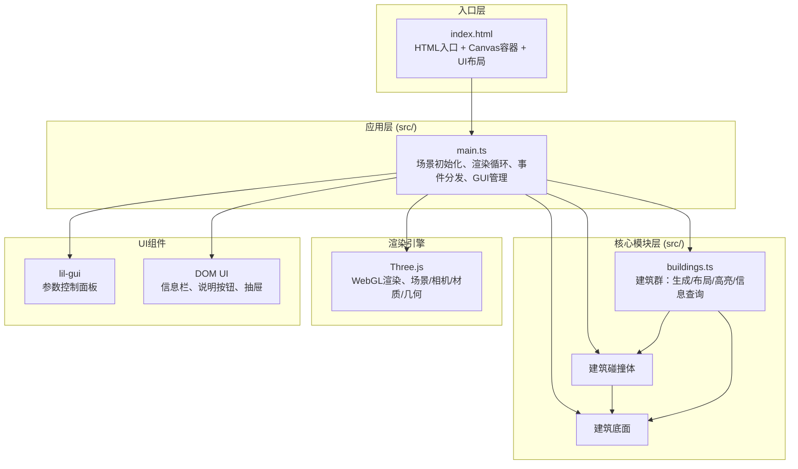
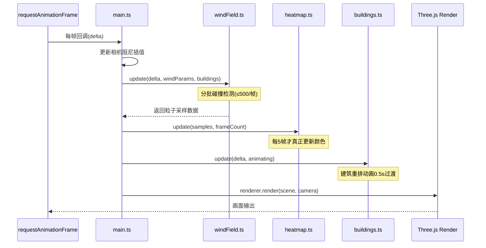

## 1. 架构设计



**数据流向**：
1. 用户GUI操作 → `main.ts` 接收参数变更事件
2. `main.ts` 将参数传递给 `windField.ts`（风向/风速/粒子数）和 `buildings.ts`（建筑密度）
3. `windField.ts` 每帧更新粒子位置与速度，粒子数据流向 `heatmap.ts` 用于速度统计
4. `heatmap.ts` 每5帧更新网格颜色，渲染回Three.js场景
5. 用户点击建筑 → `main.ts` 触发Raycaster → `buildings.ts` 返回建筑信息 → DOM信息栏更新

## 2. 技术描述

- **前端框架**：无框架（原生TypeScript），直接操作Three.js与DOM
- **构建工具**：Vite 5.x，输出目录 `dist/`
- **语言**：TypeScript 5.x，严格模式(strict)，目标ES2020，模块ESNext
- **3D引擎**：Three.js 0.160+，使用BufferGeometry、ShaderMaterial、Points、Line
- **UI组件**：lil-gui 0.19+（参数控制面板），原生CSS（信息栏、抽屉）
- **性能策略**：
  - 粒子碰撞检测分批处理（每帧≤500个）
  - 热力图颜色每5帧更新一次
  - 使用BufferGeometry减少Draw Call
  - 建筑重排使用TWEEN.js或requestAnimationFrame线性插值0.5秒过渡

## 3. 项目文件结构

```
auto50/
├── package.json              # 依赖与脚本
├── vite.config.js            # Vite构建配置
├── tsconfig.json             # TypeScript配置
├── index.html                # HTML入口
└── src/
    ├── main.ts               # 入口：场景/相机/渲染器/GUI/事件/主循环
    ├── windField.ts          # 风场粒子系统模块
    ├── heatmap.ts            # 热力图模块
    └── buildings.ts          # 建筑群管理模块
```

**文件调用关系**：
- `main.ts` → 导入并实例化 `Buildings`、`WindField`、`Heatmap` 类
- `WindField` 暴露 `update(delta, params)` 与 `getParticleData()` 方法
- `Heatmap` 暴露 `update(particleData)` 方法，内部每5帧实际执行更新
- `Buildings` 暴露 `regenerate(density)`、`getBuildingAt(intersect)`、`highlight(mesh)` 方法
- 所有模块共享同一个 `THREE.Scene` 引用，由 `main.ts` 注入

## 4. 核心类与接口定义

```typescript
// 风场参数接口
interface WindParams {
  direction: number;  // 0-360度
  speed: number;      // 1-10 单位/秒
  particleCount: number; // 500-3000
}

// 建筑数据接口
interface BuildingData {
  id: string;         // "Building A", "Building B"...
  name: string;
  position: THREE.Vector3;
  width: number;      // 2-6
  depth: number;      // 2-6
  height: number;     // 3-12
  mesh: THREE.Mesh;
  edges: THREE.LineSegments;
}

// 粒子数据（热力图用）
interface ParticleSample {
  position: THREE.Vector3;
  speed: number;
}

// 热力图网格单元
interface HeatmapCell {
  x: number;
  z: number;
  avgSpeed: number;
  history: number[];  // 最近100帧速度
}
```

## 5. 性能预算

| 指标 | 目标 | 策略 |
|------|------|------|
| FPS（默认参数） | ≥ 40 | 粒子2000，建筑15栋 |
| FPS（3000粒子） | ≥ 30 | 碰撞分批、热力图降频 |
| 首屏加载 | < 3s | Vite按需，无重型资源 |
| 内存占用 | < 500MB | BufferGeometry复用，及时dispose |

## 6. 渲染管线


