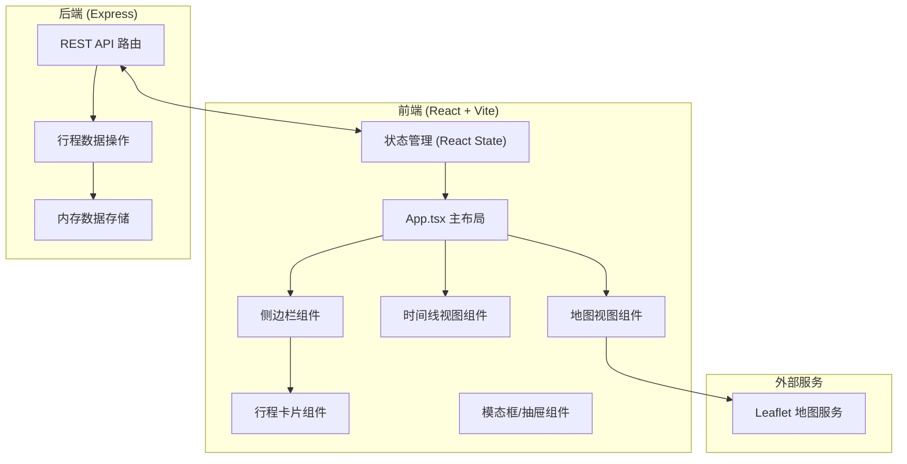
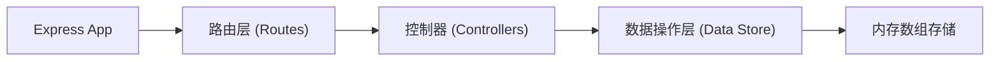
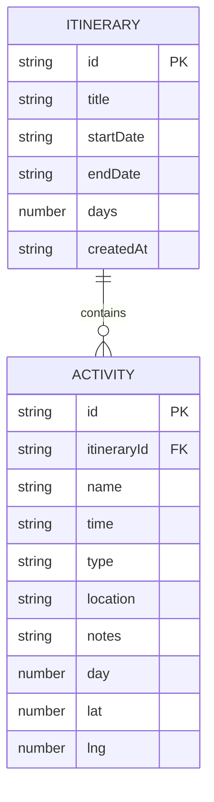

## 1. 架构设计



## 2. 技术选型说明

- **前端框架**：React 18 + TypeScript 5
- **构建工具**：Vite 5（@vitejs/plugin-react）
- **后端框架**：Express 4 + TypeScript
- **地图服务**：Leaflet + react-leaflet
- **CSV处理**：PapaParse
- **唯一ID生成**：uuid
- **图标库**：lucide-react
- **数据存储**：服务端内存数组（开发演示用）
- **状态管理**：React useState/useReducer（轻量场景）

## 3. 路由定义

| 路由路径 | 用途 |
|----------|------|
| GET /api/itineraries | 获取所有行程列表 |
| GET /api/itineraries/:id | 获取单个行程详情 |
| POST /api/itineraries | 创建新行程 |
| PUT /api/itineraries/:id | 更新行程信息 |
| DELETE /api/itineraries/:id | 删除行程 |
| POST /api/itineraries/:id/activities | 添加活动到行程 |
| PUT /api/itineraries/:id/activities/:activityId | 更新活动 |
| DELETE /api/itineraries/:id/activities/:activityId | 删除活动 |
| GET /api/itineraries/:id/export | 导出行程CSV |

## 4. API 数据类型定义

```typescript
// 活动类型
type ActivityType = 'attraction' | 'restaurant' | 'transport' | 'shopping' | 'other';

// 活动接口
interface Activity {
  id: string;
  name: string;
  time: string; // HH:mm 格式
  type: ActivityType;
  location: string;
  notes: string;
  day: number; // 第几天
  lat?: number;
  lng?: number;
}

// 行程接口
interface Itinerary {
  id: string;
  title: string;
  startDate: string; // YYYY-MM-DD
  endDate: string; // YYYY-MM-DD
  days: number;
  activities: Activity[];
  createdAt: string;
}

// 行程创建请求
interface CreateItineraryRequest {
  title: string;
  startDate: string;
  endDate: string;
}

// 活动创建请求
interface CreateActivityRequest {
  name: string;
  time: string;
  type: ActivityType;
  location: string;
  notes: string;
  day: number;
}

// API响应
interface ApiResponse<T> {
  success: boolean;
  data?: T;
  error?: string;
}
```

## 5. 服务端架构



## 6. 数据模型

### 6.1 实体关系



### 6.2 活动类型颜色映射

| 类型 | 英文标识 | 颜色代码 |
|------|----------|----------|
| 景点 | attraction | #ff9800 (橙色) |
| 餐厅 | restaurant | #f44336 (红色) |
| 交通 | transport | #ffeb3b (黄色) |
| 购物 | shopping | #9c27b0 (紫色) |
| 其他 | other | #9e9e9e (灰色) |

## 7. 项目文件结构

```
├── package.json
├── vite.config.js
├── tsconfig.json
├── index.html
├── server/
│   └── index.ts          # Express后端入口
├── src/
│   ├── main.tsx          # React入口
│   ├── App.tsx           # 主布局组件
│   ├── types/
│   │   └── index.ts      # 类型定义
│   ├── utils/
│   │   ├── csv.ts        # CSV导出工具
│   │   └── map.ts        # 地图相关工具
│   ├── hooks/
│   │   └── useDebounce.ts # 防抖Hook
│   ├── components/
│   │   ├── ItineraryCard.tsx
│   │   ├── TimelineView.tsx
│   │   ├── MapView.tsx
│   │   ├── CreateItineraryModal.tsx
│   │   ├── AddActivityDrawer.tsx
│   │   ├── ActivityCard.tsx
│   │   └── Toast.tsx
│   └── styles/
│       └── globals.css   # 全局样式
```

## 8. 性能优化策略

- 使用 React.memo 包装 ItineraryCard 和 ActivityCard 避免不必要重渲染
- 使用 useMemo/useCallback 缓存计算值和回调函数
- CSS动画使用 transform 和 opacity（GPU加速属性）
- 搜索输入使用 200ms 防抖减少过滤计算
- 地图标记点 < 50 个，保证拖拽缩放流畅
- 时间线滚动容器使用 will-change: transform 优化
