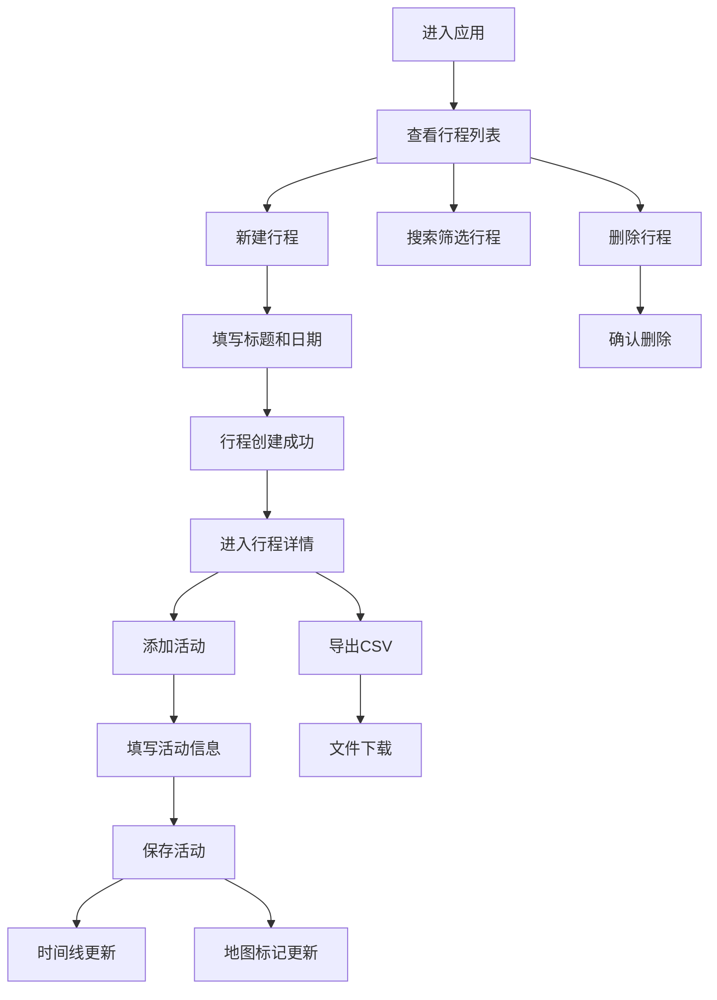

## 1. 产品概述

Travel Planner 是一款基于Web的交互式旅行行程规划与分享应用，帮助用户高效组织多日旅行计划，可视化展示行程时间线和地理分布。

- 主要面向个人旅行者和旅行爱好者，解决行程规划零散、信息不直观的问题
- 通过时间线可视化和地图标记提升行程规划体验，支持CSV导出便于分享

## 2. 核心功能

### 2.1 用户角色
| 角色 | 注册方式 | 核心权限 |
|------|----------|----------|
| 普通用户 | 无需注册（本地存储） | 创建、编辑、删除行程；添加活动；导出CSV |

### 2.2 功能模块
1. **行程管理**：新建行程、编辑标题、删除行程、搜索筛选行程、行程卡片列表
2. **活动管理**：添加每日活动（景点/餐厅/交通/购物/其他）、活动信息编辑、拖拽排序
3. **时间线视图**：垂直时间线展示、每日折叠展开、活动卡片展示
4. **地图视图**：活动地点标记、多类型彩色图标、信息弹窗、深色地图样式
5. **数据导出**：行程CSV导出、导出成功提示

### 2.3 页面详情
| 页面名称 | 模块名称 | 功能描述 |
|----------|----------|----------|
| 主应用页面 | 顶部导航栏 | 应用logo、名称展示、用户头像占位 |
| 主应用页面 | 侧边栏行程列表 | 新建行程按钮、搜索框、行程卡片列表、删除确认 |
| 主应用页面 | 主内容区-行程详情 | 行程信息、添加活动按钮、时间线视图、地图视图 |
| 主应用页面 | 新建行程模态框 | 标题输入、日期范围选择、取消/创建按钮 |
| 主应用页面 | 添加活动抽屉 | 活动信息表单、活动类型选择、保存功能 |

## 3. 核心流程

用户进入应用后，在侧边栏点击"新建行程"创建行程，填写标题和日期范围后自动切换到新行程详情。在详情页点击"添加活动"打开右侧抽屉，填写活动信息（名称、时间、类型、地点、备注）后保存，活动出现在时间线并在地图上显示标记。用户可通过拖拽调整活动顺序，点击导出按钮生成CSV文件分享。

## 4. 用户界面设计

### 4.1 设计风格
- **主色调**：深色科技风，背景色 #0f0f23，侧边栏 #1a1a2e，主内容区 #16213e
- **强调色**：亮青色 #00d4ff（时间线），活动类型色（橙色/红色/黄色/紫色/灰色）
- **按钮样式**：圆角按钮，hover时背景变浅10%，0.2秒过渡，按下时0.1秒效果
- **字体**：系统无衬线字体
- **布局风格**：三栏式布局（顶部导航+左侧边栏+主内容区），响应式适配移动端
- **图标风格**：使用lucide-react图标库

### 4.2 页面设计概述
| 页面名称 | 模块名称 | UI元素 |
|----------|----------|--------|
| 主应用页面 | 顶部导航栏 | 高度56px，深色背景 #0a0a1a，居中标题，右侧圆形用户头像 |
| 主应用页面 | 侧边栏 | 宽度300px，行程卡片悬停上浮4px加深阴影，搜索框防抖过滤 |
| 主应用页面 | 时间线视图 | 深色背景 #1a1a2e，青色竖线，活动卡片左侧彩色条带，悬停变色过渡 |
| 主应用页面 | 地图视图 | 深色地图，圆形彩色标记，半透明圆角信息窗口 |
| 主应用页面 | 模态框/抽屉 | 半透明遮罩，卡片式表单，边框聚焦动画，滑入滑出动效 |

### 4.3 响应式设计
- 桌面端优先设计（>768px）
- <768px时侧边栏变为顶部可折叠面板
- 移动端地图高度调整为300px
- 触摸交互优化

### 4.4 动效设计
- 行程卡片悬停：transform: translateY(-4px)，box-shadow加深，0.2秒GPU加速
- 抽屉滑入：translateX(100%)→0，0.3秒ease-out；滑出反向0.2秒ease-in
- 模态框弹出：opacity 0→1，scale 0.95→1，0.25秒过渡
- 删除动画：scale 1→0 + opacity 1→0，0.3秒
- 输入框聚焦：border-color 灰→蓝，0.2秒过渡
