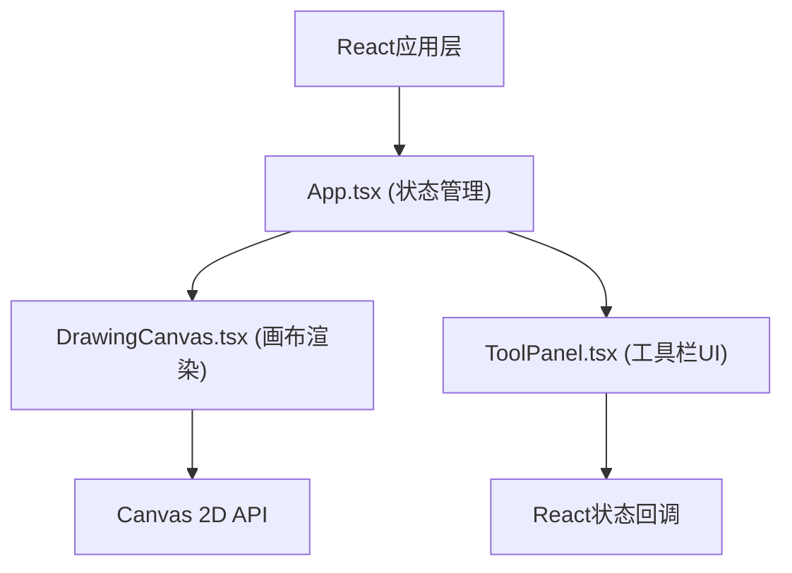

## 1. 架构设计



## 2. 技术说明

- 前端：React 18 + TypeScript + Vite
- 渲染：Canvas 2D API
- 依赖：react、react-dom、uuid
- 构建工具：Vite + @vitejs/plugin-react

## 3. 项目结构

```
├── index.html          # 入口HTML
├── package.json      # 项目配置
├── tsconfig.json   # TypeScript配置
├── vite.config.js  # Vite配置
└── src/
    ├── main.tsx          # React入口
    ├── App.tsx           # 主应用组件
    └── components/
    │   ├── DrawingCanvas.tsx  # 画布组件
    │   └── ToolPanel.tsx      # 工具栏组件
```

## 4. 数据模型

### 4.1 类型定义

```typescript
interface Point {
  x: number;
  y: number;
}

interface Stroke {
  id: string;
  points: Point[];
  colorStart: string;
  colorEnd: string;
  thickness: number;
  createdAt: number;
}
```

## 5. 核心功能实现要点

- DrawingCanvas 组件：
  - useRef 获取 canvas 引用
  - 处理鼠标/触摸事件
  - Canvas 2D 渲染发光线条
  - requestAnimationFrame 实现60FPS动画循环
  - 导出绘制历史供App使用

- ToolPanel 组件：
  - 颜色选择器（12种霓虹色）
  - 粗细滑块（1-8px）
  - 清空和播放按钮
  - 回调函数更新App状态

- App 组件：
  - 管理 strokes 状态管理
  - 播放动画状态机
  - 按顺序控制线条显示/隐藏
