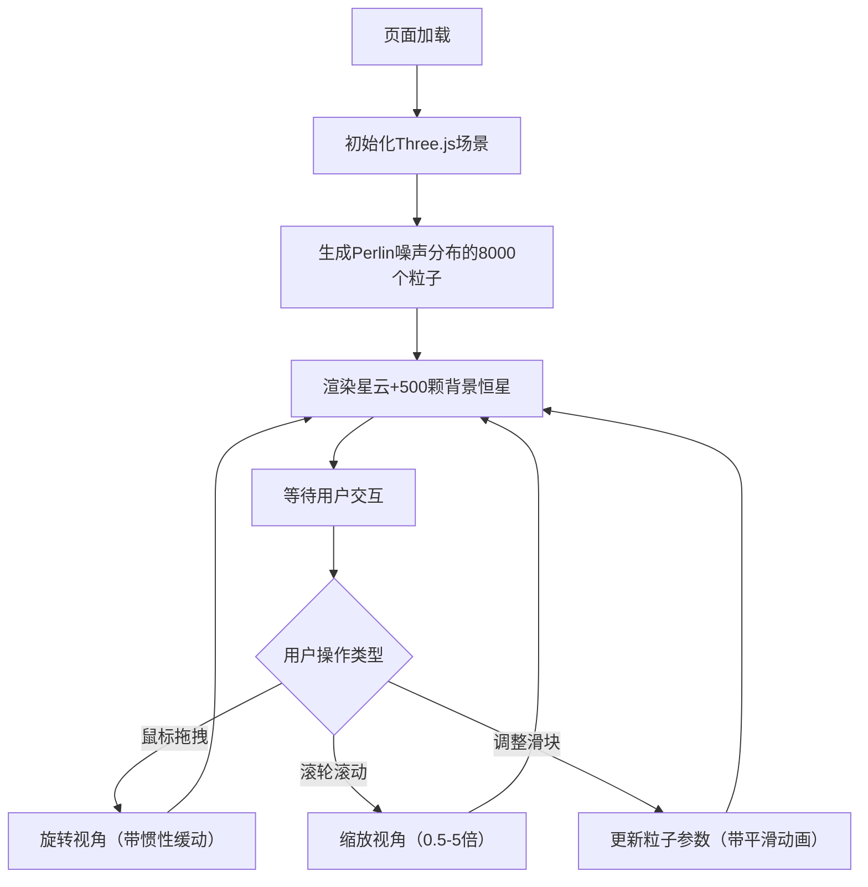

## 1. 产品概述

宇宙星云粒子探索器是一款基于WebGL的交互式3D可视化应用，通过Perlin噪声算法生成逼真的宇宙星云形态，让天文爱好者和艺术创作者能够以直观的方式动态探索和调整虚拟星云。

- 核心解决问题：传统静态图片无法满足用户对星云形态动态观察和个性化调整的需求
- 目标用户：天文爱好者、数字艺术创作者、教育工作者
- 产品价值：提供沉浸式、可交互的宇宙探索体验，支持实时参数调整和视觉创意生成

## 2. 核心功能

### 2.1 功能模块

1. **3D星云粒子系统**：基于Perlin噪声的三维粒子分布、色彩渐变、发光效果
2. **背景星空渲染**：500颗随机分布的背景恒星
3. **视角交互控制**：鼠标拖拽旋转、滚轮缩放、惯性缓动
4. **参数控制面板**：粒子数量、色相偏移、散布半径、旋转速度的实时调节
5. **动画过渡系统**：所有参数变化的平滑渐变动画

### 2.2 页面详情

| 页面名称 | 模块名称 | 功能描述 |
|----------|----------|----------|
| 主页面 | 3D渲染画布 | 全屏Three.js渲染区域，显示星云粒子和背景星空 |
| 主页面 | 视角控制器 | 处理鼠标拖拽旋转、滚轮缩放，支持0.4秒惯性缓动 |
| 主页面 | 底部控制面板 | 半透明滑出式面板，包含4个参数滑块 |

## 3. 核心流程

## 4. 用户界面设计

### 4.1 设计风格

- **主色调**：深空黑 (#000000) 背景，深蓝 (#0a0a2e) 面板
- **强调色**：亮青色 (#00d4ff) 滑块、淡紫色 (#a64dff) 悬停态
- **粒子色带**：暖色 (#ff4d4d) → 冷色 (#4d4dff) 径向渐变
- **文字颜色**：浅灰 (#cccccc) 标签文字
- **整体氛围**：深空沉浸感、科技感、神秘宇宙美学

### 4.2 页面设计概述

| 页面名称 | 模块名称 | UI元素 |
|----------|----------|--------|
| 主页面 | 3D画布 | 全屏黑色背景、彩色发光粒子点云、白色背景恒星 |
| 主页面 | 底部控制面板 | 半透明深蓝背景(#0a0a2e, 0.8)、4组滑块控件、滑入滑出动画 |
| 主页面 | 滑块控件 | 深蓝轨道(#1a1a4e)、亮青色滑块(#00d4ff)、浅灰标签(#cccccc) |

### 4.3 动画与交互

- **控制面板**：鼠标移入向上滑出(0.2s ease-out)，移出向下隐藏(0.3s ease-in)
- **视角变化**：0.4秒惯性缓动效果
- **粒子数量变化**：0.5秒位置渐变动画
- **颜色变化**：0.3秒HSL色相渐变
- **半径变化**：0.6秒径向扩散/收缩动画
- **滑块悬停**：滑块变为淡紫色(#a64dff)

### 4.4 3D场景指引

- **环境**：纯黑背景模拟宇宙深空
- **光照**：粒子自发光，无需场景光源
- **相机**：PerspectiveCamera，初始距离200，视角75度
- **运动**：星云绕Y轴匀速旋转，速度可调节
- **后期效果**：粒子通过透明度和模糊实现发光效果
- **性能目标**：50FPS以上，粒子数>15000时自动优化透明度步长

### 4.5 响应式

- 桌面端优先，画布占满整个视口
- 控制面板保持底部定位，自适应宽度
