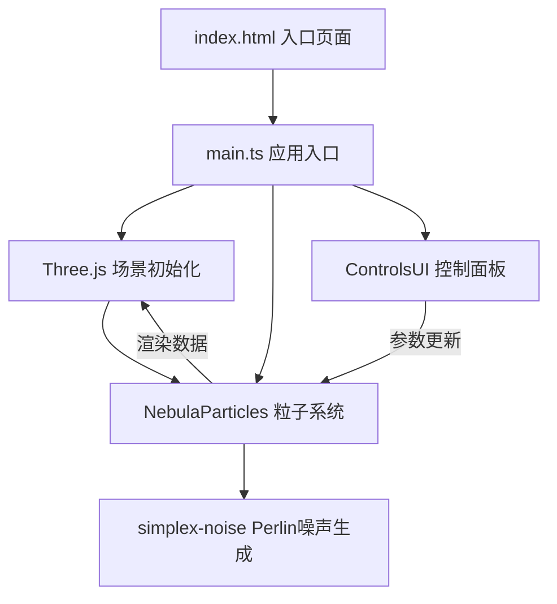
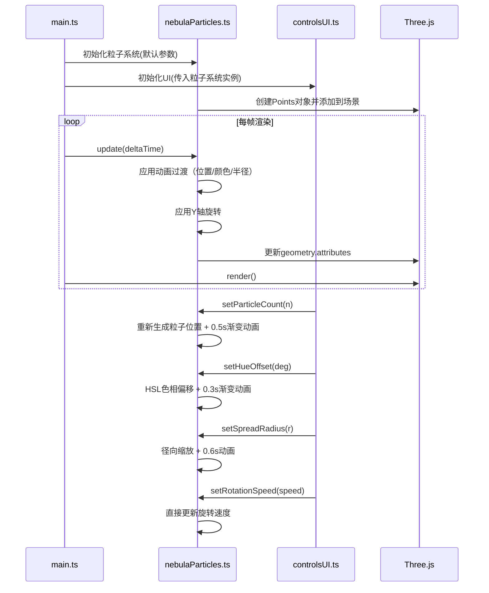

## 1. 架构设计

## 2. 技术描述

- **前端框架**：原生 TypeScript（无需React，直接操作Three.js）
- **3D引擎**：Three.js r160+
- **构建工具**：Vite 5.x
- **噪声算法**：simplex-noise 4.x
- **类型定义**：@types/three

## 3. 项目文件结构

| 文件路径 | 职责说明 |
|----------|----------|
| `package.json` | 依赖配置：three、@types/three、vite、typescript、simplex-noise |
| `index.html` | 入口HTML，包含canvas容器和底部控制面板容器 |
| `tsconfig.json` | TypeScript配置：严格模式、ES2020目标、ESNext模块 |
| `vite.config.js` | Vite基础配置，base设为'./' |
| `src/main.ts` | 应用入口：初始化场景/相机/渲染器，整合粒子系统与UI控制 |
| `src/nebulaParticles.ts` | 星云粒子系统核心：粒子生成、位置分布、颜色计算、动画过渡 |
| `src/controlsUI.ts` | 控制面板UI：滑块事件绑定、参数转发、滑入滑出动画 |

## 4. 数据流向设计

## 5. 核心技术实现要点

### 5.1 粒子分布算法

使用 simplex-noise 生成三维Perlin噪声：
- 对每个粒子生成球坐标 (r, θ, φ)
- 使用噪声值扰动半径和角度，形成螺旋纤维结构
- 中心密度高，向外逐渐稀疏

### 5.2 颜色系统

- 基础色带：暖色(#ff4d4d) HSL≈(0°, 100%, 65%) → 冷色(#4d4dff) HSL≈(240°, 100%, 65%)
- 颜色根据粒子距中心的距离在色带上插值
- 色相偏移：整体HSL的H分量加上偏移角度，模360°

### 5.3 动画过渡系统

每个参数维护目标值和当前值，使用线性插值(LERP)平滑过渡：
- 粒子数量变化：保存旧位置，生成新位置，0.5秒内插值
- 色相偏移：当前色相→目标色相，0.3秒内插值
- 散布半径：当前半径因子→目标因子，0.6秒内插值

### 5.4 性能优化策略

- 使用 BufferGeometry + Points 批量渲染，减少Draw Call
- 粒子数 > 15000 时，降低透明度动画步长（减少每帧更新的粒子数）
- 复用 TypedArray，避免频繁GC
- 使用 requestAnimationFrame 驱动渲染循环

### 5.5 视角控制

- 自定义相机控制器（不依赖OrbitControls，实现更精细的惯性控制）
- 鼠标按下记录起始位置，移动计算角度增量
- 释放后记录角速度，在0.4秒内逐渐衰减到0
- 滚轮控制相机距离，clamp在0.5x-5x范围

## 6. UI样式规范

| CSS变量 | 值 | 用途 |
|---------|-----|------|
| `--panel-bg` | rgba(10, 10, 46, 0.8) | 控制面板背景 |
| `--slider-track` | #1a1a4e | 滑块轨道颜色 |
| `--slider-thumb` | #00d4ff | 滑块颜色 |
| `--slider-hover` | #a64dff | 滑块悬停颜色 |
| `--label-color` | #cccccc | 标签文字颜色 |
