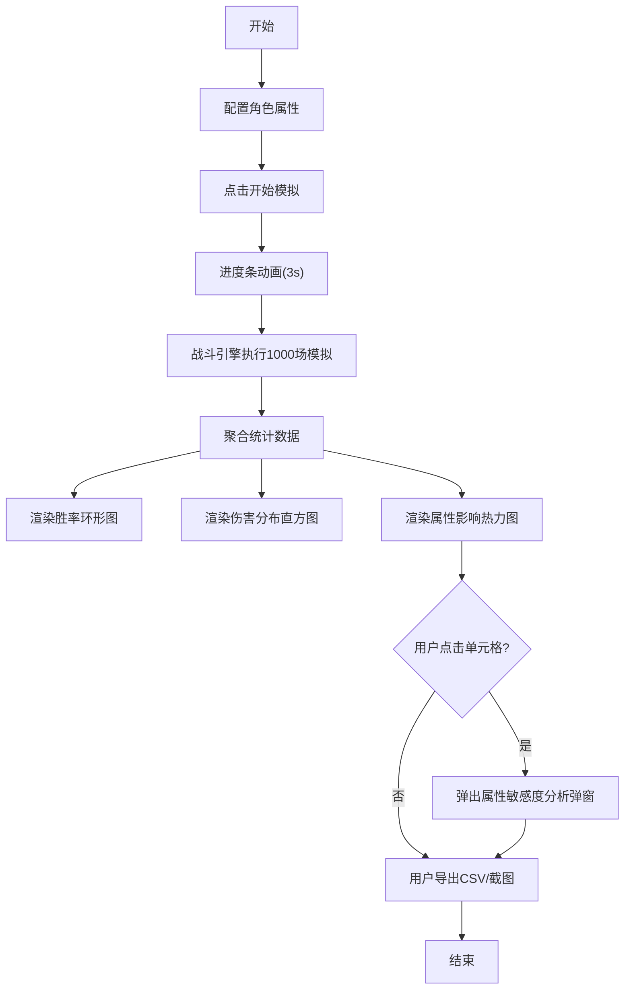

## 1. 产品概述

角色战斗模拟与伤害统计看板是面向独立游戏开发者的数值平衡工具。通过创建职业角色、设定战斗属性，自动模拟大量1v1战斗并可视化输出伤害分布、胜率统计和属性敏感度分析，帮助开发者快速验证和调整角色数值设计。

- 目标用户：独立游戏开发者、游戏数值策划
- 核心价值：减少手动数值调试时间，提供数据驱动的平衡决策依据

## 2. 核心功能

### 2.1 功能模块

1. **角色配置面板**：职业选择、属性滑动条调节、实时数值预览
2. **战斗模拟引擎**：回合制战斗逻辑、1000场批量模拟、统计数据聚合
3. **伤害统计看板**：伤害分布直方图、胜率环形图、属性影响热力图
4. **数据导出模块**：CSV格式导出配置与结果、截图导出功能

### 2.2 页面详情

| 页面名称 | 模块名称 | 功能描述 |
|----------|----------|----------|
| 主界面 | 角色配置面板 | 支持创建2-3个角色，职业下拉选择（战士/法师/刺客），四维属性滑动条（攻击50-200/防御20-100/暴击率0-80%/生命值500-2000），实时数值显示 |
| 主界面 | 模拟控制区 | 开始模拟按钮→进度条（3秒）→完成状态（绿色对勾） |
| 主界面 | 伤害统计看板 | 伤害分布直方图（带tooltip和弹性动画）、胜率环形图（数字递增动画）、属性影响热力图（4x4矩阵，点击弹出分析弹窗） |
| 主界面 | 结果导出区 | CSV导出按钮、截图导出按钮（涟漪动画） |

## 3. 核心流程

用户在左侧面板配置2-3个角色的职业与属性 → 点击"开始模拟"按钮 → 进度条展示模拟过程（约3秒） → 右侧看板渲染胜率图、伤害直方图、热力图 → 用户可点击热力图单元格查看属性敏感度曲线 → 用户导出CSV或截图

## 4. 用户界面设计

### 4.1 设计风格

- **主色调**：深蓝 #0f3460、辅助色 #e94560
- **强调渐变色**：#16213e → #00b4d8
- **职业配色**：战士 #ff7043、法师 #42a5f5、刺客 #66bb6a
- **按钮样式**：渐变背景，圆角12px，按下缩放0.95
- **布局**：左右分栏（左40%配置面板，右60%看板区域）
- **卡片风格**：圆角12px，阴影0 4px 15px rgba(0,0,0,0.3)，悬浮时阴影加深并上浮3px
- **滑动条**：轨道高6px，滑块半径12px带发光效果，轨道背景从绿#00e676渐变到红#ff1744

### 4.2 页面设计概览

| 页面名称 | 模块名称 | UI元素 |
|----------|----------|----------|
| 主界面 | 角色配置面板 | 深灰背景#1a1a2e，内边距20px，圆角12px，职业卡片分组，滑动条渐变轨道 |
| 主界面 | 看板区域 | 背景#16213e，三图表网格布局，入场淡入动画0.3s |
| 主界面 | 进度条 | 深蓝#0d47a1→浅蓝#42a5f5渐变，宽度0→100%约3秒 |
| 主界面 | 胜率环形图 | 外圈渐变色#00b4d8→#0077b6，中心数字0.5秒缓出递增动画 |
| 主界面 | 直方图 | 柱子颜色#00b4d8→#03045e渐变，弹性动画，悬停tooltip |
| 主界面 | 热力图 | 4x4矩阵，敏感度从绿#00e676→红#ff1744，白色小号百分比字体 |
| 主界面 | 弹窗 | 属性敏感度非线性曲线图，模态框居中，半透明遮罩 |

### 4.3 响应式设计

采用桌面优先设计，最小支持宽度1200px。配置面板与看板区域在窄屏下自动切换为上下堆叠布局。

### 4.4 动画与微交互

- 所有图表入场：0.3秒透明度0→1渐变
- 按钮按下：scale(0.95) 0.1秒
- 卡片悬浮：translateY(-3px) + 阴影加深 0.2秒过渡
- 进度条：宽度线性过渡3秒
- 胜率数字：requestAnimationFrame实现0→最终值缓出递增0.5秒
- 直方图柱子：弹性缓动函数高度变化
- 导出按钮：点击涟漪扩散动画
