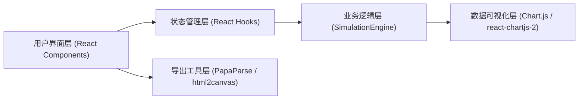

## 1. 架构设计



**模块职责与调用关系：**
- `src/App.tsx`：顶层状态容器，管理角色配置数组、模拟进度、模拟结果；将角色配置传入引擎，将结果传入看板
- `src/components/CharacterSetup.tsx`：接收当前角色配置，通过onChange回调向App上报属性变更
- `src/components/DamageDashboard.tsx`：接收模拟结果对象，渲染三个Chart.js图表
- `src/engine/SimulationEngine.ts`：纯函数模块，接收角色配置数组→执行战斗模拟→输出统计结果
- 数据流：用户输入 → CharacterSetup回调 → App状态更新 → 触发模拟 → SimulationEngine输出 → DamageDashboard渲染

## 2. 技术栈描述

- **前端框架**：React 18 + TypeScript 5
- **构建工具**：Vite 5 + @vitejs/plugin-react
- **图表库**：Chart.js 4 + react-chartjs-2 5
- **工具库**：lodash 4（数据处理）、papaparse 5（CSV导出）、html2canvas（截图导出）
- **无后端**：纯前端应用，模拟计算在浏览器主线程执行（≤500ms约束）
- **状态管理**：React useState/useReducer（轻量级，无需zustand）

## 3. 路由定义

| 路由 | 用途 |
|------|------|
| / | 主应用单页，包含配置面板与看板 |

单页应用，无路由切换需求。

## 4. 数据模型

### 4.1 TypeScript类型定义

```typescript
type CharacterClass = 'warrior' | 'mage' | 'assassin';

interface Character {
  id: string;
  name: string;
  class: CharacterClass;
  attack: number;      // 50-200
  defense: number;     // 20-100
  critRate: number;    // 0-0.8
  maxHp: number;       // 500-2000
}

interface BattleResult {
  winnerId: string;
  damagePerHit: number[];  // 本场所有攻击伤害
  totalRounds: number;
}

interface SimulationStats {
  winRates: Record<string, number>;          // 角色ID → 胜率
  averageDamage: Record<string, number>;     // 角色ID → 平均每次伤害
  damageDistribution: number[];              // 伤害频次直方图数据（分箱）
  damageBins: { min: number; max: number; count: number }[];
  attributeSensitivity: {                    // 属性名 → ±10%扰动后的胜率变化率
    attack: number;
    defense: number;
    critRate: number;
    maxHp: number;
  };
  sensitivityCurves: Record<string, { x: number[]; y: number[] }>;
}

interface SimulationProgress {
  status: 'idle' | 'running' | 'done';
  percent: number;  // 0-100
}
```

### 4.2 战斗公式

- **基础伤害** = max(1, attacker.attack - defender.defense * 0.6)
- **暴击判定**：随机值 < attacker.critRate 则伤害 × 1.8
- **回合制**：双方交替攻击，先手随机；HP降至0或以下者战败
- **属性扰动**：对单属性±10%重新运行1000场模拟，计算胜率变化百分比作为敏感度

## 5. 文件结构

```
src/
├── main.tsx              # React入口，挂载#root
├── App.tsx               # 主布局：40%左 + 60%右分栏，状态管理
├── engine/
│   └── SimulationEngine.ts  # 战斗模拟引擎（纯逻辑，无UI依赖）
├── components/
│   ├── CharacterSetup.tsx   # 角色配置面板（表单+滑动条）
│   └── DamageDashboard.tsx  # 统计看板（3个Chart.js图表）
└── styles/
    └── index.css         # 全局样式：CSS变量、滑动条自定义、动画keyframes
```

## 6. 性能约束实现方案

- **模拟性能**：1000场战斗在单次同步执行中完成（预计<100ms，JS单线程百万级操作/秒），通过requestAnimationFrame分帧更新进度条实现3秒视觉效果
- **渲染帧率**：Chart.js使用Canvas渲染，默认可达60FPS；热力图使用纯DOM+CSS，避免重绘瓶颈
- **防抖优化**：属性滑动条变化时节流预览，避免频繁重渲染
