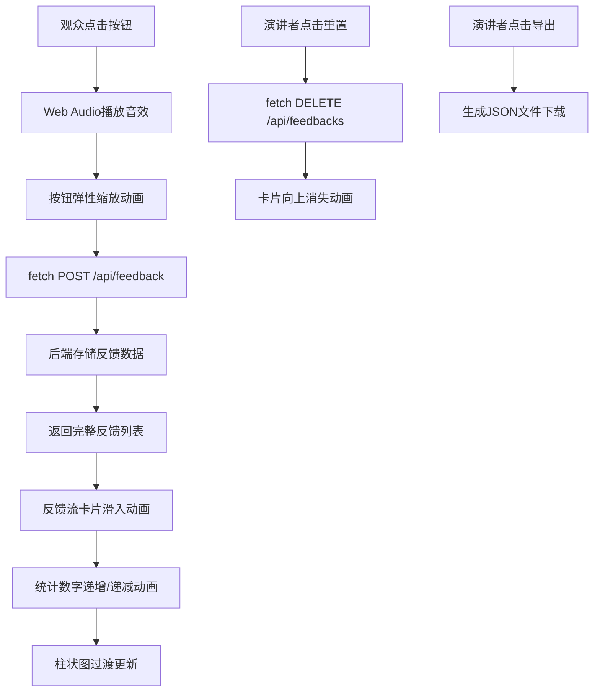

## 1. 产品概述

即时观众反馈系统是一个帮助演讲者在大屏演示或线上会议中实时收集、筛选和可视化观众反馈的Web应用。解决演讲者无法即时感知观众情绪和关注点的核心问题。

- 目标用户：演讲者、培训师、会议主持人
- 核心价值：实时感知观众反应，提升演讲互动质量和效果

## 2. 核心功能

### 2.1 用户角色

| 角色 | 使用方式 | 核心权限 |
|------|---------|----------|
| 演讲者 | 主控制台操作 | 查看反馈、重置数据、导出报告 |
| 观众（模拟） | 反馈面板 | 发送点赞、困惑、提问反馈 |

### 2.2 功能模块

1. **观众反馈面板**：三个反馈按钮（点赞/困惑/提问），带动画和音效
2. **反馈流面板**：实时卡片流展示，滚动、悬停提示、自动移除
3. **演讲者控制台**：重置、导出、实时统计、数据可视化

### 2.3 页面详情

| 页面名称 | 模块名称 | 功能描述 |
|---------|---------|---------|
| 主页面 | 观众反馈面板 | 三个emoji按钮，点击生成反馈，0.3秒弹性缩放动画，Web Audio音效 |
| 主页面 | 反馈流面板 | 卡片按时间倒序排列，滑入动画，悬停显示详细时间，超过20条自动移除最旧 |
| 主页面 | 演讲者控制台 | 重置按钮（向上消失动画）、导出JSON、三类型统计卡片（带数字动画）、柱状图（带过渡动画） |
| 主页面 | 历史数据模拟 | 页面加载时生成30条模拟反馈（各类型10条，5分钟内随机时间） |

## 3. 核心流程

观众点击反馈按钮 → 前端发送POST请求到后端 → 后端存储反馈 → 返回完整反馈列表 → 前端更新反馈流和统计数据 → 柱状图实时更新比例 → 演讲者可重置或导出数据

## 4. 用户界面设计

### 4.1 设计风格

- **主色调**：深色主题背景#1a1a2e，三种反馈类型色（点赞#2ecc71、困惑#f39c12、提问#3498db）
- **按钮风格**：圆角卡片式按钮，带emoji图标
- **字体**：白色标题带发光效果text-shadow: 0 0 10px rgba(255,255,255,0.3)
- **布局风格**：三栏左右分区（左200px、中间自适应、右250px）
- **图标**：使用emoji（👍🤔❓）作为按钮图标
- **动画**：大量CSS transition/animation实现流畅过渡效果

### 4.2 页面设计概览

| 页面名称 | 模块名称 | UI元素 |
|---------|---------|--------|
| 主页面 | 顶部标题栏 | 白色发光文字，居中显示 |
| 主页面 | 观众面板 | 深色背景，三个垂直排列的反馈按钮，带emoji |
| 主页面 | 反馈流面板 | 深色背景，卡片从右滑入，悬停提示条，卡片类型色背景 |
| 主页面 | 控制台 | 重置/导出按钮，三个渐变统计卡片，柱状图区域 |
| 主页面 | 底部装饰条 | 4px高度，绿→橙→蓝横向渐变 |

### 4.3 响应式设计

- **桌面端**（≥900px）：三栏左右布局
- **移动端**（<900px）：左右面板折叠到底部，水平三段式，反馈按钮横向排列为圆角卡片（120px×80px）

### 4.4 性能要求

- 按钮点击到卡片出现：≤100ms
- 动画帧率：≥50FPS
