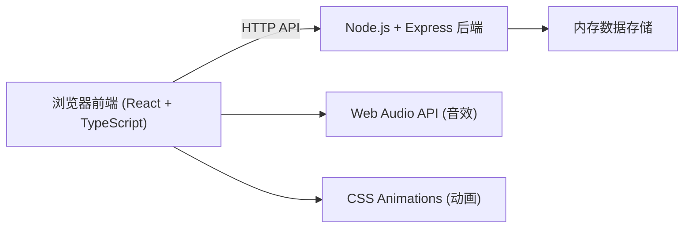
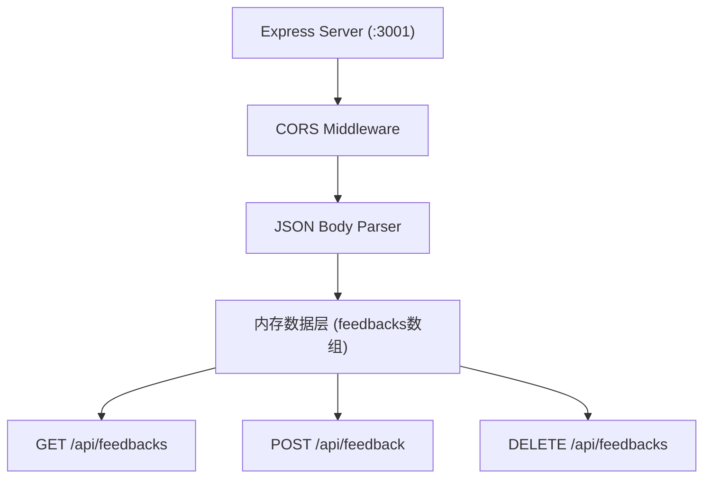
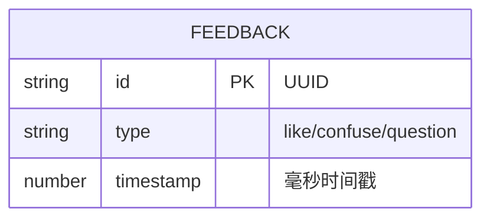

## 1. 架构设计



## 2. 技术说明

- **前端框架**：React 18 + TypeScript
- **构建工具**：Vite + @vitejs/plugin-react
- **后端框架**：Express 4
- **数据存储**：内存存储（运行时），使用uuid生成唯一ID
- **跨域处理**：cors中间件 + Vite代理
- **并发启动**：concurrently同时启动前端和后端

## 3. 路由定义

| 路由 | 用途 |
|-----|------|
| / | 前端主页面（Vite提供） |
| GET /api/feedbacks | 获取所有反馈列表（含30条模拟数据） |
| POST /api/feedback | 添加新反馈，返回完整列表 |
| DELETE /api/feedbacks | 清空所有反馈 |

## 4. API定义

### 数据类型

```typescript
type FeedbackType = 'like' | 'confuse' | 'question';

interface Feedback {
  id: string;
  type: FeedbackType;
  timestamp: number;
}
```

### GET /api/feedbacks
- **Request**: 无参数
- **Response**: `Feedback[]` 反馈数组（最新在前）

### POST /api/feedback
- **Request Body**: `{ type: FeedbackType }`
- **Response**: `Feedback[]` 更新后的完整反馈列表

### DELETE /api/feedbacks
- **Request**: 无参数
- **Response**: `{ success: true }`

## 5. 服务器架构图



## 6. 数据模型

### 6.1 数据模型定义



### 6.2 初始数据

- 应用启动时后端生成30条模拟数据（每种类型各10条）
- 时间戳随机分布在过去5分钟内
- 按时间倒序排列返回
