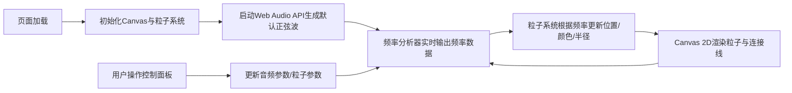

## 1. 产品概述

基于声波频率和视觉粒子共振的交互式音乐反应器，通过 Web Audio API 分析音频频率数据，驱动 Canvas 2D 粒子系统产生形态、颜色和运动的同步可视化响应。

- 目标用户：音乐爱好者、视觉艺术创作者、交互体验探索者
- 核心价值：将抽象的声波频率转化为具象的粒子视觉艺术，创造沉浸式音画同步体验

## 2. 核心特性

### 2.1 功能模块

1. **粒子可视化系统**：500个彩色粒子构成圆形阵列，随音频频率产生扩散、振荡、闪烁响应
2. **音频引擎**：支持三种预设波形（正弦波、方波、锯齿波）生成及麦克风输入捕获，实时频率分析
3. **控制面板**：波形切换、频率增益调节、粒子扩散速度调节、一键重置
4. **连接线网络**：粒子近距离自动生成半透明连接线，形成星座网络效果
5. **信息显示**：实时显示连接线数量

### 2.2 页面详情

| 页面名称 | 模块名称 | 功能描述 |
|---------|---------|----------|
| 主界面 | 粒子画布 | 全屏Canvas，径向渐变背景，500粒子圆形阵列公转，音频响应形态变化 |
| 主界面 | 控制面板 | 半透明毛玻璃面板，波形切换按钮、两个滑块、重置按钮 |
| 主界面 | 信息区 | 左上角显示当前连接线数量 |

## 3. 核心流程

用户打开页面 → 粒子系统初始化并开始缓慢公转 → 默认播放正弦波预设音频 → 粒子随音频实时响应 → 用户通过控制面板切换波形/调节参数/重置 → 系统实时更新渲染效果

## 4. 用户界面设计

### 4.1 设计风格

- **主色调**：深紫色到黑色径向渐变背景（中心#2b1a4a到边缘#0a0a10）
- **粒子颜色**：HSL色环紫到蓝区域（色相240-300，饱和度70%，亮度60%），音频响应时动态偏移
- **波形标识色**：正弦波#e74c3c红、方波#3498db蓝、锯齿波#2ecc71绿
- **信息文字**：淡绿色#aaffaa，字号14px
- **控制面板**：背景#0f0f1a，透明度0.85，圆角12px，毛玻璃效果
- **整体风格**：暗色调科幻风，交互元素悬停发光边框效果

### 4.2 页面设计概述

| 页面名称 | 模块名称 | UI元素 |
|---------|---------|--------|
| 主界面 | 粒子画布 | 全屏Canvas，径向渐变背景，500彩色粒子公转，连接线网络 |
| 主界面 | 控制面板 | 底部半透明面板，三个波形按钮（带颜色标识），两个滑块（带浮动数值），重置按钮 |
| 主界面 | 信息区 | 左上角淡绿色文字显示连接线数量 |

### 4.3 响应式适配

桌面端优先，适配分辨率范围1920x1080到1366x768，Canvas自适应窗口尺寸，控制面板在较小屏幕下自动压缩间距。
