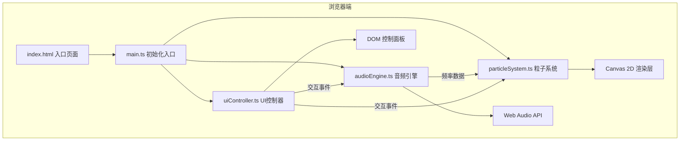

## 1. 架构设计



## 2. 技术描述

- **构建工具**：Vite 5.x
- **语言**：TypeScript 5.x（严格模式，目标ES2020，模块ESNext
- **渲染技术**：Canvas 2D原生API + requestAnimationFrame
- **音频技术**：Web Audio API（OscillatorNode, AnalyserNode, MediaStreamAudioSourceNode）
- **UI**：原生DOM + CSS（毛玻璃效果backdrop-filter）
- **无第三方UI框架、无后端、无数据库**

## 3. 文件结构

```
auto57/
├── index.html              # 入口HTML，全屏Canvas，底部控制面板容器
├── package.json           # 依赖：typescript、vite
├── tsconfig.json         # TS配置
├── vite.config.js        # Vite配置
└── src/
    ├── main.ts            # 入口初始化
    ├── particleSystem.ts # 粒子类定义与系统
    ├── audioEngine.ts  # 音频处理模块
    └── uiController.ts  # 控制面板UI
```

## 4. 核心模块设计

### 4.1 Particle 粒子类
```typescript
interface Particle {
  x: number;           // 当前X坐标
  y: number;           // 当前Y坐标
  baseAngle: number;    // 初始角度（圆形排列）
  baseRadius: number; // 初始半径
  radius: number;     // 当前粒子半径
  baseHue: number;   // 基础色相
  saturation: number;
  lightness: number;
  velocityX: number;
  velocityY: number;
  oscillationPhase: number; // 振荡相位
}
```

### 4.2 ParticleSystem 粒子系统
- 初始化500个粒子圆形排列
- update(frequencyData: FrequencyData): void
- render(ctx: CanvasRenderingContext2D): void
- reset(): void
- setGain(value: number): void
- setSpreadSpeed(value: number): void
- getConnectionCount(): number

### 4.3 AudioEngine 音频引擎
- start(): Promise<void>
- stop(): void
- setWaveform(type: 'sine' | 'square' | 'sawtooth'): void
- getFrequencyData(): FrequencyData
- setGain(value: number): void
- enableMicrophone(): Promise<void>
- disableMicrophone(): void

### 4.4 UIController UI控制器
- 波形切换按钮事件绑定
- 滑块事件绑定（增益、扩散速度
- 重置按钮事件绑定
- 悬停发光效果

## 5. 性能优化策略

- 使用requestAnimationFrame保证60FPS渲染循环
- 粒子位置计算使用批量处理
- 连接线距离检测优化（空间分区或距离平方比较避免开方）
- Canvas像素比适配高清屏
- 避免渲染循环中创建新对象（对象池模式
