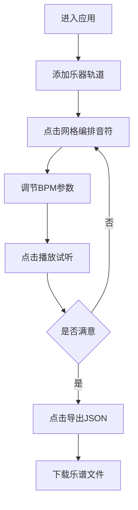

## 1. 产品概述
多轨乐谱生成器是一款面向乐队和音乐爱好者的Web应用，帮助用户快速创建、编排多轨乐谱并实时播放试听。解决传统专业乐谱软件（如Sibelius、Finale等）学习成本高、操作复杂的痛点，让音乐创作变得简单直观。

- 核心目标：降低音乐创作门槛，提供即点即编的交互体验
- 目标用户：乐队成员、音乐爱好者、音乐教育初学者
- 产品价值：无需专业知识，通过可视化网格快速编排多声部音乐

## 2. 核心功能

### 2.1 用户角色
无需注册登录，所有访客均可直接使用全部功能。

### 2.2 功能模块
1. **乐器轨道管理**：左侧面板添加四种乐器（吉他、钢琴、鼓、贝斯），支持拖拽排序
2. **音符编辑网格**：每个轨道包含16列音符网格，点击单元格添加/删除音符
3. **播放控制栏**：播放/暂停、重置、BPM调节（60-180）
4. **乐谱导出**：将当前编排导出为JSON文件下载

### 2.3 页面详情
| 页面名称 | 模块名称 | 功能描述 |
|---------|---------|---------|
| 主编辑页 | 乐器面板 | 点击添加乐器轨道，拖拽排序，垂直滚动 |
| 主编辑页 | 音符网格 | 16分音符网格，点击增删音符，播放时高亮当前列 |
| 主编辑页 | 播放控制栏 | 底部固定，播放/暂停/重置/BPM滑块 |
| 主编辑页 | 导出按钮 | 右上角，导出JSON乐谱文件 |

## 3. 核心流程
用户进入应用 → 添加乐器轨道 → 在网格中点击编排音符 → 调整BPM → 点击播放试听 → 调整修改 → 导出乐谱JSON

## 4. 用户界面设计

### 4.1 设计风格
- **主色调**：深色主题（背景#0d0d1a，卡片#1a1a2e，文字#f0f0f0）
- **乐器颜色**：吉他#2ecc71、钢琴#3498db、鼓#e74c3c、贝斯#f39c12
- **按钮样式**：圆形控制按钮（播放50px/重置40px），圆角矩形导出按钮
- **字体**：Google Fonts 'Inter'
- **布局**：左右分栏，居中最大宽度1200px，底部固定控制栏

### 4.2 页面设计概述
| 页面名称 | 模块名称 | UI元素 |
|---------|---------|---------|
| 主编辑页 | 乐器面板 | 280px宽左侧面板，彩色条带（40px高），拖拽排序，自定义滚动条 |
| 主编辑页 | 音符网格 | 16列网格，点击动画（渐变出现/缩小消失），播放黄色光晕高亮 |
| 主编辑页 | 播放控制栏 | 播放按钮脉冲动画，BPM滑块渐变轨道（#2c3e50到#1abc9c） |
| 主编辑页 | 导出按钮 | 紫色背景#8e44ad，悬停#9b59b6，0.2秒过渡 |

### 4.3 响应式设计
- Desktop-first设计
- <768px宽度时：左侧乐器面板折叠为顶部水平滚动条带
- 触控设备优化：增大点击区域

### 4.4 交互动效
- 元素悬停：translateY(-2px) + box-shadow加深
- 按钮/轨道点击：0.1秒缩放至0.95反馈
- 音符添加：0.15秒线性颜色渐变
- 音符删除：0.1秒缩放至0消失动画
- 播放高亮：黄色光晕透明度0.6，持续0.05秒
