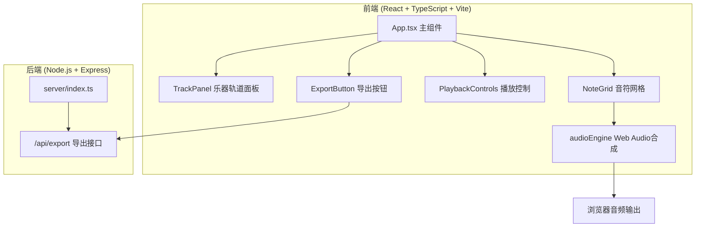

## 1. 架构设计



## 2. 技术选型
- **前端框架**：React 18 + TypeScript
- **构建工具**：Vite 5
- **后端服务**：Express 4
- **音频处理**：Web Audio API（浏览器原生）
- **状态管理**：React useState/useReducer（轻量级场景）
- **拖拽实现**：原生HTML5 Drag & Drop API

## 3. 目录结构
```
auto60/
├── package.json
├── vite.config.js
├── tsconfig.json
├── index.html
├── src/
│   ├── main.tsx
│   ├── App.tsx
│   ├── components/
│   │   ├── TrackPanel.tsx
│   │   └── NoteGrid.tsx
│   └── utils/
│       └── audioEngine.ts
└── server/
    └── index.ts
```

## 4. 数据模型

### 4.1 核心类型定义
```typescript
type InstrumentType = 'guitar' | 'piano' | 'drums' | 'bass';

interface Track {
  id: string;
  instrument: InstrumentType;
  notes: boolean[]; // 长度16，对应16个16分音符位置
}

interface ScoreData {
  tracks: Track[];
  bpm: number;
  createdAt: number;
}
```

### 4.2 乐器配置
| 乐器 | 波形类型 | 颜色 | 基准音高 |
|------|---------|------|---------|
| 吉他 | triangle | #2ecc71 | 329.63 Hz (E4) |
| 钢琴 | sine | #3498db | 440.00 Hz (A4) |
| 鼓 | square | #e74c3c | 200.00 Hz |
| 贝斯 | sawtooth | #f39c12 | 82.41 Hz (E2) |

## 5. API 定义

### 5.1 导出接口
- **路由**：`POST /api/export`
- **请求体**：`ScoreData` JSON对象
- **响应**：`Content-Disposition: attachment; filename="乐谱_时间戳.json"`
- **响应类型**：`application/json`

## 6. 播放引擎设计

### 6.1 时序计算
- 每小节16个16分音符
- 单个音符时长 = 60 / BPM / 4 秒
- 使用 Web Audio API 的 `AudioContext.currentTime` 精确调度

### 6.2 音色合成
- 每个音符创建 OscillatorNode + GainNode
- Attack: 5ms 线性淡入
- Release: 50ms 指数淡出
- 音符总时长约0.1秒

### 6.3 播放循环
- 使用 `setInterval` 按 BPM 节拍推进
- 当前列索引：0-15 循环
- 遍历所有轨道，在有音符的位置触发合成

## 7. 性能要求
- UI响应延迟 < 50ms（音符增删、轨道拖拽）
- 音频合成延迟 < 20ms（使用Web Audio调度而非setTimeout）
- 避免不必要的重渲染：使用 React.memo 优化 NoteGrid
