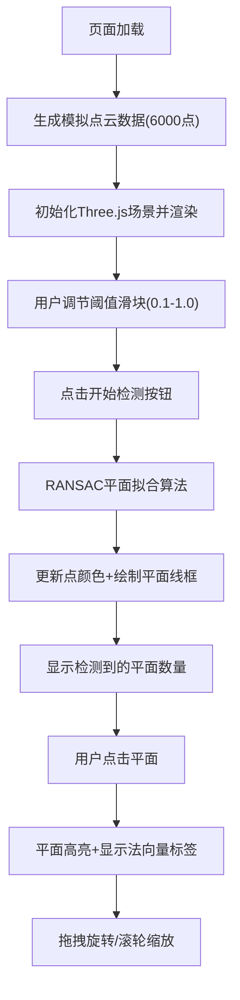

## 1. 产品概述

点云平面检测可视化应用，帮助建筑测量人员和室内设计师快速从原始三维点云数据中提取平面结构（墙面、地面、桌面等），无需专业扫描仪软件即可进行空间规划和测量分析。

- **核心功能**：基于Three.js的3D点云渲染 + RANSAC平面检测算法
- **目标用户**：建筑测量人员、室内设计师、3D建模人员
- **产品价值**：降低专业门槛，快速可视化提取平面结构信息

## 2. 核心功能

### 2.1 功能模块

1. **点云数据生成模块**：自动生成模拟室内点云数据（约6000点），包含墙面、地面、倾斜桌面及噪声点
2. **3D可视化模块**：高性能点云渲染、鼠标交互（旋转/缩放）、FPS实时监控
3. **平面检测模块**：RANSAC算法实现平面拟合，阈值可调，500ms内完成检测
4. **交互标注模块**：平面高亮显示、边界线框、点击选择、法向量标签展示
5. **控制面板模块**：开始检测按钮、阈值滑块、平面数量统计、操作提示

### 2.2 页面详情

| 页面名称 | 模块名称 | 功能描述 |
|-----------|-------------|---------------------|
| 主页面 | 3D渲染区 | 中央80%宽度区域，显示深空渐变背景下的三维点云 |
| 主页面 | 左侧控制面板 | 280px宽半透明深灰面板，含按钮、滑块、统计信息 |
| 主页面 | 底部信息栏 | 实时FPS和点云数量显示，低于40FPS红色高亮 |
| 主页面 | 浮动标签 | 选中平面时显示法向量信息，半透明黑色圆角背景 |

## 3. 核心流程

用户打开页面 → 自动生成模拟点云并渲染 → 用户调节阈值滑块 → 点击"开始检测"按钮 → RANSAC算法检测平面 → 高亮显示平面点和线框边界 → 用户点击平面查看法向量详情 → 用户拖拽旋转/滚轮缩放浏览

## 4. 用户界面设计

### 4.1 设计风格

- **主色调**：深空渐变背景 (#0a0a20 → #1a1a3e)
- **强调色**：青色 (#00aaff) 用于边框、滑块主题
- **辅助色**：白色文字、深青色(#0055aa)按钮悬停、灰色(#555555)噪声点
- **平面高亮**：随机半透明颜色(透明度0.6)，选中时透明度升至0.9
- **按钮样式**：圆角矩形，悬停变色，点击缩放0.95弹回，0.2s动画
- **字体**：现代无衬线字体，白色为主，FPS低于40时红色
- **布局**：左侧固定面板 + 中央渲染区 + 底部信息栏

### 4.2 页面设计概述

| 页面名称 | 模块名称 | UI元素 |
|-----------|-------------|-------------|
| 主页面 | 3D渲染区 | 深空渐变背景、Three.js Canvas、点云彩色渐变(深蓝→浅灰) |
| 主页面 | 控制面板 | 280px宽、2px青色边框、rgba(20,20,40,0.9)背景、白色文字、青色滑块、按钮悬停/点击动画 |
| 主页面 | 信息栏 | 底部固定、最小化样式、FPS+点云计数、红色警告色、0.3s过渡动画 |
| 主页面 | 操作提示 | 面板底部、淡入淡出、鼠标静止3s后消失 |
| 主页面 | 法向量标签 | 浮动显示、半透明黑色圆角矩形、白色文字、0.3s过渡动画 |

### 4.3 响应式设计

- 桌面端优先设计，中央渲染区自适应窗口大小
- 控制面板固定280px宽度，不随窗口缩放
- 点云渲染区保持80%宽度，最小宽度600px

### 4.4 3D场景指导

- **环境**：纯深空渐变背景，无额外HDRI，突出点云数据
- **光照**：使用Points材质，无需复杂光照，依赖顶点颜色
- **相机**：PerspectiveCamera，初始位置合理角度观察三个平面
- **交互**：OrbitControls实现绕Y/X轴旋转、滚轮缩放、禁用平移
- **性能**：Points渲染6000顶点，目标帧率≥50FPS，使用BufferGeometry优化
- **动画**：所有颜色/透明度过渡0.3s ease-in-out，按钮点击0.2s弹回动画
