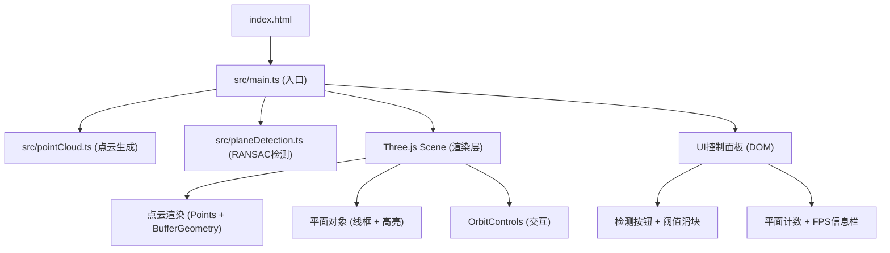

## 1. 架构设计



## 2. 技术说明

- **前端框架**：TypeScript + Three.js + Vite
- **初始化工具**：Vite vanilla-ts 模板
- **3D渲染**：Three.js (r160+)，使用BufferGeometry + PointsMaterial
- **算法实现**：RANSAC平面拟合，纯TypeScript实现
- **调试面板**：lil-gui
- **噪声库**：simplex-noise（点云数据生成辅助）

## 3. 文件结构定义

| 文件路径 | 目的 |
|-------|---------|
| /package.json | 项目依赖配置，包含three、@types/three、vite、typescript、lil-gui、simplex-noise |
| /index.html | 入口HTML页面，#root容器、FPS信息栏元素 |
| /tsconfig.json | TypeScript配置，严格模式，ES2020目标，ESNext模块 |
| /vite.config.js | Vite构建配置，输出到dist目录 |
| /src/main.ts | 主入口：场景初始化、控制面板、渲染循环、事件绑定 |
| /src/pointCloud.ts | 点云数据生成：墙面、地面、桌面、噪声点 |
| /src/planeDetection.ts | RANSAC算法：平面拟合、阈值过滤、返回平面索引和法向量 |

## 4. 数据模型

### 4.1 点云数据结构

```typescript
interface PointCloudData {
  positions: Float32Array;  // xyz坐标，长度 = 点数 * 3
  colors: Float32Array;     // rgb颜色，长度 = 点数 * 3
  planeIds: Int32Array;     // 所属平面ID，-1表示噪声，长度 = 点数
}
```

### 4.2 检测结果结构

```typescript
interface DetectedPlane {
  indices: number[];        // 属于该平面的点索引
  normal: { x: number; y: number; z: number };  // 平面法向量（单位向量）
  centroid: { x: number; y: number; z: number }; // 平面中心点
  bbox: {
    minX: number; maxX: number;
    minY: number; maxY: number;
    minZ: number; maxZ: number;
  };
  color: string;            // 高亮颜色（随机生成）
}
```

## 5. 关键实现要点

### 5.1 RANSAC算法流程
1. 随机选取3个点计算平面方程 ax + by + cz + d = 0
2. 统计距离小于阈值的内点数量
3. 迭代N次选择内点最多的平面
4. 移除该平面的内点，重复检测下一个平面
5. 直到剩余点数不足或迭代次数用完

### 5.2 性能优化
- 使用TypedArray（Float32Array）存储顶点数据
- 单次BufferGeometry更新，避免逐点修改
- RANSAC迭代次数根据点数动态调整
- 线框使用LineSegments合并渲染

### 5.3 交互实现
- Raycaster实现点拾取，判断点击所属平面
- OrbitControls配置enablePan=false，限制旋转轴
- 鼠标静止计时器实现操作提示淡入淡出
