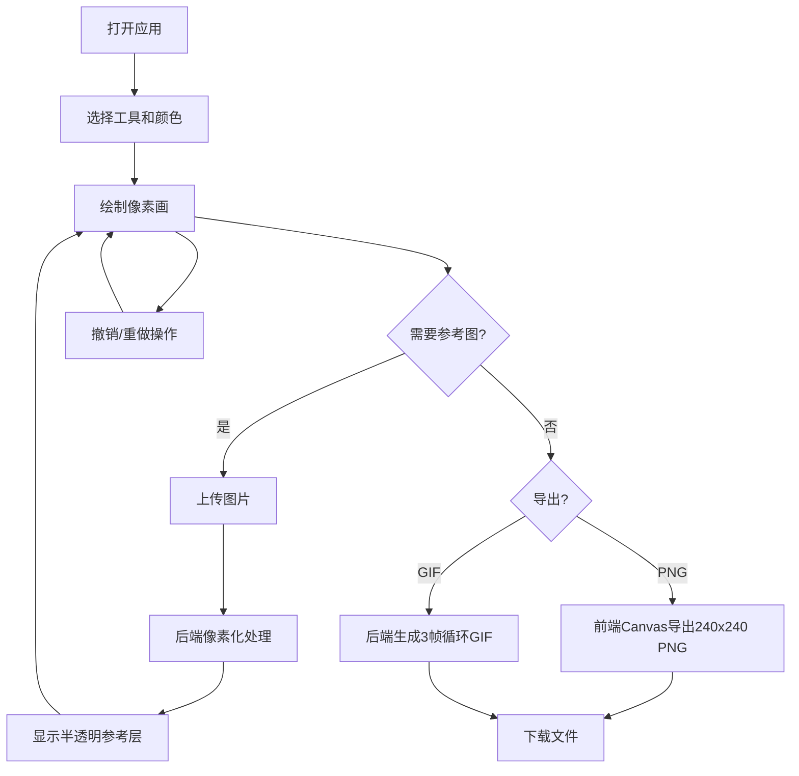

## 1. 产品概述

一款基于Web的交互式复古像素艺术生成与导出应用，让用户能在浏览器中像使用经典像素编辑器一样绘制、编辑和导出像素画作品。
- 主要用途：像素艺术创作、像素化图片导入与导出、复古风格像素画制作
- 目标用户：像素艺术爱好者、游戏开发者、复古设计爱好者
- 产品价值：提供简洁高效的像素画创作工具，支持参考图像素化还原，支持PNG/GIF导出功能

## 2. 核心功能

### 2.1 功能模块

1. **像素编辑器主页：画布绘制、工具选择、颜色面板、撤销/重做

2. **文件处理模块**：参考图导入与像素化、PNG导出、GIF导出

### 2.2 页面详情

| 页面名称 | 模块名称 | 功能描述 |
|-----------|-------------|---------------------|
| 像素编辑器 | 画布区域 | 24x24像素画布，居中显示在CRT风格边框内 |
| 像素编辑器 | 工具栏 | 铅笔、矩形填充、吸管工具切换 |
| 像素编辑器 | 颜色面板 | 16种预设颜色，前景色/背景色选择 |
| 像素编辑器 | 撤销/重做 | Ctrl+Z撤销，Ctrl+Shift+Z重做，最多50步 |
| 像素编辑器 | 参考图层 | 导入图片半透明参考层，可关闭 |
| 像素编辑器 | 导出功能 | PNG/GIF导出，进度条动画 |

## 3. 核心流程

用户打开应用 → 选择颜色和工具 → 在画布上绘制像素画 → 可导入参考图辅助绘制 → 完成后导出PNG或GIF

## 4. 用户界面设计

### 4.1 设计风格
- 主色调：深米色(#d4c8a0)、浅米色(#e8dcc8)、深棕色(#3a3020)
- 按钮样式：高度32px，背景#3a3020，悬停变浅#5a4c3a，点击缩放动画
- 字体：'Press Start 2P'像素风格字体，后备monospace
- 布局：左侧固定工具栏+颜色面板(200px)，右侧居中画布
- CRT屏幕效果：圆角边框、内阴影、扫描线渐变叠加

### 4.2 页面设计概览

| 页面名称 | 模块名称 | UI元素 |
|-----------|-------------|-------------|
| 像素编辑器 | CRT画布区 | 圆角边框8px #3a3020，内阴影inset，扫描线效果 |
| 像素编辑器 | 工具栏 | 3个工具按钮，选中高亮白色背景 |
| 像素编辑器 | 颜色面板 | 4x4网格，每个色块30x30px，选中2px白色边框 |
| 像素编辑器 | 导出按钮 | 高度32px，悬停/点击微动画 |
| 像素编辑器 | 进度条 | 0%-100%绿色渐变 |

### 4.3 响应式设计
- 桌面端：左侧200px侧边栏，画布居中
- 移动端(<768px)：工具栏和颜色面板折叠为顶部水平横条(60px高度，可横向滚动)，画布自适应视口高度，保持正方形比例
