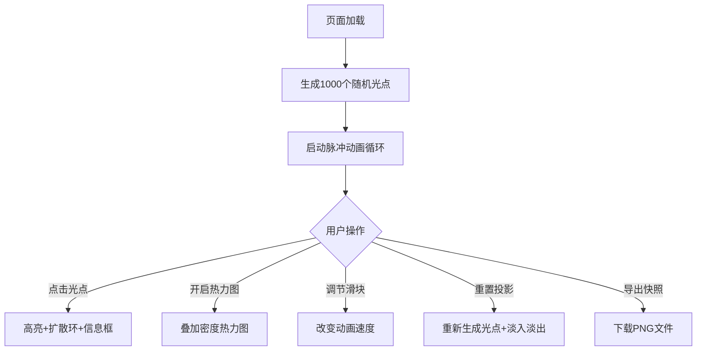

## 1. 产品概述

城市霓虹灯光模拟与光污染热力图可视化应用，为城市规划者和环保爱好者提供直观的夜间灯光分布与光污染评估工具。

- 主要目的：通过交互式可视化方式，模拟城市夜间霓虹灯光效果，直观展示不同区域灯光分布密集度及其对光污染的贡献。
- 目标用户：城市规划者、环保爱好者、研究人员。
- 产品价值：将抽象的光污染数据转化为可交互、可感知的视觉体验，辅助决策和科普教育。

## 2. 核心功能

### 2.1 用户角色
本应用无用户角色区分，所有功能对所有访问者开放。

### 2.2 功能模块
1. **城市俯瞰画布**：随机生成1000个霓虹灯光点，模拟脉冲闪烁动画效果
2. **光点交互系统**：点击光点显示高亮效果、扩散圆环和悬浮信息框
3. **热力图可视化**：根据光点密度和亮度生成半透明热力图叠加层
4. **实时统计图表**：显示各亮度等级光点数量的条形统计图
5. **控制面板**：全局速度调节、投影重置、画布导出功能

### 2.3 页面详情
| 页面名称 | 模块名称 | 功能描述 |
|---------|---------|---------|
| 主页面 | 城市俯瞰画布 | 800x600 深蓝背景画布，1000个随机分布霓虹灯光点，脉冲闪烁动画 |
| 主页面 | 光点交互 | 点击光点放大变白色高亮，扩散圆环动画，悬浮信息框跟随鼠标 |
| 主页面 | 热力图叠加 | 开关控制，Canvas颜色映射（蓝到红），每0.5秒刷新 |
| 主页面 | 统计图表 | 右侧边栏条形图，横轴亮度等级1-5，纵轴光点数量0-100 |
| 主页面 | 控制面板 | 速度滑块(1-10x)、重置投影按钮、导出PNG按钮 |

## 3. 核心流程

用户打开页面后，自动生成随机城市灯光分布。用户可以：
- 观察光点脉冲动画效果
- 点击任意光点查看详细信息
- 开启热力图查看光污染分布
- 调节速度滑块改变动画频率
- 点击重置生成新的随机分布
- 导出当前画布为PNG图片

## 4. 用户界面设计

### 4.1 设计风格
- **主色调**：深蓝渐变背景（#0d1b2a → #1a1a2e → #16213e）
- **光点颜色**：暖色系（#ff6b35 橙红、#f7c59f 浅橙、#ffb703 金黄）
- **高亮色**：白色 #ffffff，按钮色 #e94560 → #ff6b6b（悬停）
- **按钮风格**：圆角、无边框扁平设计，悬停0.2秒背景变亮效果
- **字体**：sans-serif
- **整体风格**：深色科幻风格，高饱和度霓虹色彩，科技感强烈

### 4.2 页面设计概述
| 页面名称 | 模块名称 | UI元素 |
|---------|---------|-------|
| 主页面 | 布局 | 左侧800x600画布 + 右侧边栏 + 底部控制面板 |
| 主页面 | 画布光点 | 中心发光 + 外围模糊光晕渐变层次，脉冲缩放动画 |
| 主页面 | 信息框 | 半透明深灰背景（#2c3e50），白色文字，圆角8px，阴影 |
| 主页面 | 滑块 | 渐变轨道（#1a1a2e→#16213e），圆形按钮（半径12px，#e94560） |
| 主页面 | 热力图 | 蓝→红颜色映射，透明度0.5，半透明叠加 |

### 4.3 响应式
- 桌面端优先设计，画布固定800x600尺寸
- 控制面板和边栏自适应布局
- 性能目标：1200个光点时帧率稳定50fps以上

### 4.4 动画细节
- 光点脉冲：大小1→1.15→1，持续0.4秒，随机间隔0.5-2秒
- 选中高亮：放大1.5倍变白，持续1.5秒
- 扩散圆环：半径0→60px，透明度0.6→0，持续0.6秒
- 信息框：跟随鼠标，离开延迟0.3秒消失
- 重置动画：整个画布0.3秒淡入淡出
