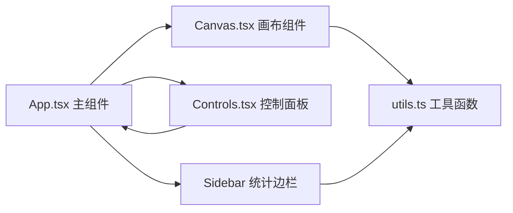

## 1. 架构设计



纯前端单页应用，无后端服务。React 组件分层管理，Canvas 负责高性能渲染，工具函数处理数据计算。

## 2. 技术描述

- **前端框架**：React 18 + TypeScript
- **构建工具**：Vite
- **UI 渲染**：HTML5 Canvas 2D API（光点、热力图、动画）
- **工具库**：lodash.throttle（函数节流）
- **状态管理**：React useState / useRef（无需额外状态管理库）

## 3. 项目文件结构

```
├── package.json          # 项目依赖和脚本
├── index.html            # 入口HTML
├── tsconfig.json         # TypeScript配置
├── vite.config.js        # Vite配置
└── src/
    ├── App.tsx           # 主组件，全局状态管理
    ├── Canvas.tsx        # 画布组件，渲染和动画
    ├── Controls.tsx      # 控制面板组件
    ├── Sidebar.tsx       # 边栏热力图开关和统计图表
    └── utils.ts          # 工具函数集合
```

## 4. 数据模型

### 4.1 光点数据结构

```typescript
interface LightPoint {
  id: number;
  x: number;           // X坐标 0-800
  y: number;           // Y坐标 0-600
  baseSize: number;    // 基础大小 6-14px
  color: string;       // 颜色：#ff6b35 | #f7c59f | #ffb703
  brightnessLevel: 1 | 2 | 3 | 4 | 5;  // 亮度等级
  pulseInterval: number;  // 脉冲间隔 500-2000ms
  lastPulseTime: number;  // 上次脉冲时间戳
  isPulsing: boolean;     // 是否正在脉冲
  pulseProgress: number;  // 脉冲进度 0-1
  isSelected: boolean;    // 是否被选中
  selectedTime: number;   // 选中时间戳
}
```

### 4.2 扩散圆环数据结构

```typescript
interface Ripple {
  id: number;
  x: number;
  y: number;
  color: string;
  startTime: number;
  duration: number;  // 600ms
}
```

### 4.3 悬浮信息框状态

```typescript
interface HoverInfo {
  visible: boolean;
  x: number;
  y: number;
  pointId: number | null;
  hideTimeout: number | null;
}
```

## 5. 核心算法

### 5.1 光点脉冲动画
- 使用 requestAnimationFrame 驱动主循环
- 每个光点独立计时，达到 pulseInterval 时触发脉冲
- 脉冲进度 0→1 使用 easeInOutQuad 缓动函数计算缩放：
  - scale = 1 + 0.15 * sin(progress * π)

### 5.2 热力图计算
- 将画布划分为网格（如40x30网格，每格20x20像素）
- 每个光点根据亮度等级对周围网格贡献权重：
  - 权重 = brightnessLevel * gaussian(distance, sigma)
- 颜色映射：权重归一化后映射到蓝→青→绿→黄→红渐变

### 5.3 碰撞检测
- 点击检测：遍历光点，计算鼠标位置与光点中心距离 ≤ (size * 1.5)

## 6. 性能优化策略

1. **Canvas 分层**：光点层、热力图层分离，减少重绘区域
2. **离屏 Canvas**：热力图预渲染到离屏画布，仅在更新时重绘
3. **requestAnimationFrame**：统一动画循环，避免 setTimeout 抖动
4. **对象池**：复用 Ripple 对象，减少 GC 压力
5. **lodash.throttle**：热力图每 500ms 计算一次，而非每帧
6. **批量绘制**：相似颜色光点批量绘制，减少 context 状态切换
